# Mesh API

Welcome to the Mesh API Documentation - the central hub containing our API definitions and integration SDKs.

Our APIs are exposed over [gRPC](https://grpc.io/). To facilitate seamless integration we provide [API integration SDKs](#api-integration-sdks) in a number of languages.

The following sections cover:
1.  [API Integration SDKs](#api-integration-sdks) - *API integration SDKs in our supported languages.*
2.  [API Philosophy](#api-philosophy) - *A description of the principles behind our API design.*
3.  [Repository Structure](#repository-structure) - *An overview of the structure of  this repository.*

## API Integration SDKs
Integration SDKs for our API services are available in the following languages:

* **[Go](./go/README.md)**
* **[Python](./python/README.md)**
* **[TypeScript](./ts/README.md)**

If an SDK in another language is required, you can generate one directly from the Protobuf API definitions in the [proto](./proto) directory. We recommend using [buf](https://github.com/bufbuild/buf) to do this.

## API Philosophy
* **Schema-First Design**: The [protobuf](https://github.com/protocolbuffers/protobuf) definitions in the [proto](./proto) directory are the source of truth describing our API. The types and gRPC clients in our [integration SDKs](#client-libraries-for-api-access) are generated directly from these definitions.
* **Resource-Oriented Design**: Our APIs are designed around _resource services_ - each providing methods from the following stanard verb list: Create, Get, List, Update, Delete. Services may also provide custom methods when appropriate. A full verb list with documentation can be found alongside the associated API in the proto directory.
* **Backward Compatibility**: We are committed to API stability. Following semantic versioning principles, a `v1` API is a stable contract; any breaking changes will necessitate a new major version (e.g., `v2`). These will be published in the form of another version DIRECTORY in `/proto/service/vX`.
* **Independent Modules**: Each API service and shared type collection is treated as a distinct, versionable module. This allows consumers to import only the code they need for their specific language.

## Repository Structure

The following diagram illustrates the relationship between our source protobuf files and the generated client libraries for each language:

```mermaid
%%{init: {'theme': 'base', 'themeVariables': { 'background': '#ffffff' }}}%%
graph TD
%% Main direction is Top Down for better vertical layout

    subgraph proto ["proto"]
        subgraph p_meshtrade ["proto/meshtrade"]
            subgraph p_api_services ["API Services"]
                subgraph p_compliance ["proto/meshtrade/compliance/client/v1"]
                    p_compliance_files("*.proto")
                end
                p_other_services(...)
            end
            subgraph p_type ["proto/meshtrade/type/v1"]
                p_type_files("*.proto")
            end
        end
    end

    subgraph generated_code ["Generated Client Libraries"]
        subgraph ts ["ts"]
            subgraph ts_meshtrade ["ts/src"]
                subgraph ts_api_services ["API Services"]
                    subgraph ts_compliance ["ts/src/compliance/client/v1"]
                        ts_compliance_files("*.ts")
                    end
                    ts_other_services(...)
                end
                subgraph ts_type ["ts/type/v1"]
                    ts_type_files("*.ts")
                end
            end
        end
        subgraph go ["go"]
            subgraph go_api_services ["API Services"]
                subgraph go_compliance ["go/compliance/client/v1"]
                    go_compliance_files("*.go")
                end
                go_other_services(...)
            end
            subgraph go_type ["go/type/v1"]
                go_type_files("*.go")
            end
        end
        subgraph python ["python"]
            subgraph python_meshtrade ["python/src/meshtrade"]
                subgraph python_api_services ["API Services"]
                    subgraph python_compliance ["python/src/meshtrade/compliance/client/v1"]
                        python_compliance_files("*.py")
                    end
                    python_other_services(...)
                end
                subgraph python_type ["python/src/meshtrade/type/v1"]
                    python_type_files("*.py")
                end
            end
        end
    end

    proto -- "buf generate" --> generated_code


    %% Styling for Light Mode with Black Text/Lines
    classDef default stroke:#000,color:#000;
    
    style proto fill:#f8f9fa,stroke:#000
    style generated_code fill:#f8f9fa,stroke:#000

    %% API Service Modules
    style p_compliance fill:#e9f2fa,stroke:#000
    style go_compliance fill:#e9f2fa,stroke:#000
    style python_compliance fill:#e9f2fa,stroke:#000
    style ts_compliance fill:#e9f2fa,stroke:#000

    %% Shared Type Modules
    style p_type fill:#e7f5e8,stroke:#000
    style go_type fill:#e7f5e8,stroke:#000
    style python_type fill:#e7f5e8,stroke:#000
    style ts_type fill:#e7f5e8,stroke:#000

    %% Language-specific containers
    style go fill:#fdf1e8,stroke:#000
    style python fill:#fff9e6,stroke:#000
    style ts fill:#e8f3ff,stroke:#000

    %% Dotted line block for API Services
    style p_api_services fill:none,stroke:#000,stroke-width:2px,stroke-dasharray: 5 5
    style go_api_services fill:none,stroke:#000,stroke-width:2px,stroke-dasharray: 5 5
    style python_api_services fill:none,stroke:#000,stroke-width:2px,stroke-dasharray: 5 5
    style ts_api_services fill:none,stroke:#000,stroke-width:2px,stroke-dasharray: 5 5
```

### Directory Breakdown

#### `/proto`

This directory contains the [protobuf](https://github.com/protocolbuffers/protobuf) definitions of our API services. It can be divided into two conceptual categories:

* **API Services** (`iam`, `account`, etc.): These are the type and service definitions that describe our APIs. A combination of protobuf `service` and `message` definitions.
* **Shared Types** (`type`): These are foundational messages (such as `Decimal`, `Token` or `Amount`) that are used across multiple API services. There are no `service` definitions here.

#### API Integration SDK Directories (`/go`, `/python`, `/ts`)

These directories contain the the API integration SDKs for our supported languages. Each SDK is tailored to the conventions of its language ecosystem. For more information consult the README inside the respective SDK directory.

* **/go**: Go modules.
* **/python**: Python packages managed by a central `pythonproject.toml`.
* **/ts**: TypeScript packages managed as a monorepo.

### API Product Status

The following table provides a high-level overview of our API products and their current status across different languages and versions.

| Module | Resource | 
Proto
 | 
Go
 | 
Python
 | 
TS
 |
| :--- | :--- | :---: | :---: | :---: | :---: |
| | | **v1** | **v1** | **v1** | **v1** | **v1** |
| **compliance** | client | 🚧 | 🚧 | 🚧 | 🚧 |
| **iam** | group | 🚧 | 🚧 | 🚧 | 🚧 |
| | role | 🚧 | 🚧 | 🚧 | 🚧 |
| **issuance hub** | instrument | 🚧 | 🚧 | 🚧 | 🚧 |
| **trading** | direct order | 🚧 | 🚧 | 🚧 | 🚧 |
| | limit order | 🚧 | 🚧 | 🚧 | 🚧 |
| | spot | 🚧 | 🚧 | 🚧 | 🚧 |
| **wallet** | account | 🚧 | 🚧 | 🚧 | 🚧 |

**Legend:**
*   `✅` - **Available**: The API product is fully supported and ready for use.
*   `🚧` - **Under Construction**: The API product is currently in development and may be subject to change.
*   `❌` - **Not Available**: The API product is not yet available in this language or version.