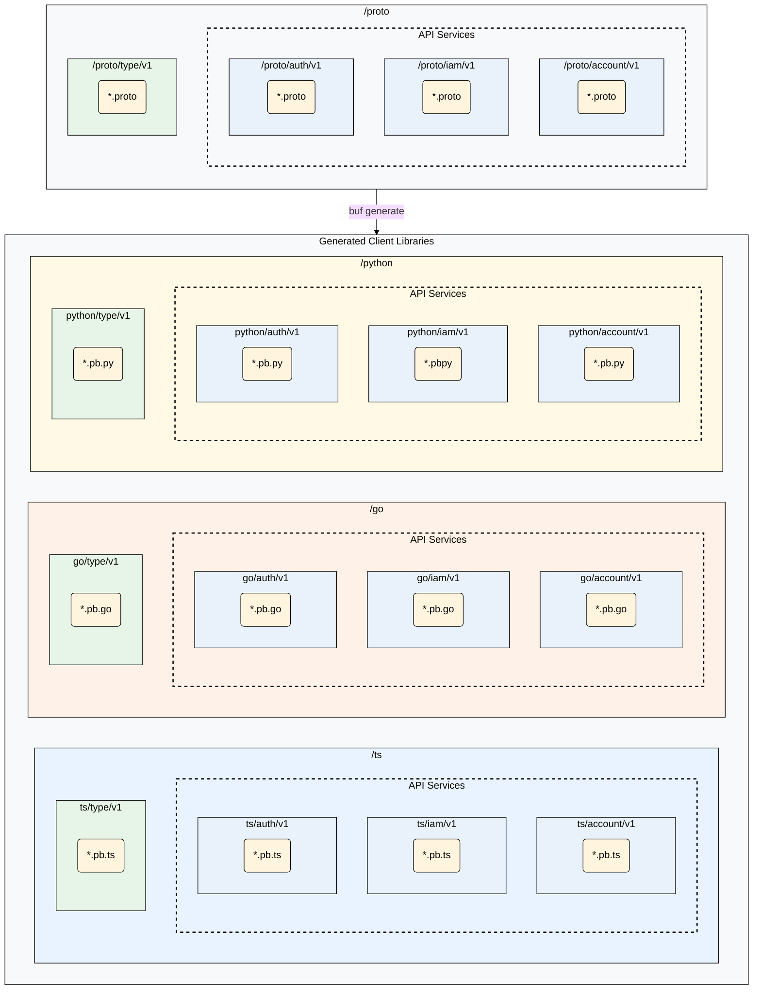

# Mesh API Monorepo

Welcome to the Mesh API monorepo - the central hub containing our API definitions and integration SDKs.

Our APIs are exposed over [gRPC](https://grpc.io/). To facilitate seamless integration we provide [API integration SDKs](#api-integration-sdks) in a number of languages that can be used to integrate with them.

The following sections cover:
1.  [API Integration SDKs](#api-integration-sdks) - *API integration SDKs in our supported languages.*
2.  [API Philosophy](#api-philosophy) - *A description of the principles behind our API design.*
3.  [Repository Structure](#repository-structure) - *An overview of this repositorys structure.*

## API Integration SDKs
Integration SDKs for our API services are available in the following languages:

* **[Go](./go/README.md)**
* **[Python](./python/README.md)**
* **[TypeScript](./ts/README.md)**

If an SDK in another language is required the protobuf API definitions in the [proto](./proto) directory of this repository can be used to generate a new integration library using a protobuf compiler with the appropriate plug-ins. (We use [buf](https://github.com/bufbuild/buf)).

## API Philosophy
* **Schema-First Design**: The [protobuf](https://github.com/protocolbuffers/protobuf) definitions in the [proto](./proto) directory are the source of truth describing our API. The types and gRPC clients in our [integration SDKs](#client-libraries-for-api-access) are generated directly from these definitions.
* **Resource-Oriented Design**: Our APIs are designed around _resource services_ - each providing methods from the following stanard verb list: Create, Get, List, Update, Delete. Services may also provide custom methods when appropriate. A full verb list with documentation can be found alongside the associated API in the proto directory.
* **Backward Compatibility**: We are committed to API stability. Following semantic versioning principles, a `v1` API is a stable contract; any breaking changes will necessitate a new major version (e.g., `v2`). These will be published in the form of another version DIRECTORY in `/proto/service/vX`.
* **Independent Modules**: Each API service and shared type collection is treated as a distinct, versionable module. This allows consumers to import only the code they need for their specific language.

## Repository Structure

The following diagram illustrates the relationship between our source protobuf files and the generated client libraries for each language:

### Directory Breakdown

#### `/proto`

This directory our [protobuf](https://github.com/protocolbuffers/protobuf) definitions. It is divided into two conceptual categories:

* **API Services** (`auth`, `iam`, `account`, etc.): These are the type and service definitions that describe our APIs. A combination of protobuf `service` and `message` definitions.
* **Shared Types** (`type`): These are the foundational "bricks"—reusable messages like `Amount` or `Decimal`—that are used across multiple API services. They never contain `service` definitions.

#### Generated Code Directories (`/go`, `/python`, `/ts`)

These directories contain the generated client libraries, each tailored to the conventions of its language ecosystem. For detailed usage, local development, and testing instructions, see the README inside each directory.

* **/go**: Contains Go modules structured as a **Go workspace**. See the **[Go README](./go/README.md)** for more information.
* **/python**: Contains Python packages managed by a central `pythonproject.toml`. See the **[Python README](./python/README.md)** for more information.
* **/ts**: Contains TypeScript/JavaScript packages managed as a monorepo. See the **[TypeScript README](./ts/README.md)** for more information.

---