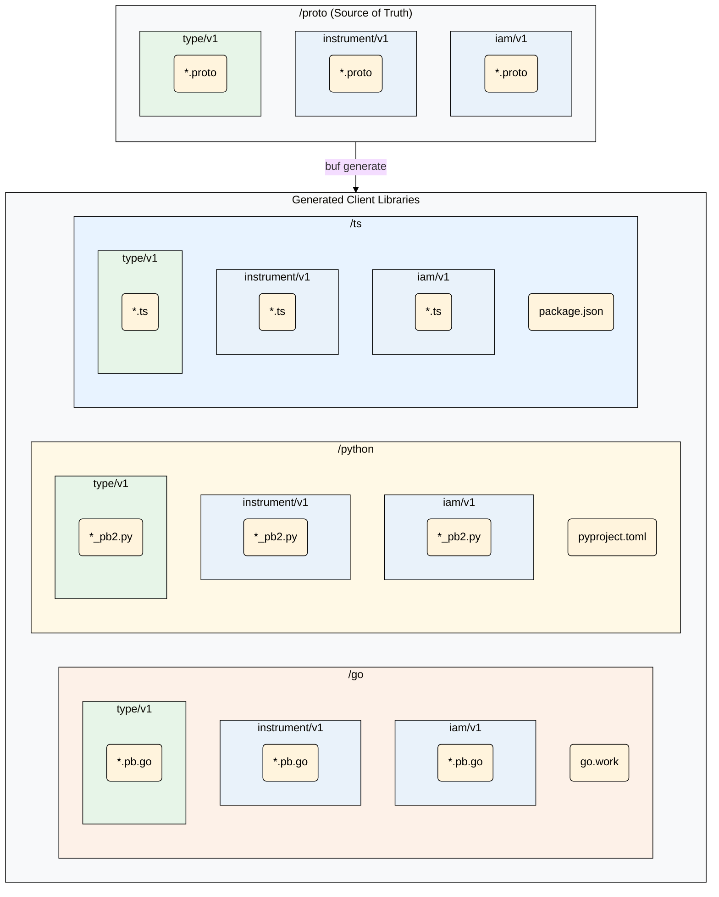

# Mesh API Monorepo

Welcome to the official source repository for Mesh's Protobuf API definitions and their corresponding generated client libraries for Go, Python, and TypeScript. This monorepo is the single source of truth for how our services communicate.

This document provides a high-level overview of the repository's structure, philosophy, and development workflow. For language-specific details, please see the README in the corresponding directory:

* **[Proto Client README](./proto/README.md)**
* **[Go Client README](./go/README.md)**
* **[Python Client README](./python/README.md)**
* **[TypeScript Client README](./ts/README.md)**

The repository is managed using the [Buf](https://buf.build) toolchain to enforce a consistent style, prevent breaking changes, and automate code generation.

## Core Philosophy

* **Schema-First Design**: The Protobuf definitions in the `/proto` directory are the source of truth. All code is generated from them.
* **Clear Separation**: A strict separation is maintained between the API definitions (`/proto`) and the language-specific generated code (`/go`, `/python`, `/ts`).
* **Independent Modules**: Each API product and shared type collection is treated as a distinct, versionable module. This allows consumers to import only the code they need for their specific language.
* **Backward Compatibility**: We enforce backward compatibility using `buf`. A `v1` API is a stable contract. Breaking changes require a new version.

## Repository Structure

The following diagram illustrates the relationship between our source Protobuf files and the generated client libraries for each language:



### Directory Breakdown

#### `/proto` (The Source of Truth)

This directory contains all our master Protobuf definitions. It is divided into two conceptual categories:

* **API Products** (`iam`, `instrument`, `legal`, etc.): These are self-contained functional domains that represent a capability of our system. They often contain `service` definitions.
* **Shared Types** (`type`): These are the foundational "bricks"—reusable messages like `Amount` or `Decimal`—that are used across multiple API products. They never contain `service` definitions.

#### Generated Code Directories (`/go`, `/python`, `/ts`)

These directories contain the generated client libraries, each tailored to the conventions of its language ecosystem. For detailed usage, local development, and testing instructions, see the README inside each directory.

* **/go**: Contains Go modules structured as a **Go workspace**. See the **[Go README](./go/README.md)** for more information.
* **/python**: Contains Python packages managed by a central `pyproject.toml`. See the **[Python README](./python/README.md)** for more information.
* **/ts**: Contains TypeScript/JavaScript packages managed as a monorepo. See the **[TypeScript README](./ts/README.md)** for more information.

---

## Consumer Guides

To use our API clients, you do not need to clone this repository. You can install them directly from their respective package managers.

### Go

For example, to get the `iam/v1` client:

```sh
go get [github.com/meshtrade/api/go/iam/v1@latest](https://github.com/meshtrade/api/go/iam/v1@latest)
```

Then, import it:

```go
import "[github.com/meshtrade/api/go/iam/v1](https://github.com/meshtrade/api/go/iam/v1)"
```

### Python

To install the `iam` client package:

```sh
pip install meshtrade-api-iam
```

Then, import it:

```python
from meshtrade.api.iam.v1 import role_pb2
```

### TypeScript

To install the `iam` client package:

```sh
npm install @meshtrade/api-iam-v1
```

Then, import it:

```typescript
import { Role } from '@meshtrade/api-iam-v1';
```

*(Note: Exact package names for Python and TS may vary based on final configuration).*

## Developer Workflow

1.  **Modify Protobuf**: Make your desired changes to the files within the `/proto` directory.
2.  **Lint & Check**: From the repository root, run `buf lint` and `buf breaking` to ensure your changes are valid and don't break compatibility.

    ```sh
    # Lint your changes
    buf lint
    
    # Check for breaking changes against the main branch
    buf breaking --against .git#branch=main
    ```

3.  **Generate Code**: Once validation passes, run `buf generate` to update the corresponding client libraries in the `/go`, `/python`, and `/ts` directories.

    ```sh
    buf generate
    ```

4.  **Commit**: Commit the changes to both the `/proto` files and the newly generated code in the same commit.