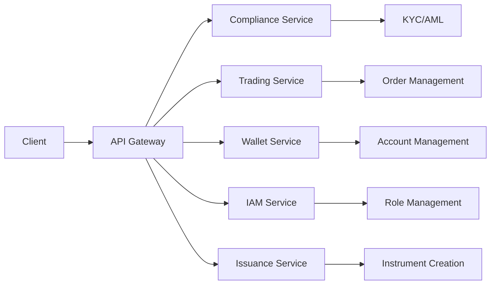

# API Overview

The Mesh API is organized around **services** that handle specific business domains.
Each service is versioned independently and provides a focused set of capabilities.

## Service Architecture



## Available Services

### 🔍 Compliance Service

**Endpoint:** `compliance.client.v1.ClientService`

Handle client onboarding, KYC processes, and regulatory compliance.

<div className="api-method api-method--post">POST</div>

**Key Methods:**

- `CreateClient` - Onboard new clients
- `GetClient` - Retrieve client information
- `UpdateClient` - Update client details
- `ListClients` - List all clients with filtering

### 📈 Trading Service

**Endpoints:**

- `trading.spot.v1.SpotService`
- `trading.limit_order.v1.LimitOrderService`
- `trading.direct_order.v1.DirectOrderService`

Execute trades and manage orders across different trading modes.

<div className="api-method api-method--post">POST</div>

**Key Methods:**

- `PlaceOrder` - Submit new trading orders
- `CancelOrder` - Cancel existing orders
- `GetOrderStatus` - Check order status
- `ListOrders` - Retrieve order history

### 💰 Wallet Service

**Endpoint:** `wallet.account.v1.AccountService`

Manage user accounts, balances, and wallet operations.

<div className="api-method api-method--get">GET</div>
<div className="api-method api-method--post">POST</div>

**Key Methods:**

- `CreateAccount` - Create new accounts
- `GetAccount` - Retrieve account details
- `GetBalance` - Check account balances
- `TransferFunds` - Move funds between accounts

### 🔐 IAM Service

**Endpoints:**

- `iam.role.v1.RoleService`
- `iam.group.v1.GroupService`

Handle authentication, authorization, and access control.

<div className="api-method api-method--get">GET</div>
<div className="api-method api-method--post">POST</div>
<div className="api-method api-method--put">PUT</div>
<div className="api-method api-method--delete">DELETE</div>

**Key Methods:**

- `CreateRole` - Define new roles
- `AssignRole` - Assign roles to users
- `CreateGroup` - Create user groups
- `ManagePermissions` - Control access rights

### 🏭 Issuance Service

**Endpoint:** `issuance_hub.instrument.v1.InstrumentService`

Create and manage financial instruments and securities.

<div className="api-method api-method--post">POST</div>

**Key Methods:**

- `CreateInstrument` - Issue new financial instruments
- `MintInstrument` - Mint additional units
- `GetInstrument` - Retrieve instrument details
- `ListInstruments` - Browse available instruments

## Request/Response Patterns

### Standard Request Format

All API requests follow a consistent pattern:

```protobuf title="Standard Request"
message GetAccountRequest {
  string account_id = 1;
  repeated string fields = 2;  // Optional field selection
  bool include_deleted = 3;    // Optional: include soft-deleted records
}
```

### Standard Response Format

Responses include the requested resource directly:

```protobuf title="Standard Response"
message Account {
  string id = 1;
  string user_id = 2;
  string currency = 3;
  meshtrade.type.v1.Decimal balance = 4;
  AccountStatus status = 5;
  google.protobuf.Timestamp created_at = 6;
  google.protobuf.Timestamp updated_at = 7;
}
```

### List Operations

List operations support pagination and filtering:

```protobuf title="List Request"
message ListAccountsRequest {
  int32 page_size = 1;          // Maximum number of results
  string page_token = 2;        // Pagination token
  string filter = 3;            // Filter expression
  string order_by = 4;          // Sort order
}

message ListAccountsResponse {
  repeated Account accounts = 1;
  string next_page_token = 2;   // Token for next page
  int32 total_count = 3;        // Total number of results
}
```

## Common Types

### Decimal Type

High-precision decimal arithmetic for financial calculations:

```protobuf title="Decimal"
message Decimal {
  string value = 1;  // String representation for precision
  int32 scale = 2;   // Number of decimal places
}
```

### Amount Type

Monetary amounts with currency information:

```protobuf title="Amount"
message Amount {
  Decimal quantity = 1;
  string currency = 2;
  string unit = 3;
}
```

### Token Type

Blockchain token representations:

```protobuf title="Token"
message Token {
  string symbol = 1;
  string name = 2;
  string contract_address = 3;
  int32 decimals = 4;
  string chain_id = 5;
}
```

## Authentication

All API calls require authentication using one of these methods:

### API Key Authentication

```bash
# Include API key in headers
curl -H "Authorization: Bearer YOUR_API_KEY" \
     -H "Content-Type: application/json" \
     https://api.mesh.dev/v1/accounts
```

### JWT Authentication

```bash
# Include JWT token in headers
curl -H "Authorization: Bearer YOUR_JWT_TOKEN" \
     -H "Content-Type: application/json" \
     https://api.mesh.dev/v1/accounts
```

## Error Handling

The API uses standard gRPC status codes:

| Code | Status            | Description                |
| ---- | ----------------- | -------------------------- |
| 0    | OK                | Success                    |
| 3    | INVALID_ARGUMENT  | Invalid request parameters |
| 5    | NOT_FOUND         | Resource not found         |
| 7    | PERMISSION_DENIED | Insufficient permissions   |
| 16   | UNAUTHENTICATED   | Authentication required    |

Example error response:

```json
{
  "error": {
    "code": 5,
    "message": "Account not found",
    "details": [
      {
        "type": "ResourceNotFound",
        "resource": "Account",
        "id": "account-123"
      }
    ]
  }
}
```

## Rate Limiting

API requests are subject to rate limiting:

- **Default Limit:** 1000 requests per minute
- **Burst Limit:** 100 requests per second
- **Headers:** Rate limit information included in response headers

```http
X-RateLimit-Limit: 1000
X-RateLimit-Remaining: 999
X-RateLimit-Reset: 1640995200
```

## Next Steps

- 🔍 **[Service Details](./services/compliance)** - Explore individual services
- 📊 **[Types Reference](./types)** - Learn about data types
- ⚠️ **[Error Handling](./errors)** - Handle API errors gracefully