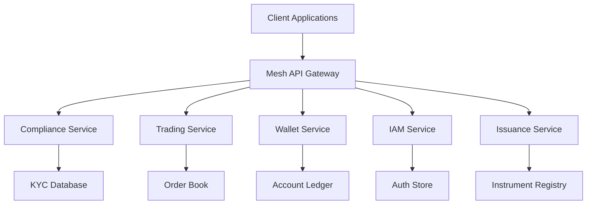

# Introduction

Welcome to the **Mesh API Documentation** - your comprehensive guide to integrating with the Mesh trading platform.

## What is Mesh API?

Mesh API is a modern, gRPC-based API that provides access to:

- **Compliance Services** - Client onboarding, KYC, and regulatory compliance
- **Trading Services** - Direct orders, limit orders, and spot trading
- **Wallet Management** - Account creation and balance management
- **Identity & Access Management** - Role-based access control
- **Issuance Hub** - Financial instrument creation and management

## Getting Started

Let's discover **Mesh API in less than 5 minutes**.

### What you'll need

- [Node.js](https://nodejs.org/en/download/) version 18.0 or above
- [Go](https://golang.org/dl/) version 1.21 or above
- [Python](https://www.python.org/downloads/) version 3.9 or above

### Authentication

All API requests require proper authentication. Get started by:

1. **Obtaining API credentials** from your Mesh account
2. **Configuring your client** with the provided credentials
3. **Making your first authenticated request**

```bash
# Install the Go SDK
go get github.com/meshtrade/api/go

# Install the Python SDK
pip install meshtrade-api

# Install the TypeScript SDK
npm install @meshtrade/api
```

## Architecture Overview



## API Design Principles

### Schema-First Development

- All APIs are defined using Protocol Buffers
- Generated client libraries ensure type safety
- Versioned APIs maintain backward compatibility

### gRPC & REST

- Primary interface is gRPC for high performance
- REST endpoints available for web clients
- Streaming support for real-time updates

### Security by Design

- Role-based access control (RBAC)
- TLS encryption for all communications
- API key and JWT authentication

## Quick Example

Here's a simple example of creating a client and fetching account information:

```go title="Go Example"
package main

import (
    "context"
    "log"

    "github.com/meshtrade/api/go/wallet/account/v1"
)

func main() {
    client, err := account.NewClient(ctx, "your-api-key")
    if err != nil {
        log.Fatal(err)
    }

    resp, err := client.GetAccount(ctx, &account.GetAccountRequest{
        AccountId: "your-account-id",
    })
    if err != nil {
        log.Fatal(err)
    }

    log.Printf("Account: %+v", resp)
}
```

```python title="Python Example"
import asyncio
from meshtrade.wallet.account.v1 import AccountServiceClient

async def main():
    client = AccountServiceClient("your-api-key")

    response = await client.get_account(
        account_id="your-account-id"
    )

    print(f"Account: {response}")

asyncio.run(main())
```

```typescript title="TypeScript Example"
import { AccountServiceClient } from '@meshtrade/api/wallet/account/v1';

async function main() {
  const client = new AccountServiceClient('your-api-key');

  const response = await client.getAccount({
    accountId: 'your-account-id',
  });

  console.log('Account:', response);
}

main();
```

## Next Steps

- 📚 **[Getting Started](./getting-started/installation)** - Set up your development environment
- 🔐 **[Authentication](./getting-started/authentication)** - Learn about API authentication
- 📖 **[API Reference](./api/overview)** - Explore all available endpoints
- 🛠️ **[SDK Documentation](./sdks/overview)** - Language-specific guides
- 💡 **[Examples](./examples/basic-usage)** - Real-world integration patterns
