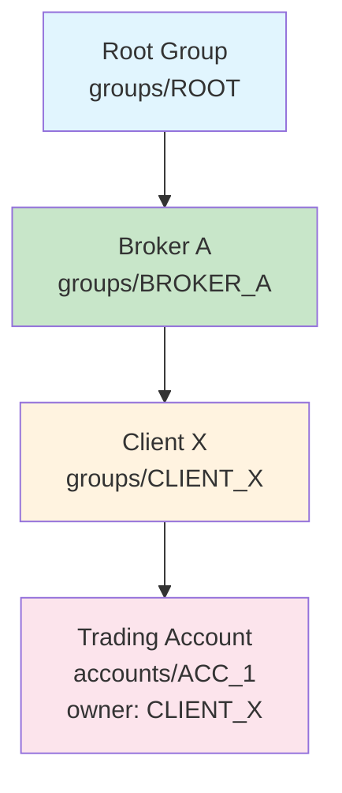
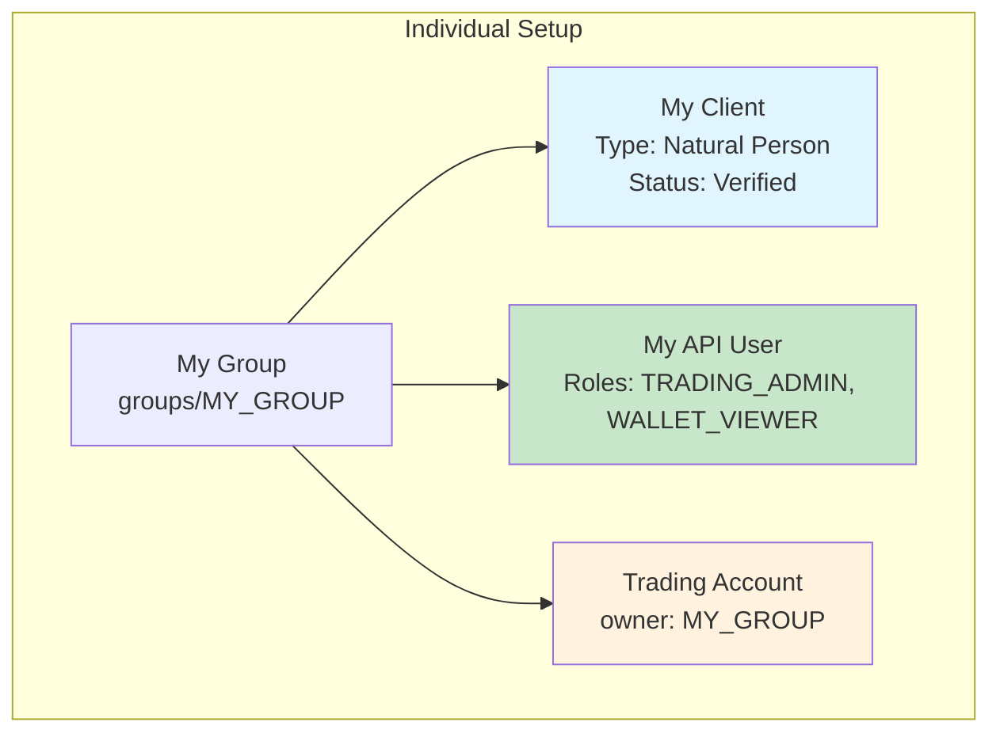
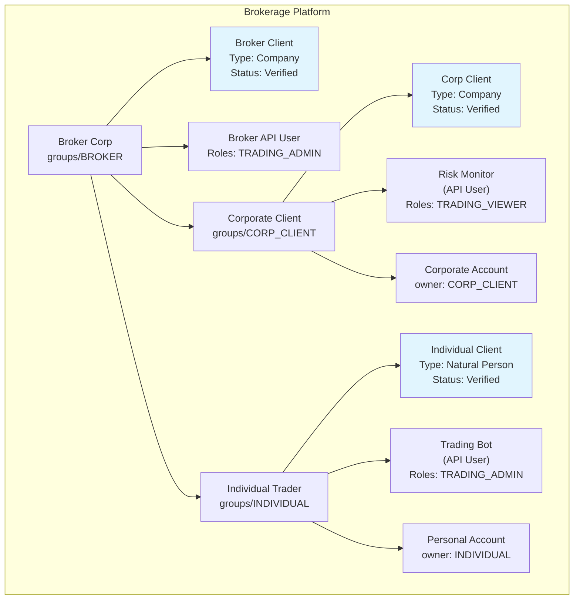

# Access Control

How authentication, authorisation, and resource access scoping work together in the Mesh API.

## Key Concepts

Four concepts form the access control model of the Mesh API:

1. **Method Options** — protobuf annotations on each RPC method declaring its type, access level, roles, and verification requirements
2. **Executing Entity** — the API User performing the API call
3. **Executing Group** — the group context in which the call is executed
4. **Resource Ownership** — the `owner` and `owners` fields on every resource

## Authentication

All authorised API methods require two headers:

```
x-api-key: {api_key}
x-group: groups/{group_ulid}
```

- **`x-api-key`** — authenticates the executing entity (API User via API key)
- **`x-group`** — specifies the group context for the operation

Public methods (`METHOD_ACCESS_LEVEL_PUBLIC`) can be called without credentials. If credentials are provided on a public method they are validated but not required.

### Security Best Practices

- Store API keys in environment variables or secret managers — never in source control
- Rotate API keys regularly and deactivate unused API users promptly
- Use environment-specific group configurations rather than hardcoded group IDs

## Method Options

Every RPC method is annotated with method options that declare its authorisation requirements. There are four dimensions:

```protobuf
import "meshtrade/option/method_options/v1/method_options.proto";

service AccountService {
  rpc CreateAccount(CreateAccountRequest) returns (Account) {
    option (meshtrade.option.method_options.v1.method_options) = {
      type: METHOD_TYPE_WRITE
      access_level: METHOD_ACCESS_LEVEL_AUTHORISED
      roles: [
        ROLE_WALLET_ADMIN,
        ROLE_WALLET_ACCOUNT_ADMIN
      ]
      verification_status: VERIFICATION_STATUS_VERIFIED
    };
  }

  rpc GetAccount(GetAccountRequest) returns (Account) {
    option (meshtrade.option.method_options.v1.method_options) = {
      type: METHOD_TYPE_READ
      access_level: METHOD_ACCESS_LEVEL_AUTHORISED
      roles: [
        ROLE_WALLET_ADMIN,
        ROLE_WALLET_VIEWER,
        ROLE_WALLET_ACCOUNT_ADMIN,
        ROLE_WALLET_ACCOUNT_VIEWER
      ]
      verification_status: VERIFICATION_STATUS_VERIFIED
    };
  }
}
```

### Method Type

Defines whether the method is a read or write operation. This determines how resource access scoping is applied:

| Type | Description | Scoping Rule |
|------|-------------|--------------|
| `METHOD_TYPE_READ` | Safe, idempotent query | Resources where executing group is anywhere in the `owners` hierarchy |
| `METHOD_TYPE_WRITE` | State-changing mutation | Only resources directly owned by the executing group (`owner`) |

### Access Level

Determines whether credentials are required:

| Level | `x-api-key` | `x-group` | Description |
|-------|-------------|-----------|-------------|
| `METHOD_ACCESS_LEVEL_PUBLIC` | Optional | Ignored | Anonymous access allowed |
| `METHOD_ACCESS_LEVEL_AUTHORISED` | Required | Required | Credentials and group context required |

### Roles

The set of roles that grant access to the method. The executing entity needs **at least one** of these roles assigned in the ownership hierarchy of the executing group.

Roles are enum values following the naming convention `ROLE_{DOMAIN}_{SCOPE}_{LEVEL}`:

- **Domain** — business area (WALLET, TRADING, IAM, COMPLIANCE, STUDIO, REPORTING)
- **Scope** — optional specific resource type (ACCOUNT, USER, GROUP, API_USER)
- **Level** — ADMIN (read + write) or VIEWER (read only)

The `roles` list on each method is the **exhaustive source of truth** for access. Only the roles explicitly listed on a method grant access to it.

### Verification Status (Optional)

When set to `VERIFICATION_STATUS_VERIFIED`, the method is only accessible if the compliance client associated with the executing API user has been verified (KYC/KYB complete). If omitted, the method is accessible regardless of verification status.

This is used to gate sensitive operations like trading and wallet management behind completed compliance verification.

## Resource Ownership

Every resource has two ownership fields:

```protobuf
message Account {
  // Direct owner — the group that created/owns this resource
  string owner = 1;   // e.g. "groups/01ABC..."

  // Ownership hierarchy — full path from root to owner
  repeated string owners = 2;  // e.g. ["groups/ROOT...", "groups/BROKER...", "groups/01ABC..."]
}
```

### Groups and Hierarchy

Groups are the fundamental organisational unit. They form tree structures through ownership — each group has exactly one parent group. Every resource (users, accounts, orders, instruments) belongs to exactly one group.



### Read vs Write Access

**Read** (METHOD_TYPE_READ): the executing group can access resources owned by itself **or any descendant group**.

**Write** (METHOD_TYPE_WRITE): the executing group can only access resources it **directly owns**.

| Executing Group | Resource Owner | READ | WRITE |
|----------------|---------------|------|-------|
| Broker A | Broker A (self) | Accessible | Accessible |
| Broker A | Client X (descendant) | Accessible | Not accessible |
| Broker A | Client Y (descendant) | Accessible | Not accessible |

## Executing Entity

API Users have a list of role strings indicating which roles they hold and in which group:

```
groups/{group_ulid}/roles/{role_enum}
```

For example, an API User with `groups/01ABC.../roles/3000000` has `ROLE_TRADING_ADMIN` in group `01ABC...`. When a method labelled with that role is called, the executing group must be that group or any group below it in the hierarchy.

:::note
Regular Users (human, via web/mobile) follow the same authorisation model as API Users — the only difference is the authentication method.
:::

## Clients and Legal Entities

Clients represent compliance-verified legal entities within the group hierarchy. Each client is owned by a group and starts a new **legal entity boundary** in the tree. A client's verification status (`VERIFIED`, `PENDING`, etc.) is what methods with `verification_status: VERIFICATION_STATUS_VERIFIED` check against.

Supported client types:

- **Natural Person** — an individual
- **Company** — a registered company
- **Fund** — an investment fund
- **Trust** — a trust structure

## Authorisation Checks

When an API request is made with `x-api-key` and `x-group` headers, the following checks are performed:

1. **Method lookup** — retrieve method options (type, access level, roles, verification status) for the called method
2. **Group resolution** — fetch the executing group specified in `x-group`
3. **Entity identification** — the API key is used to retrieve the associated API User
4. **Role check** — verify the API User has at least one of the method's required roles, assigned in any group in the executing group's ownership hierarchy
5. **Verification check** — if the method requires `VERIFICATION_STATUS_VERIFIED`, confirm the API User's associated compliance client is verified
6. **Resource scoping** — filter resources based on method type:
   - **READ**: resources where the executing group appears anywhere in the `owners` hierarchy
   - **WRITE**: only resources where `owner` equals the executing group

## Example Scenarios

### Basic: Individual Trader

A single individual with one group, one client, one API User, and one account:



The API User authenticates with `x-api-key` and `x-group: groups/MY_GROUP`. Since it has `TRADING_ADMIN` and `WALLET_VIEWER` roles in `MY_GROUP`, it can call any method that lists those roles, and can read and write resources owned by `MY_GROUP`.

### Brokerage: Multi-Tenant Hierarchy

A brokerage platform with a broker, a corporate client, and an individual client. Each top-level group has a client entity that defines a **legal entity boundary**:



Each client entity starts a new legal entity boundary. The Corporate Client and Individual Client entities are both ultimately owned by the Broker Corp group hierarchy, but each defines its own compliance boundary.

**Access scenarios:**

| API User | Method | Can access | Cannot access | Why |
|----------|--------|-----------|--------------|-----|
| Broker API User | ListAccounts (READ) | Corporate Account, Personal Account | — | Descendant group resources visible on READ |
| Broker API User | UpdateAccount (WRITE) | — | Corporate Account, Personal Account | WRITE limited to direct owner group |
| Risk Monitor | GetAccount (READ) | Corporate Account | Personal Account | READ scoped to own group + descendants only |
| Trading Bot | CreateOrder (WRITE) | Create in INDIVIDUAL | Create in CORP_CLIENT | WRITE limited to direct owner group |

## Related Documentation

- **[Service Structure](../service-structure)** — how Mesh APIs are organised and common method patterns
- **[SDK Configuration](../sdk-configuration)** — configuring SDK clients for authentication and connectivity
- **[API Reference](/docs/api-reference/)** — complete API documentation for all services
