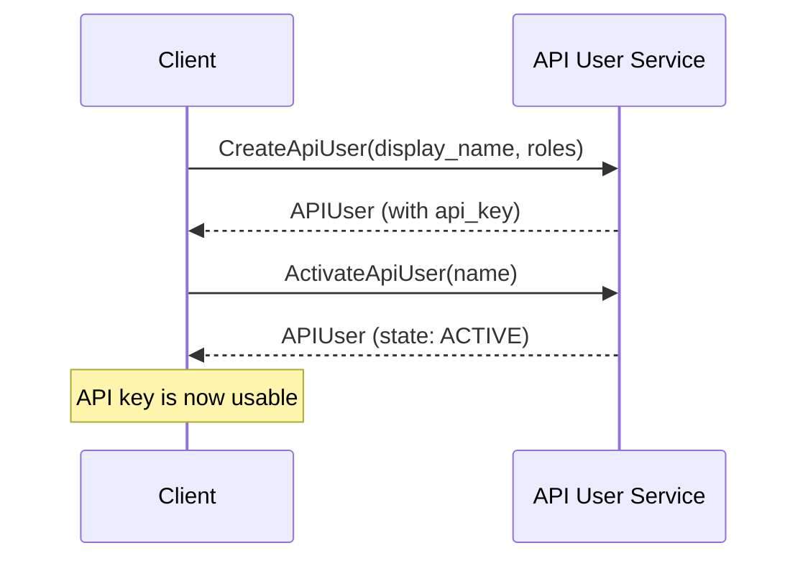

# API User v1 Service

#### Skip The Details?
- 👉 Jump to **[Package Types](/docs/api-reference/iam/api_user/v1/type/index_meshdoc)**
- 👉 Jump to **[Service Methods](/docs/api-reference/iam/api_user/v1/service/index_meshdoc)**

{/*
Generated by protoc-gen-meshdoc the first time.
-> This file can be edited manually to add information about the API User v2 Service.

THIS COMMENT AND EVERYTHING ABOVE IT IS AUTOGENERATED
*/}

## Overview

The API User Service manages API user lifecycle and authentication credentials.
API users represent automated clients that can authenticate with API keys and perform operations within a specific group context.

API users enable programmatic access to the Mesh API through API key authentication. Each API user:
- Has a unique identifier and display name
- Belongs to a specific group for resource isolation  
- Has role-based permissions for authorization
- Can be activated or deactivated for access control
- Generates a unique API key for authentication

## Quick Start

1. **Create an API user** with the required roles for your use case
2. **Activate the API user** to enable API key authentication
3. **Use the API key** in your application with the appropriate group context

## Common Workflows

### Creating and Activating an API User



### Using API Key for Authentication

Once you have an active API user, include these headers in your requests:

```
Authorization: Bearer {api_key}
x-group: groups/{group_ulid}
```

Official SDKs described in this documentation do this automatically.