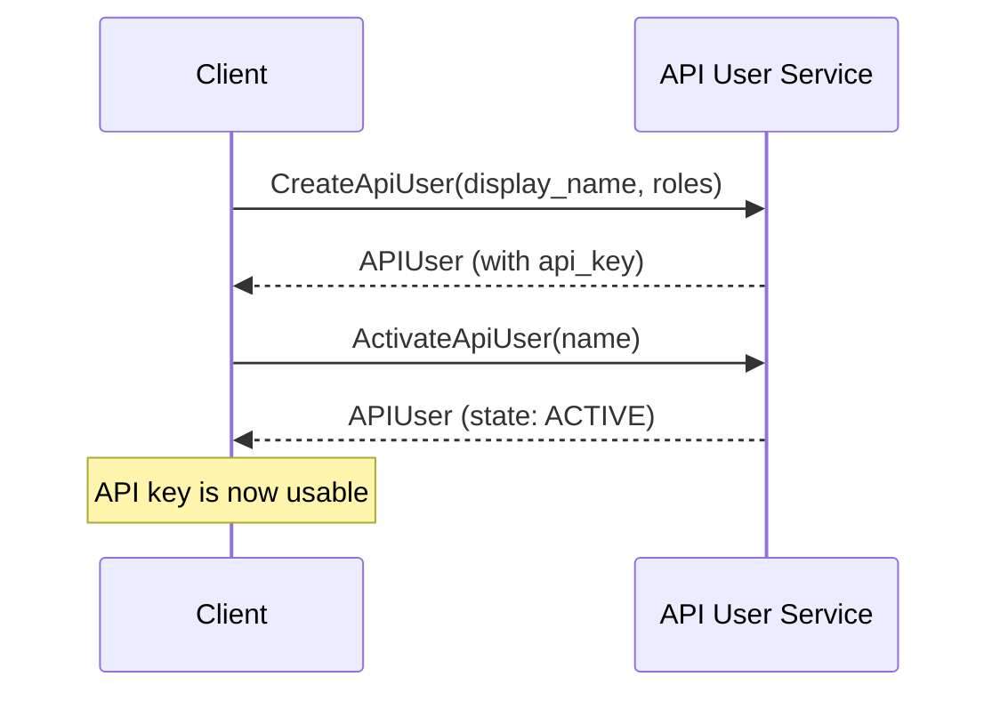

# API User Service v1

The API User Service manages API user lifecycle and authentication credentials. API users represent automated clients that can authenticate with API keys and perform operations within a specific group context.

## Overview

API users enable programmatic access to the Mesh API through API key authentication. Each API user:

- Has a unique identifier and display name
- Belongs to a specific group for resource isolation  
- Has role-based permissions for authorization
- Can be activated or deactivated for access control

## Quick Start

1. **Create an API user** with the required roles for your use case
2. **Activate the API user** to enable API key authentication
3. **Use the API key** in your application with the appropriate group context

## Service Documentation

- **[Types Reference](./types)** - Message definitions and data structures
- **[Service Methods](./service/)** - Complete API method documentation with examples

## Common Workflows

### Creating and Activating an API User



### Using API Key for Authentication

Once you have an active API user, include these headers in your requests:

```
Authorization: Bearer {api_key}
x-group-id: {group_id}
```

## Authorization Requirements

All operations require IAM domain permissions and operate within the authenticated group context:

- **Read Operations** - Require `ROLE_IAM_ADMIN` or `ROLE_IAM_VIEWER`
- **Write Operations** - Require `ROLE_IAM_ADMIN`

## Code Examples

View complete working examples:

- **[Go Examples](./examples/go/)** - Using the Go SDK with functional options
- **[Python Examples](./examples/python/)** - Using the Python SDK with wrapper clients
