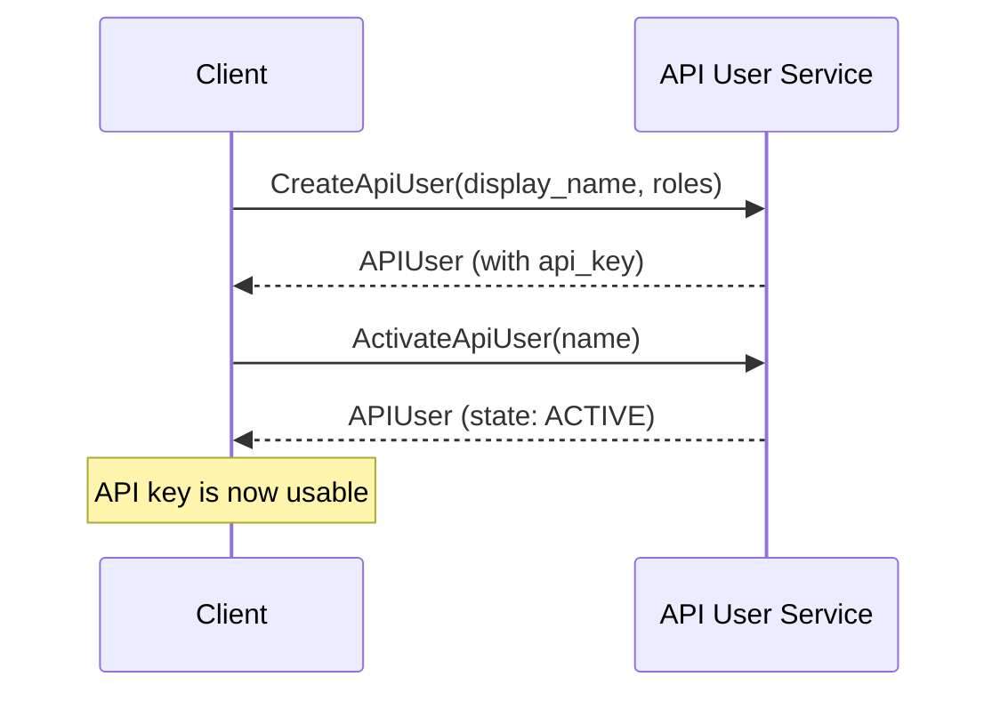

# Service Methods

Complete documentation for all API User Service methods with working code examples.

import serviceData from '../service.generated.json';

## Service Overview

**{serviceData.service.name}**

{serviceData.service.description}

**Authentication:** {serviceData.service.authentication_required ? 'Required' : 'Not required'}  
**Group Context:** {serviceData.service.group_context_required ? 'Required' : 'Not required'}

## Available Methods

### Standard Verbs

| Method | Description | Authorization |
|--------|-------------|---------------|
| **[CreateApiUser](./create-api-user)** | Creates a new API user with specified roles | ROLE_IAM_ADMIN |
| **[GetApiUser](./get-api-user)** | Retrieves a single API user by identifier | ROLE_IAM_ADMIN, ROLE_IAM_VIEWER |
| **[ListApiUsers](./list-api-users)** | Lists all API users in the group | ROLE_IAM_ADMIN, ROLE_IAM_VIEWER |
| **[SearchApiUsers](./search-api-users)** | Searches API users by display name | ROLE_IAM_ADMIN, ROLE_IAM_VIEWER |

### Custom Verbs

| Method | Description | Authorization |
|--------|-------------|---------------|
| **[ActivateApiUser](./activate-api-user)** | Activates an API user for authentication | ROLE_IAM_ADMIN |
| **[DeactivateApiUser](./deactivate-api-user)** | Deactivates an API user | ROLE_IAM_ADMIN |
| **[GetApiUserByKeyHash](./get-api-user-by-key-hash)** | Retrieves API user by key hash | ROLE_IAM_ADMIN, ROLE_IAM_VIEWER |

## Common Workflows

### Creating and Activating an API User



### Using API Key for Authentication

Once you have an active API user, include these headers in your requests:

```
Authorization: Bearer {api_key}
x-group: groups/{group_ulid}
```

## Code Examples

All methods include complete working examples:

- **[Go Examples](../examples/go/)** - Using the Go SDK with functional options
- **[Python Examples](../examples/python/)** - Using protobuf classes with manual gRPC setup
