# API Authentication

## Purpose
Defines authentication methods and group context for secure API access.

## Core Concept

API authentication in Mesh uses a dual-header approach that combines user identification with organizational context. This creates secure, multi-tenant access where users can operate within different organizational contexts while maintaining consistent authorization patterns.

**Authentication Architecture:**
- **User Identity**: API keys identify and authenticate users
- **Organizational Context**: Group headers specify execution context
- **Authorization Integration**: Works with role-based access control and resource ownership

## Key Implementation Points
- **Dual-Header Authentication**: API key for identity, group header for context
- **Multi-Tenant Security**: Group context enforces organizational boundaries
- **Role Activation**: Group header activates user's role assignments
- **Resource Ownership**: Group-based filtering of accessible resources
- **Token Lifecycle**: Support for secure key rotation and management

## Essential Example

A trading API client demonstrates authentication workflow:

- **API Key**: `x-api-key: api_key_abc123` identifies the user
- **Group Context**: `x-group: groups/TRADING_DESK_A` specifies execution context
- **Role Activation**: User's TRADING_ADMIN role becomes active for desk operations
- **Resource Access**: Can access resources owned by TRADING_DESK_A and descendants

The system validates credentials, checks group membership, verifies method permissions, then applies ownership filtering.

## Authentication Flow

The complete authentication flow combines credential validation with authorization checks:

```mermaid
sequenceDiagram
    participant Client
    participant API Gateway
    participant Auth Service
    participant Resource Service

    Client->>API Gateway: Request with x-api-key & x-group headers
    API Gateway->>Auth Service: Validate credentials

    Auth Service->>Auth Service: 1. Verify API key validity
    Auth Service->>Auth Service: 2. Check user has role in specified group
    Auth Service->>Auth Service: 3. Verify role grants method access

    Auth Service->>API Gateway: ✅ Authentication successful
    API Gateway->>Resource Service: Execute with group context

    Resource Service->>Resource Service: Apply ownership filters based on method type
    Resource Service->>API Gateway: Return accessible resources
    API Gateway->>Client: Response with filtered data
```

**Authentication Steps:**
1. **Credential Validation**: Verify API key is valid and active
2. **Group Membership**: Confirm user has role assignments in specified group
3. **Method Authorization**: Check if user's roles grant access to the requested method
4. **Resource Filtering**: Apply group-based ownership rules to returned data

## Integration

API authentication integrates with other architecture components:

- [Resource Hierarchy](./resource-hierarchy) - How group context controls resource access through ownership hierarchy
- [Method Permissions](./method-permissions) - How API key authentication activates role-based method access
- [Legal Entity Boundaries](./legal-entities) - How group context respects legal entity boundaries

## API Reference
[IAM API User Service API Reference](/docs/api-reference/iam/api_user/v1) - Complete API documentation for creating and managing API users