# Client Structuring

Understanding how clients define legal entity boundaries within Mesh's hierarchical group structure and control role assignments for users and API integrations.

## Overview

Clients in Mesh serve as **legal entity boundaries** that define where one legal entity ends and another begins within the hierarchical group structure. Each client represents a distinct legal entity (individual, company, fund, or trust) that has undergone compliance verification and establishes the scope of role assignments for users and API users operating within that entity's organizational structure.

**The Three-Layer Architecture:**
- **Groups** ([Group Ownership](./group-ownership)): Control resource ownership and access hierarchy
- **Clients** (this document): Define legal entity boundaries and available role types
- **Roles** ([Role-Based Access](./role-based-access)): Control method-level API access permissions

## What are Clients?

Clients are compliance-verified legal entities that exist within the group hierarchy and define organizational boundaries for user role assignments. Each client represents a single legal entity that can operate independently and maintain its own compliance status, user base, and operational scope.

**Key Characteristics:**
- **Legal Entity Representation**: Each client corresponds to a real-world legal entity (person, corporation, fund, trust)
- **Group Ownership**: Every client is owned by exactly one group, establishing its position in the hierarchy
- **Role Boundary Definition**: Clients determine which role types can be assigned to users/API users in groups under that client
- **Compliance Verification**: Clients maintain verification status and audit trail for regulatory compliance
- **Multi-Tenancy**: Clients provide legal entity isolation within the broader group hierarchy

## Client-Group Integration

Clients integrate seamlessly with the group ownership hierarchy to create comprehensive organizational structures where legal entities can exist at any level of the hierarchy.

### Legal Entity Positioning

```mermaid
graph TD
    subgraph "Legal Entity Boundaries in Group Hierarchy"
        RootGroup["🏢 Root Group
        groups/ROOT"]

        BrokerGroup["🏦 Broker Corporation
        groups/BROKER_CORP"]
        BrokerClient["🏛️ Broker Legal Entity
        clients/BROKER_ENTITY
        📋 Type: Company
        📋 Roles: [TRADING_ADMIN, IAM_ADMIN, COMPLIANCE_ADMIN]"]

        FundGroup["💼 Investment Fund
        groups/INVESTMENT_FUND"]
        FundClient["📊 Fund Legal Entity
        clients/FUND_ENTITY
        📋 Type: Fund
        📋 Roles: [TRADING_ADMIN, TRADING_VIEWER, REPORTING_ADMIN]"]

        IndividualGroup["👤 Individual Client
        groups/INDIVIDUAL"]
        IndividualClient["👤 Person Legal Entity
        clients/PERSON_ENTITY
        📋 Type: Natural Person
        📋 Roles: [TRADING_VIEWER, WALLET_ADMIN]"]

        UserA["👤 Fund Manager (Regular User)
        users/FUND_MANAGER"]
        UserB["🔑 Trading Bot (API User)
        api_users/TRADING_BOT"]

        AccountA["💰 Fund Trading Account
        accounts/FUND_ACCOUNT"]

        RootGroup --> BrokerGroup
        BrokerGroup --> BrokerClient
        BrokerGroup --> FundGroup
        FundGroup --> FundClient
        FundGroup --> IndividualGroup
        IndividualGroup --> IndividualClient

        FundGroup --> UserA
        FundGroup --> UserB
        FundGroup --> AccountA
    end
```



**Legal Entity Boundaries:**
- **Broker Corporation**: Legal entity at the broker level with administrative roles
- **Investment Fund**: Separate legal entity with trading and reporting capabilities
- **Individual Client**: Personal legal entity with limited trading permissions

### Universal User System

Both regular users and API users operate within the same client-defined role boundaries:

**Regular Users**: Access Mesh through web interfaces, mobile apps, desktop applications
**API Users**: Access Mesh through programmatic API integration
**Unified Authorization**: Both user types receive identical role assignments and follow the same client-defined role boundaries

## Legal Entity Types

Mesh supports four primary legal entity types, each with specific compliance and operational characteristics:

### Natural Person
Individual human beings who undergo KYC (Know Your Customer) verification.

**Use Cases:**
- Individual retail traders
- High-net-worth individuals
- Personal investment accounts
- Family office principals

### Company
Corporate entities including corporations, LLCs, partnerships, and other business structures.

**Use Cases:**
- Trading firms and broker-dealers
- Investment management companies
- Corporate treasury operations
- Business-to-business integrations

### Fund
Investment vehicles including hedge funds, mutual funds, ETFs, and other pooled investment structures.

**Use Cases:**
- Hedge fund management
- Mutual fund operations
- ETF creation and management
- Institutional investment vehicles

### Trust
Trust entities including family trusts, charitable trusts, and other fiduciary structures.

**Use Cases:**
- Estate planning structures
- Charitable foundations
- Family wealth management
- Fiduciary relationships

## Hierarchy Structure Examples

The following examples demonstrate how clients define legal entity boundaries in organizational structures of varying complexity.

### Individual Client Structure

A simple structure where an individual person operates as a single legal entity.

```mermaid
graph TD
    subgraph "Individual Client Structure"
        MeshRoot["🏢 Mesh Platform
        groups/MESH_ROOT"]

        IndividualGroup["👤 John Smith Group
        groups/JOHN_SMITH"]
        IndividualClient["👤 John Smith (Legal Entity)
        clients/JOHN_SMITH_ENTITY
        📋 Type: Natural Person
        📋 Roles: [TRADING_ADMIN, WALLET_ADMIN]
        📋 Status: Verified"]

        RegularUser["👤 John Smith (Regular User)
        users/JOHN_SMITH_USER
        📋 Auth: Username/Password
        📋 Assigned Roles: [TRADING_ADMIN]"]

        APIUser["🔑 Personal Trading Bot (API User)
        api_users/JOHN_BOT
        📋 Auth: API Key
        📋 Assigned Roles: [TRADING_ADMIN]"]

        TradingAccount["💰 Personal Trading Account
        accounts/JOHN_TRADING
        owner: groups/JOHN_SMITH"]

        BuyOrder["📊 Stock Purchase Order
        orders/BUY_AAPL_001
        owner: groups/JOHN_SMITH
        💡 Created by: Regular User via Web App"]

        MeshRoot --> IndividualGroup
        IndividualGroup --> IndividualClient
        IndividualGroup --> RegularUser
        IndividualGroup --> APIUser
        IndividualGroup --> TradingAccount
        IndividualGroup --> BuyOrder
    end
```



**Key Characteristics:**
- **Single Legal Entity**: John Smith as a natural person
- **Group Ownership**: All resources owned by John's group
- **Role Constraints**: Users can only receive roles defined in client (TRADING_ADMIN, WALLET_ADMIN)
- **Unified Access**: Both regular and API users operate with same permissions within the legal entity boundary

### Corporate Client Structure

A medium-complexity structure with a corporation and multiple departments.

```mermaid
graph TD
    subgraph "Corporate Client Structure"
        MeshRoot["🏢 Mesh Platform
        groups/MESH_ROOT"]

        CorpGroup["🏢 TechCorp Inc
        groups/TECHCORP"]
        CorpClient["🏛️ TechCorp Legal Entity
        clients/TECHCORP_ENTITY
        📋 Type: Company
        📋 Roles: [TRADING_ADMIN, TRADING_VIEWER, WALLET_ADMIN, IAM_ADMIN]
        📋 Status: Verified"]

        TreasuryGroup["💼 Treasury Department
        groups/TREASURY_DEPT"]
        ITGroup["💻 IT Department
        groups/IT_DEPT"]

        TreasuryManager["👤 Treasury Manager (Regular User)
        users/TREASURY_MGR
        📋 Auth: SSO/SAML
        📋 Assigned Roles: [TRADING_ADMIN, WALLET_ADMIN]"]

        TreasuryBot["🔑 Treasury Automation (API User)
        api_users/TREASURY_BOT
        📋 Auth: API Key
        📋 Assigned Roles: [TRADING_VIEWER]"]

        ITAdmin["👤 IT Administrator (Regular User)
        users/IT_ADMIN
        📋 Auth: Active Directory
        📋 Assigned Roles: [IAM_ADMIN]"]

        CorporateAccount["💰 Corporate Treasury Account
        accounts/CORP_TREASURY
        owner: groups/TECHCORP"]

        DeptAccount["💰 Treasury Operations Account
        accounts/TREASURY_OPS
        owner: groups/TREASURY_DEPT"]

        MeshRoot --> CorpGroup
        CorpGroup --> CorpClient
        CorpGroup --> TreasuryGroup
        CorpGroup --> ITGroup
        TreasuryGroup --> TreasuryManager
        TreasuryGroup --> TreasuryBot
        ITGroup --> ITAdmin
        CorpGroup --> CorporateAccount
        TreasuryGroup --> DeptAccount
    end
```



**Key Characteristics:**
- **Single Legal Entity**: TechCorp Inc as a company
- **Departmental Structure**: Multiple groups within the corporate legal entity
- **Role Specialization**: Different users receive different roles based on function
- **Hierarchical Resource Access**: Corporate-level and department-level resources

### Fund Management Structure

A complex structure with multiple legal entities in a hierarchical relationship.

```mermaid
graph TD
    subgraph "Fund Management Structure"
        MeshRoot["🏢 Mesh Platform
        groups/MESH_ROOT"]

        ManagementGroup["🏛️ Goldman Asset Management
        groups/GOLDMAN_MGMT"]
        ManagementClient["🏢 Goldman Management Entity
        clients/GOLDMAN_MGMT_ENTITY
        📋 Type: Company
        📋 Roles: [IAM_ADMIN, COMPLIANCE_ADMIN, REPORTING_ADMIN]
        📋 Status: Verified"]

        AlphaFundGroup["💼 Alpha Hedge Fund LP
        groups/ALPHA_FUND"]
        AlphaFundClient["📊 Alpha Fund Legal Entity
        clients/ALPHA_FUND_ENTITY
        📋 Type: Fund
        📋 Roles: [TRADING_ADMIN, TRADING_VIEWER, REPORTING_VIEWER]
        📋 Status: Verified"]

        BetaFundGroup["💼 Beta Real Estate Fund
        groups/BETA_FUND"]
        BetaFundClient["🏢 Beta Fund Legal Entity
        clients/BETA_FUND_ENTITY
        📋 Type: Fund
        📋 Roles: [TRADING_VIEWER, WALLET_ADMIN, REPORTING_VIEWER]
        📋 Status: Verified"]

        InvestorGroup["👤 HNW Investor
        groups/HNW_INVESTOR"]
        InvestorClient["👤 Investor Legal Entity
        clients/INVESTOR_ENTITY
        📋 Type: Natural Person
        📋 Roles: [TRADING_VIEWER, WALLET_VIEWER, REPORTING_VIEWER]
        📋 Status: Verified"]

        FundManager["👤 Portfolio Manager (Regular User)
        users/PORTFOLIO_MGR
        📋 Auth: Smart Card + PIN
        📋 Assigned Roles: [TRADING_ADMIN]"]

        RiskSystem["🔑 Risk Management System (API User)
        api_users/RISK_SYSTEM
        📋 Auth: API Key
        📋 Assigned Roles: [TRADING_VIEWER, REPORTING_VIEWER]"]

        ComplianceOfficer["👤 Compliance Officer (Regular User)
        users/COMPLIANCE_OFFICER
        📋 Auth: Multi-Factor Auth
        📋 Assigned Roles: [COMPLIANCE_ADMIN, REPORTING_ADMIN]"]

        InvestorPortal["👤 Investor (Regular User)
        users/INVESTOR_USER
        📋 Auth: Mobile App + Biometric
        📋 Assigned Roles: [TRADING_VIEWER, WALLET_VIEWER]"]

        AlphaAccount["💰 Alpha Fund Master Account
        accounts/ALPHA_MASTER
        owner: groups/ALPHA_FUND"]

        BetaAccount["💰 Beta Fund Property Account
        accounts/BETA_PROPERTY
        owner: groups/BETA_FUND"]

        InvestorAccount["💰 Investor Subscription Account
        accounts/INVESTOR_SUBSCRIPTION
        owner: groups/HNW_INVESTOR"]

        MeshRoot --> ManagementGroup
        ManagementGroup --> ManagementClient
        ManagementGroup --> AlphaFundGroup
        ManagementGroup --> BetaFundGroup
        ManagementGroup --> InvestorGroup

        AlphaFundGroup --> AlphaFundClient
        BetaFundGroup --> BetaFundClient
        InvestorGroup --> InvestorClient

        ManagementGroup --> ComplianceOfficer
        AlphaFundGroup --> FundManager
        AlphaFundGroup --> RiskSystem
        InvestorGroup --> InvestorPortal

        AlphaFundGroup --> AlphaAccount
        BetaFundGroup --> BetaAccount
        InvestorGroup --> InvestorAccount
    end
```



**Key Characteristics:**
- **Multiple Legal Entities**: Management company, two funds, and individual investor
- **Distinct Role Boundaries**: Each client defines different available roles
- **Compliance Segregation**: Separate legal entities with independent verification status
- **Hierarchical Legal Structure**: Investment manager owns funds, funds have individual investors

## Client Role Assignment Architecture

Clients control role availability through their `roles` field, which defines the comprehensive set of role types that can be assigned to users and API users within that client's organizational structure.

### Role Definition Mechanism

The Client protobuf includes a critical `roles` field that establishes role boundaries:

```protobuf
/*
   A list of the role types that meshtrade.iam.user.v1.User and meshtrade.iam.api_user.v1.User instances may be assigned
   in groups within this client structure.

   NOTE: a viewer role at a domain e.g. IAM_VIEWER allows viewer roles in ALL sub domain roles e.g. IAM_GROUP_VIEWER
   NOTE: an admin role at a domain e.g. IAM_ADMIN allows viewer at that domain i.e. IAM_VIEWER, AND
         admin and viewer roles in ALL sub domain roles e.g., IAM_GROUP_ADMIN and IAM_GROUP_VIEWER
*/
repeated meshtrade.iam.role.v1.Role roles = 12;
```

**This field serves as the authorization boundary** - users and API users in groups under this client can only be assigned roles that are explicitly listed in the client's `roles` array.

### Role Inheritance Rules

The system implements sophisticated role inheritance to simplify administration:

#### Domain-Level Roles

**Viewer Domain Inheritance:**
- Assigning `ROLE_IAM_VIEWER` to a client automatically allows assignment of:
  - `ROLE_IAM_GROUP_VIEWER`
  - `ROLE_IAM_USER_VIEWER`
  - `ROLE_IAM_API_USER_VIEWER`
  - Any other IAM sub-domain viewer roles

**Admin Domain Inheritance:**
- Assigning `ROLE_IAM_ADMIN` to a client automatically allows assignment of:
  - `ROLE_IAM_VIEWER` (admin includes viewer at domain level)
  - `ROLE_IAM_GROUP_ADMIN` and `ROLE_IAM_GROUP_VIEWER`
  - `ROLE_IAM_USER_ADMIN` and `ROLE_IAM_USER_VIEWER`
  - `ROLE_IAM_API_USER_ADMIN` and `ROLE_IAM_API_USER_VIEWER`
  - All other IAM sub-domain admin and viewer roles

```mermaid
graph TD
    subgraph "Role Inheritance Model"
        ClientRoles["🏛️ Client Defined Roles
        roles: [TRADING_ADMIN, IAM_VIEWER, WALLET_ADMIN]"]

        subgraph "Automatically Available Roles"
            TradingAdmin["👤 ROLE_TRADING_ADMIN
            ✅ Explicitly Defined"]
            TradingViewer["👁️ ROLE_TRADING_VIEWER
            ✅ Admin includes Viewer"]

            IAMViewer["👁️ ROLE_IAM_VIEWER
            ✅ Explicitly Defined"]
            IAMGroupViewer["👁️ ROLE_IAM_GROUP_VIEWER
            ✅ Domain Viewer allows Sub-domain Viewer"]
            IAMUserViewer["👁️ ROLE_IAM_USER_VIEWER
            ✅ Domain Viewer allows Sub-domain Viewer"]

            WalletAdmin["👤 ROLE_WALLET_ADMIN
            ✅ Explicitly Defined"]
            WalletViewer["👁️ ROLE_WALLET_VIEWER
            ✅ Admin includes Viewer"]
            WalletAccountAdmin["👤 ROLE_WALLET_ACCOUNT_ADMIN
            ✅ Domain Admin allows Sub-domain Admin"]
            WalletAccountViewer["👁️ ROLE_WALLET_ACCOUNT_VIEWER
            ✅ Domain Admin allows Sub-domain Viewer"]
        end

        subgraph "Blocked Roles"
            ComplianceAdmin["❌ ROLE_COMPLIANCE_ADMIN
            Not in Client Roles"]
            ComplianceViewer["❌ ROLE_COMPLIANCE_VIEWER
            Not in Client Roles"]
        end

        ClientRoles --> TradingAdmin
        ClientRoles --> IAMViewer
        ClientRoles --> WalletAdmin

        TradingAdmin -.-> TradingViewer
        IAMViewer -.-> IAMGroupViewer
        IAMViewer -.-> IAMUserViewer
        WalletAdmin -.-> WalletViewer
        WalletAdmin -.-> WalletAccountAdmin
        WalletAdmin -.-> WalletAccountViewer
    end
```



### Three-Layer Authorization Flow

Client role boundaries integrate with group ownership and role-based access control to create comprehensive authorization:

```mermaid
sequenceDiagram
    participant User as User/API User
    participant Gateway as API Gateway
    participant AuthService as Authorization Service
    participant GroupService as Group Service
    participant ResourceService as Resource Service

    User->>Gateway: API Request with x-api-key + x-group headers
    Gateway->>AuthService: Validate request

    AuthService->>AuthService: 1. Verify API key validity
    AuthService->>AuthService: 2. Lookup user's group assignments
    AuthService->>AuthService: 3. Find client in group's ownership chain
    AuthService->>AuthService: 4. Check requested role against client.roles
    AuthService->>AuthService: 5. Apply role inheritance rules
    AuthService->>AuthService: 6. Verify role grants method access

    Note over AuthService: ✅ All role checks passed

    AuthService->>GroupService: Get group hierarchy context
    GroupService->>ResourceService: Apply ownership filters
    ResourceService->>ResourceService: 7. Filter resources based on method type
    ResourceService->>ResourceService: 8. Return only accessible resources

    ResourceService->>User: Authorized response
```



**Authorization Validation Steps:**

1. **API Key Validation**: Verify user credentials and active status
2. **Group Membership**: Confirm user has assignment in requested group
3. **Client Role Boundary Check**: Verify requested role exists in client's `roles` array (with inheritance)
4. **Method Authorization**: Confirm user's role grants access to the specific RPC method
5. **Resource Ownership Filter**: Apply group-based ownership rules based on method type (READ vs WRITE)

### Role Assignment Examples

#### Individual Client Role Assignment


#### Corporate Client Role Assignment

```mermaid
graph LR
    subgraph "Corporate Client: TechCorp"
        TechCorpClient["🏢 TechCorp Client
        clients/TECHCORP_ENTITY
        📋 roles: [TRADING_ADMIN, IAM_ADMIN, WALLET_ADMIN]"]

        TechCorpGroup["🏢 TechCorp Group
        groups/TECHCORP"]
        TreasuryGroup["💼 Treasury Dept
        groups/TREASURY"]

        TreasuryUser["👤 Treasury Manager
        users/TREASURY_MGR
        📋 Assigned: [TRADING_ADMIN, WALLET_ADMIN]
        ✅ Valid: Both explicitly in client roles"]

        ITUser["👤 IT Admin
        users/IT_ADMIN
        📋 Assigned: [IAM_GROUP_ADMIN]
        ✅ Valid: IAM_ADMIN allows IAM_GROUP_ADMIN"]

        TechCorpGroup --> TechCorpClient
        TechCorpGroup --> TreasuryGroup
        TreasuryGroup --> TreasuryUser
        TechCorpGroup --> ITUser
    end
```



### Implementation Best Practices

**Client Role Planning:**
- **Principle of Least Privilege**: Only assign minimum necessary roles to client
- **Domain-Level Assignment**: Use domain roles (e.g., `IAM_ADMIN`) rather than specific sub-domain roles for flexibility
- **Future-Proofing**: Consider organizational growth and role expansion needs
- **Compliance Requirements**: Ensure role assignments meet regulatory separation requirements

**Role Assignment Workflow:**
1. **Client Creation**: Define comprehensive role set during client setup
2. **User Onboarding**: Assign specific roles from available client roles based on job function
3. **Role Auditing**: Regularly review assigned roles against client role boundaries
4. **Role Updates**: Modify client roles only with appropriate authorization and change management

## Integration with Mesh Architecture

Client structuring works seamlessly with Mesh's other architectural components to provide comprehensive organizational control:

### Group Ownership Integration
Clients exist within the group ownership hierarchy, with each client owned by exactly one group. The group ownership system controls resource access (READ vs WRITE permissions), while clients control role availability within that ownership structure.

**Key Integration Points:**
- Client creation requires appropriate permissions in the owning group
- Users and API users inherit resource access based on group hierarchy
- Legal entity boundaries defined by clients respect group ownership rules

### Role-Based Access Control Integration
Client role boundaries work with the RBAC system to control method-level API access. Clients define the available role types, while RBAC determines which methods those roles can access.

**Authorization Flow Integration:**
- Client role validation occurs before method-level role checking
- Role inheritance rules apply consistently across client boundaries
- Method access patterns remain consistent regardless of client structure

### Compliance and Verification
Client verification status provides the compliance foundation for the entire organizational structure. Each client maintains independent verification status, creating clear regulatory boundaries.

**Compliance Benefits:**
- Separate KYC/KYB verification for each legal entity
- Independent compliance status and audit trails
- Regulatory segregation between different client entities
- Clear legal entity identification for reporting requirements

## Related Documentation

### Core Architecture Components
- **[Group Ownership Structure](./group-ownership)** - Understanding the hierarchical resource ownership system that provides the foundation for client positioning
- **[Role-Based Access Control](./role-based-access)** - Understanding the role system that clients control and how method-level permissions work

### API Reference Documentation
- **[Compliance Client Service API Reference](/docs/api-reference/compliance/client/v1)** - Complete API documentation for client management operations and legal entity types
- **[IAM Group Service API Reference](/docs/api-reference/iam/group/v1)** - Complete API documentation for group management operations that own clients
- **[IAM API User Service Reference](/docs/api-reference/iam/api_user/v1)** - Complete API documentation for managing API users and role assignments within client boundaries

### Implementation Guides
- **[Authentication](./authentication)** - API key and group context authentication mechanisms that work with client role boundaries
- **[Service Structure](./service-structure)** - Understanding API organization and method patterns that clients control access to
