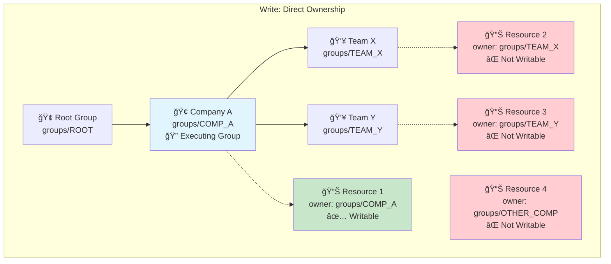

# Group Ownership Structure

Understanding how groups provide hierarchical ownership and multi-tenancy boundaries for all resources in the Mesh API.

## What are Groups?

Groups are the fundamental organizational and ownership units in Mesh. Every resource in the system (API users, accounts, orders, instruments, etc.) belongs to exactly one group. Groups themselves can own other groups, forming hierarchical tree structures that model real-world organizational relationships.

**Key Characteristics:**
- **Resource Ownership**: Every entity in the system has an owner group
- **Hierarchical Structure**: Groups can own sub-groups, creating tree structures
- **Multi-tenancy Boundaries**: Groups provide complete isolation between organizations
- **Permission Inheritance**: Access rights flow down the hierarchy

## Group Hierarchy Model

Groups form tree structures with sophisticated ownership tracking:

### Ownership Fields

Each group (and every other resource) maintains two ownership fields:

- **`owner`** (Direct Owner): The immediate parent group that directly owns this resource
- **`owners`** (Ownership Path): An ordered array containing the complete ownership chain from root to immediate parent

### Hierarchical Benefits

This denormalized structure provides:
- **Efficient Access Queries**: Find all resources accessible to a group with simple array membership checks
- **Permission Inheritance**: Resources inherit access permissions from all ancestors
- **Organizational Modeling**: Mirror real-world company structures and business units

## Everything is Owned

Every resource in Mesh has an owner group. This includes everything from clients, users and API users through to accounts, financial instruments and different trade types.

```mermaid
graph TD
    subgraph "Universal Ownership Model"
        Root["🏢 Root Organization<br/>groups/01ROOT...ABC"]
        
        CompanyA["🏢 Company A<br/>groups/01COMP...DEF"]
        CompanyB["🏢 Company B<br/>groups/01COMP...GHI"]
        
        TeamAlpha["👥 Team Alpha<br/>groups/01TEAM...JKL"]
        TeamBeta["👥 Team Beta<br/>groups/01TEAM...MNO"]
        
        ApiUser1["🔑 API User 1<br/>api_users/01API...PQR"]
        ApiUser2["🔑 API User 2<br/>api_users/01API...STU"]
        
        Account1["💰 Trading Account<br/>accounts/01ACC...VWX"]
        Account2["💰 Settlement Account<br/>accounts/01ACC...YZA"]
        
        Order1["📊 Limit Order<br/>orders/01ORD...BCD"]
        Order2["📊 Market Order<br/>orders/01ORD...EFG"]
        
        Instrument1["🏦 Bond Instrument<br/>instruments/01INS...HIJ"]
        
        Root --> CompanyA
        Root --> CompanyB
        
        CompanyA --> TeamAlpha
        CompanyA --> TeamBeta
        
        TeamAlpha --> ApiUser1
        TeamBeta --> ApiUser2
        
        TeamAlpha --> Account1
        TeamBeta --> Account2
        
        Account1 --> Order1
        Account2 --> Order2
        
        CompanyA --> Instrument1
    end
```

## Access Control: Hierarchical vs Direct Ownership

The Mesh API enforces different access patterns based on method type:

### Reading Methods (METHOD_TYPE_READ)

**Rule**: Can access resources owned by your executing group OR any descendant groups in the hierarchy.

**Implementation**: Uses the `owners` array to check if the executing group appears anywhere in the ownership path.

```mermaid
graph TD
    subgraph "Read: Hierarchical Scope"
        Root["🢠Root Group<br/>groups/ROOT"]
        CompanyA["🢠Company A<br/>groups/COMP_A<br/>🔠Executing Group"]
        TeamX["👥 Team X<br/>groups/TEAM_X"]
        TeamY["👥 Team Y<br/>groups/TEAM_Y"]
        
        Res1["📊 Resource 1<br/>owners: [ROOT, COMP_A]<br/>✅ Accessible"]
        Res2["📊 Resource 2<br/>owners: [ROOT, COMP_A, TEAM_X]<br/>✅ Accessible"]
        Res3["📊 Resource 3<br/>owners: [ROOT, COMP_A, TEAM_Y]<br/>✅ Accessible"]
        Res4["📊 Resource 4<br/>owners: [ROOT, OTHER_COMP]<br/>⌠Not Accessible"]
        
        Root --> CompanyA
        CompanyA --> TeamX
        CompanyA --> TeamY
        
        CompanyA -.-> Res1
        TeamX -.-> Res2
        TeamY -.-> Res3
        
        style CompanyA fill:#e1f5fe
        style Res1 fill:#c8e6c9
        style Res2 fill:#c8e6c9
        style Res3 fill:#c8e6c9
        style Res4 fill:#ffcdd2
    end
```

**Example**: If *executing* as Company A **Group**, you can read:
- Resources directly owned by Company A
- Resources owned by the Team X group (descendant)
- Resources owned by the Team Y group (descendant)
- But NOT resources owned by other company groups

### Writing Methods (METHOD_TYPE_WRITE)

**Rule**: Can only access resources directly owned by your **executing group**.

**Implementation**: Uses the `owner` field to check exact ownership match with executing group.

**Example**: If executing as Company A, you can write:
- Only resources directly owned by Company A
- NOT resources owned by Team X or Team Y (even though they're descendants)
- NOT resources owned by other companies

## Integration with Role-Based Access Control

Groups work in conjunction with the role-based access control system:

### Authentication Flow

### Role Assignment and Group Context

**API Credentials Structure:**
- **API Key**: Identifies the user
- **Group Context Header** (`x-group`): Specifies which group the operation executes within
- **Role Assignment**: User must have appropriate role assigned within the specified group

**Access Requirements:**
1. **Valid API Key**: Must be active and not expired
2. **Group Access**: User must have role assignment in the specified group
3. **Method Permissions**: User's role must include access to the specific API method
4. **Resource Ownership**: Resource must pass ownership filter based on method type

### Role-Based Method Access

**Permission Model:**
- **Admin Roles** (`*_ADMIN`): Full read and write access to domain operations
- **Viewer Roles** (`*_VIEWER`): Read-only access for monitoring and auditing
- **Domain Separation**: Roles are scoped to specific business domains (IAM, Trading, Compliance, etc.)

### Example: Complete Access Check

For a `CreateGroup` operation:

1. **Authentication**: Validate API key and extract user identity
2. **Group Context**: Verify `x-group` header specifies valid group
3. **Role Check**: User must have `ROLE_IAM_ADMIN` or `ROLE_IAM_GROUP_ADMIN` in specified group
4. **Method Authorization**: `CreateGroup` requires write method permissions
5. **Ownership Validation**: New group's owner must match executing group (direct ownership rule)
6. **Hierarchy Update**: System automatically maintains `owners` array for new group

## Practical Examples

### Multi-Tenant Trading Platform

**Access Scenarios:**

**Broker A executing ListAccounts (READ method):**
- ✅ Can see Account A1-Main (descendant: CLIENT_A1)
- ✅ Can see Account A2-Trading (descendant: CLIENT_A2)  
- ❌ Cannot see Account B1-Settlement (different broker)

**Client A1 executing CreateOrder (WRITE method):**
- ✅ Can create orders owned by CLIENT_A1
- ❌ Cannot create orders owned by CLIENT_A2 (not direct ownership)
- ❌ Cannot create orders owned by BROKER_A (not direct ownership)

**Broker A Admin executing UpdateAccount (WRITE method):**
- ❌ Cannot update Account A1-Main (owned by CLIENT_A1, not BROKER_A)
- ✅ Can update groups directly owned by BROKER_A
- ❌ Cannot update Account B1-Settlement (different broker)

## Security Implications

### Isolation Guarantees

- **Complete Tenant Separation**: Resources in one group hierarchy cannot access resources in another
- **Inheritance Control**: Parent groups gain read access to descendant resources but not write access
- **Permission Boundaries**: Role assignments are scoped to specific groups

## Related Documentation

- **[Role-Based Access Control](./role-based-access)** - Understanding the role system that works with groups
- **[Authentication](./authentication)** - API key and group context authentication
- **[Group Service API Reference](/docs/api-reference/iam/group/v1)** - Complete API documentation for group management operations