# Legal Entity Boundaries

## Purpose
Defines legal entity boundaries within the hierarchical group structure and controls role assignments.

## Core Concept
Clients serve as legal entity boundaries that define where one legal entity ends and another begins within the group hierarchy. Each client represents a distinct legal entity that has undergone compliance verification and establishes the scope of role assignments for users and API users within that entity's organizational structure.

## Key Implementation Points
- **Legal Entity Representation**: Each client corresponds to a real-world legal entity
- **Group Integration**: Clients exist within the group ownership hierarchy
- **Role Boundary Control**: Clients define available role types for users
- **Compliance Verification**: Clients maintain verification status and audit trails
- **Multi-tenancy Isolation**: Legal entity separation within group hierarchy

## Essential Example

A fund management structure demonstrates legal entity boundaries:

- **Management Company**: Corporate legal entity with administrative roles
- **Investment Fund**: Separate fund legal entity with trading capabilities
- **Individual Investor**: Personal legal entity with limited permissions

Each entity maintains independent compliance verification while operating within the same organizational hierarchy.

### Legal Entity Positioning

```mermaid
graph TD
    BrokerGroup["🏦 Broker Corp
    groups/BROKER"]
    BrokerClient["🏛️ Broker Entity
    Type: Company
    Roles: [TRADING_ADMIN, IAM_ADMIN]"]

    FundGroup["💼 Investment Fund
    groups/FUND"]
    FundClient["📊 Fund Entity
    Type: Fund
    Roles: [TRADING_ADMIN, REPORTING_ADMIN]"]

    IndividualGroup["👤 Individual
    groups/PERSON"]
    IndividualClient["👤 Person Entity
    Type: Natural Person
    Roles: [TRADING_VIEWER]"]

    UserA["👤 Fund Manager"]
    AccountA["💰 Fund Account"]

    BrokerGroup --> BrokerClient
    BrokerGroup --> FundGroup
    FundGroup --> FundClient
    FundGroup --> IndividualGroup
    IndividualGroup --> IndividualClient
    FundGroup --> UserA
    FundGroup --> AccountA

    style BrokerGroup fill:#e1f5fe
    style FundGroup fill:#c8e6c9
    style IndividualGroup fill:#fff3e0
    style BrokerClient fill:#f3e5f5
    style FundClient fill:#e8f5e8
    style IndividualClient fill:#fce4ec
```

### Legal Entity Types

**Natural Person**: Individual humans undergoing KYC verification

**Company**: Corporate entities including corporations, LLCs, partnerships

**Fund**: Investment vehicles including hedge funds, mutual funds, ETFs

**Trust**: Trust entities including family trusts, charitable foundations

### Client Role Assignment

Clients control role availability through their `roles` field, which defines the comprehensive set of role types that can be assigned to users within that client's structure.

```mermaid
graph TD
    ManagementGroup["🏛️ Asset Management
    groups/MGMT"]
    ManagementClient["🏢 Management Entity
    Type: Company"]

    AlphaFundGroup["💼 Hedge Fund
    groups/FUND"]
    AlphaFundClient["📊 Fund Entity
    Type: Fund"]

    InvestorGroup["👤 Investor
    groups/INVESTOR"]
    InvestorClient["👤 Investor Entity
    Type: Natural Person"]

    ManagementGroup --> ManagementClient
    ManagementGroup --> AlphaFundGroup
    ManagementGroup --> InvestorGroup
    AlphaFundGroup --> AlphaFundClient
    InvestorGroup --> InvestorClient

    style ManagementGroup fill:#e1f5fe
    style AlphaFundGroup fill:#c8e6c9
    style InvestorGroup fill:#fff3e0
    style ManagementClient fill:#f3e5f5
    style AlphaFundClient fill:#e8f5e8
    style InvestorClient fill:#fce4ec
```

## Integration

Client legal entity boundaries integrate with other architecture components:

- [Resource Hierarchy](./resource-hierarchy) - Group ownership hierarchy containing clients
- [Method Permissions](./method-permissions) - Role system controlled by client boundaries
- [API Access](./api-access) - Authentication with client context

## API Reference
[Compliance Client Service API Reference](/docs/api-reference/compliance/client/v1) - Complete API documentation for client management and legal entity operations
