# Role-Based Access Control

## Purpose
Defines method-level access control through business domain roles within the Mesh API's hierarchical group ownership system.

## Core Concept

Role-Based Access Control (RBAC) in Mesh operates as a **two-layer security model** where roles define **what operations** users can perform, while groups define **which resources** they can access. This creates a comprehensive authorization system that combines business-level permissions with organizational hierarchy constraints.

**The Dual Authorization Model:**
- **Roles** (this document): Control method-level access to API operations
- **Groups** ([Resource Hierarchy](./resource-hierarchy)): Control resource-level access through ownership hierarchy

Our guiding principle is using the **Protobuf schema as the single source of truth** for all authorization rules, ensuring our security model is self-documenting, automatically verifiable, and always in sync with the API contract.

## Key Implementation Points
- **Enum-Based Design**: Roles are simple enum constants, not complex permission objects
- **Method-Level Grants**: API methods declare which roles can access them via protobuf annotations
- **Domain-Scoped**: Roles are organized by business domains (Trading, Wallet, IAM, etc.)
- **Business-Aligned**: Role names reflect actual business functions and responsibilities
- **Universal User System**: Same permissions apply to regular users and API users

## Essential Example

A trading desk structure demonstrates role-based access control:

- **Trading Admin**: Full trading operations including order management and risk controls
- **Trading Viewer**: Read-only access to trading data for analysis and compliance
- **IAM Admin**: User and permission management within the organization
- **Wallet Viewer**: Account balance and transaction monitoring capabilities

Roles work by **method-level declaration** - each RPC method explicitly declares which role enum values can access it in its protobuf definition.

## Role Hierarchy by Business Domain

The Mesh API organizes roles into six core business domains, each with a consistent permission structure:

```mermaid
graph TD
    subgraph "Business Domain Roles"
        subgraph "Wallet Domain"
            WalletAdmin["👤 ROLE_WALLET_ADMIN
            Full wallet operations"]
            WalletViewer["👁️ ROLE_WALLET_VIEWER
            Read-only wallet access"]
            WalletAccAdmin["👤 ROLE_WALLET_ACCOUNT_ADMIN
            Account management"]
            WalletAccViewer["👁️ ROLE_WALLET_ACCOUNT_VIEWER
            Account read access"]
        end

        subgraph "Trading Domain"
            TradingAdmin["👤 ROLE_TRADING_ADMIN
            Full trading operations"]
            TradingViewer["👁️ ROLE_TRADING_VIEWER
            Trading data access"]
        end

        subgraph "IAM Domain"
            IAMAdmin["👤 ROLE_IAM_ADMIN
            Identity management"]
            IAMViewer["👁️ ROLE_IAM_VIEWER
            Identity read access"]
            IAMUserAdmin["👤 ROLE_IAM_USER_ADMIN
            User management"]
            IAMUserViewer["👁️ ROLE_IAM_USER_VIEWER
            User read access"]
            IAMGroupAdmin["👤 ROLE_IAM_GROUP_ADMIN
            Group management"]
            IAMGroupViewer["👁️ ROLE_IAM_GROUP_VIEWER
            Group read access"]
            IAMAPIAdmin["👤 ROLE_IAM_API_USER_ADMIN
            API user management"]
            IAMAPIViewer["👁️ ROLE_IAM_API_USER_VIEWER
            API user read access"]
        end

        subgraph "Compliance Domain"
            CompAdmin["👤 ROLE_COMPLIANCE_ADMIN
            Compliance operations"]
            CompViewer["👁️ ROLE_COMPLIANCE_VIEWER
            Compliance read access"]
        end

        subgraph "Issuance Hub Domain"
            IssuanceAdmin["👤 ROLE_STUDIO_ADMIN
            Asset issuance"]
            IssuanceViewer["👁️ ROLE_STUDIO_VIEWER
            Issuance read access"]
        end

        subgraph "Reporting Domain"
            ReportingAdmin["👤 ROLE_REPORTING_ADMIN
            Report generation"]
            ReportingViewer["👁️ ROLE_REPORTING_VIEWER
            Report access"]
        end
    end
```

<div style={{textAlign: 'center'}}>



</div>

### Role Naming Convention

All roles follow a consistent pattern: `ROLE_{DOMAIN}_{SCOPE}_{ACCESS_LEVEL}`

- **Domain**: Business area (WALLET, TRADING, IAM, COMPLIANCE, ISSUANCE_HUB, REPORTING)
- **Scope**: Specific resource type (optional - e.g., ACCOUNT, USER, GROUP, API_USER)
- **Access Level**: Permission tier (ADMIN, VIEWER)

### Domain Role Structure

**Wallet Domain:**
- **General**: `ROLE_WALLET_ADMIN` 👤, `ROLE_WALLET_VIEWER` 👁️
- **Specialized**: `ROLE_WALLET_ACCOUNT_ADMIN` 👤, `ROLE_WALLET_ACCOUNT_VIEWER` 👁️

**Trading Domain:**
- **General**: `ROLE_TRADING_ADMIN` 👤, `ROLE_TRADING_VIEWER` 👁️
- **Specialized**: *(Future expansion planned)*

**IAM Domain:**
- **General**: `ROLE_IAM_ADMIN` 👤, `ROLE_IAM_VIEWER` 👁️
- **Specialized**:
  - User Management: `ROLE_IAM_USER_ADMIN` 👤, `ROLE_IAM_USER_VIEWER` 👁️
  - Group Management: `ROLE_IAM_GROUP_ADMIN` 👤, `ROLE_IAM_GROUP_VIEWER` 👁️
  - API User Management: `ROLE_IAM_API_USER_ADMIN` 👤, `ROLE_IAM_API_USER_VIEWER` 👁️

**Compliance Domain:**
- **General**: `ROLE_COMPLIANCE_ADMIN` 👤, `ROLE_COMPLIANCE_VIEWER` 👁️
- **Specialized**: *(Future expansion planned)*

**Issuance Hub Domain:**
- **General**: `ROLE_STUDIO_ADMIN` 👤, `ROLE_STUDIO_VIEWER` 👁️
- **Specialized**: *(Future expansion planned)*

**Reporting Domain:**
- **General**: `ROLE_REPORTING_ADMIN` 👤, `ROLE_REPORTING_VIEWER` 👁️
- **Specialized**: *(Future expansion planned)*

## Permission Levels: Admin vs Viewer

Each domain implements a two-tier permission model that aligns with common organizational needs:

### Admin Roles (`*_ADMIN`)

**Capabilities:**
- **Full Read Access**: All GET, LIST, SEARCH operations within domain
- **Full Write Access**: All CREATE, UPDATE, DELETE operations within domain
- **Resource Management**: Lifecycle operations for domain resources
- **Configuration Control**: Modify settings and parameters

**Use Cases:**
- Service administrators and operators
- Domain experts managing resources
- Automation systems requiring full control

### Viewer Roles (`*_VIEWER`)

**Capabilities:**
- **Read-Only Access**: GET, LIST, SEARCH operations only
- **Monitoring and Auditing**: Access for compliance and oversight
- **Reporting and Analytics**: Data access for analysis
- **No Modification Rights**: Cannot CREATE, UPDATE, or DELETE

**Use Cases:**
- Auditors and compliance officers
- Analysts and reporting systems
- Monitoring and observability tools
- Junior staff requiring supervised access

## Integration

Role-based access control integrates with other architecture components:

- [Resource Hierarchy](./resource-hierarchy) - Resource ownership and hierarchy system that works with roles
- [Legal Entity Boundaries](./legal-entities) - How clients define role boundaries within organizational structures
- [API Access](./api-access) - Authentication mechanisms and group context headers

## Method-Level Role Declaration

Each API method explicitly declares which roles can access it using protobuf annotations:

### Single Role Access

```protobuf
rpc CreateAccount(CreateAccountRequest) returns (Account) {
  option (meshtrade.option.v1.method_type) = METHOD_TYPE_WRITE;
  option (meshtrade.iam.role.v1.roles) = {
    roles: [ROLE_WALLET_ADMIN]
  };
}
```

### Multiple Role Access (Admin + Specialized)

```protobuf
rpc CreateAccount(CreateAccountRequest) returns (Account) {
  option (meshtrade.option.v1.method_type) = METHOD_TYPE_WRITE;
  option (meshtrade.iam.role.v1.roles) = {
    roles: [
      ROLE_WALLET_ADMIN,
      ROLE_WALLET_ACCOUNT_ADMIN
    ]
  };
}
```

### Read Access (Admin + Viewer)

```protobuf
rpc GetLimitOrder(GetLimitOrderRequest) returns (LimitOrder) {
  option (meshtrade.option.v1.method_type) = METHOD_TYPE_READ;
  option (meshtrade.iam.role.v1.roles) = {
    roles: [
      ROLE_TRADING_ADMIN,
      ROLE_TRADING_VIEWER
    ]
  };
}
```

## Real-World Authorization Example

For detailed authorization scenarios showing complete access patterns across multiple user types and organizational levels, see [Resource Hierarchy: Practical Examples](./resource-hierarchy#practical-examples).

**Example Overview:**
- Team leads with broad admin roles across domains
- Individual traders with domain-specific permissions
- Analysts with read-only access to trading data
- Both regular users (web/mobile access) and API users (programmatic access) with identical permissions

## Role Assignment and Management

### API User Role Configuration

API Users receive role assignments within specific groups, creating the foundation for the authorization system:

<div style={{textAlign: 'center'}}>


</div>

**Key Principles:**
- **Per-Group Assignment**: Same user can have different roles in different groups
- **Context Switching**: User specifies execution group via `x-group` header
- **Principle of Least Privilege**: Assign minimal roles necessary for function
- **Scope Isolation**: Roles in one group don't grant access to other groups

### Best Practices for Role Assignment

**Organizational Alignment:**
- **Map to Job Functions**: Assign roles that match actual responsibilities
- **Consider Hierarchy**: Senior roles often need broader access across domains
- **Separate Concerns**: Don't grant admin roles when viewer access suffices

**Security Considerations:**
- **Regular Auditing**: Review and validate role assignments periodically
- **Cross-Training**: Multiple people should have critical admin roles
- **Automation Accounts**: Service accounts should have minimal required roles

## API Reference
[IAM API User Service API Reference](/docs/api-reference/iam/api_user/v1) - Complete API documentation for managing API users and role assignments