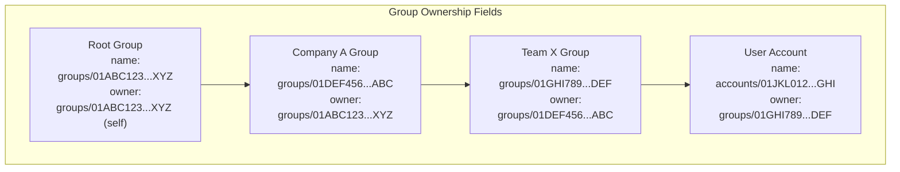
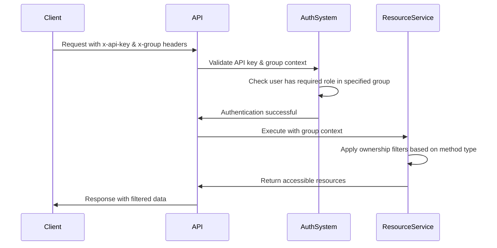

# Group Ownership Structure

## What are Groups?

Groups are the fundamental organizational and ownership units in Mesh.
They provide hierarchical ownership and multi-tenancy boundaries for all resources.
Every resource in the system (API users, accounts, orders, instruments, etc.) belongs to exactly one group.
Groups themselves can own other groups, forming hierarchical tree structures that
model real-world organizational relationships.

**Key Characteristics:**
- **Resource Ownership**: Every entity in the system has an owner group
- **Hierarchical Structure**: Groups can own sub-groups, creating tree structures
- **Multi-tenancy Boundaries**: Groups provide complete isolation between organizations
- **Permission Inheritance**: Access rights flow down the hierarchy

## Universal User System: API Users & Regular Users

**Important**: While this documentation focuses on "API users" due to its technical API context, the **exact same ownership and permission system applies to regular users** who access Mesh through web interfaces, mobile apps, and other user-facing applications.

### Unified Authorization Model

**Both user types follow identical patterns:**
- **Regular Users**: Authenticate via username/password, OAuth providers (Google, Microsoft, etc.), or SSO systems
- **API Users**: Authenticate via API keys for programmatic access
- **Same Permissions**: Both receive identical role assignments within groups
- **Same Ownership**: Both are subject to the same hierarchical ownership rules
- **Same Access Control**: Both follow the same READ/WRITE method restrictions

### Digital Infrastructure Structuring

This system enables organizations to structure their **complete digital infrastructure** around groups:

**Enterprise Use Cases:**
- **Employee Access**: Regular users logging into web dashboards with group-based permissions
- **System Integration**: API users enabling automated workflows and integrations  
- **Unified Management**: Single ownership hierarchy governing both human and system access
- **Consistent Security**: Same authorization model across all access methods

**Example: Trading Firm Structure**
- **Executives**: Regular users with broad read access across all groups via web interface
- **Traders**: Regular users with trading permissions in specific desk groups via mobile/web apps
- **Risk Systems**: API users with read-only access for automated monitoring and reporting
- **Order Management**: API users with trading permissions for algorithmic execution

Throughout the examples below, we reference "API users" for technical precision, but understand that **regular users would appear in identical organizational positions** with the same role assignments and access patterns.

## Group Hierarchy Model

Groups form tree structures with sophisticated ownership tracking:

### Ownership Model

Each group (and every other resource) maintains ownership relationships:

- **`owner`** (Direct Owner): The immediate parent group that directly owns this resource
- **Hierarchical Path**: The system internally maintains the complete ownership chain from root to immediate parent for efficient access control

### Hierarchical Benefits

The system's internal hierarchical tracking provides:
- **Efficient Access Queries**: Find all resources accessible to a group through optimized ancestry checks
- **Permission Inheritance**: Resources inherit access permissions from all ancestors
- **Organizational Modeling**: Mirror real-world company structures and business units

## Everything is Owned

Every resource in Mesh has an owner group. This includes everything from clients, regular users, and API users through to accounts, financial instruments and different trade types.

```mermaid
graph TD
    subgraph "Universal Ownership Model"
        Root["🏢 Root Organization
groups/01ROOT...ABC"]
        
        CompanyA["🏢 Company A
groups/01COMP...DEF"]
        CompanyB["🏢 Company B
groups/01COMP...GHI"]
        
        TeamAlpha["👥 Team Alpha
groups/01TEAM...JKL"]
        TeamBeta["👥 Team Beta
groups/01TEAM...MNO"]
        
        RegUser1["👤 Regular User 1
users/01USER...ABC
Auth: Username/Password"]
        ApiUser1["🔑 API User 1
api_users/01API...PQR
Auth: API Key"]
        
        RegUser2["👤 Regular User 2
users/01USER...DEF
Auth: Google OAuth"]
        ApiUser2["🔑 API User 2
api_users/01API...STU
Auth: API Key"]
        
        Account1["💰 Trading Account
accounts/01ACC...VWX"]
        Account2["💰 Settlement Account
accounts/01ACC...YZA"]
        
        Order1["📊 Limit Order
orders/01ORD...BCD
Created by: Regular User"]
        Order2["📊 Market Order
orders/01ORD...EFG
Created by: API User"]
        
        Instrument1["🏦 Bond Instrument
instruments/01INS...HIJ"]
        
        Root --> CompanyA
        Root --> CompanyB
        
        CompanyA --> TeamAlpha
        CompanyA --> TeamBeta
        
        TeamAlpha --> RegUser1
        TeamAlpha --> ApiUser1
        TeamBeta --> RegUser2
        TeamBeta --> ApiUser2
        
        TeamAlpha --> Account1
        TeamBeta --> Account2
        
        Account1 --> Order1
        Account2 --> Order2
        
        CompanyA --> Instrument1
    end
```

## Access Control: Hierarchical vs Direct Ownership

The Mesh API enforces different access patterns based on method type:

### Reading Methods (METHOD_TYPE_READ)

**Rule**: Can access resources owned by your executing group OR any descendant groups in the hierarchy.

**Implementation**: The system internally maintains hierarchical relationships to determine access based on group ancestry.

```mermaid
graph TD
    subgraph "Read: Hierarchical Scope"
        Root["🏢 Root Group
groups/ROOT"]
        CompanyA["🏢 Company A
groups/COMP_A
🔍 Executing Group"]
        TeamX["👥 Team X
groups/TEAM_X"]
        TeamY["👥 Team Y
groups/TEAM_Y"]

        Res1["📊 Resource 1
owner: COMP_A
✅ Accessible"]
        Res2["📊 Resource 2
owner: TEAM_X
✅ Accessible"]
        Res3["📊 Resource 3
owner: TEAM_Y
✅ Accessible"]
        Res4["📊 Resource 4
owner: OTHER_COMP
❌ Not Accessible"]
        
        Root --> CompanyA
        CompanyA --> TeamX
        CompanyA --> TeamY
        
        CompanyA -.-> Res1
        TeamX -.-> Res2
        TeamY -.-> Res3
        
        style CompanyA fill:#e1f5fe
        style Res1 fill:#c8e6c9
        style Res2 fill:#c8e6c9
        style Res3 fill:#c8e6c9
        style Res4 fill:#ffcdd2
    end
```

**Example**: If *executing* as Company A **Group**, you can read:
- Resources directly owned by Company A
- Resources owned by the Team X group (descendant)
- Resources owned by the Team Y group (descendant)
- But NOT resources owned by other company groups

### Writing Methods (METHOD_TYPE_WRITE)

**Rule**: Can only access resources directly owned by your **executing group**.

**Implementation**: Uses the `owner` field to check exact ownership match with executing group.

```mermaid
graph TD
    subgraph "Write: Direct Ownership"
        Root["🏢 Root Group
groups/ROOT"]
        CompanyA["🏢 Company A
groups/COMP_A
🔍 Executing Group"]
        TeamX["👥 Team X
groups/TEAM_X"]
        TeamY["👥 Team Y
groups/TEAM_Y"]

        Res1["📊 Resource 1
owner: groups/COMP_A
✅ Writable"]
        Res2["📊 Resource 2
owner: groups/TEAM_X
❌ Not Writable"]
        Res3["📊 Resource 3
owner: groups/TEAM_Y
❌ Not Writable"]
        Res4["📊 Resource 4
owner: groups/OTHER_COMP
❌ Not Writable"]
        
        Root --> CompanyA
        CompanyA --> TeamX
        CompanyA --> TeamY
        
        CompanyA -.-> Res1
        TeamX -.-> Res2
        TeamY -.-> Res3
        
        style CompanyA fill:#e1f5fe
        style Res1 fill:#c8e6c9
        style Res2 fill:#ffcdd2
        style Res3 fill:#ffcdd2
        style Res4 fill:#ffcdd2
    end
```

**Example**: If executing as Company A, you can write:
- Only resources directly owned by Company A
- NOT resources owned by Team X or Team Y (even though they're descendants)
- NOT resources owned by other companies

## Integration with Role-Based Access Control

Groups work in conjunction with the role-based access control system:

### Authentication Flow

### Role Assignment and Group Context

**API Credentials Structure:**
- **API Key**: Identifies the user
- **Group Context Header** (`x-group`): Specifies which group the operation executes within
- **Role Assignment**: User must have appropriate role assigned within the specified group

**Access Requirements:**
1. **Valid API Key**: Must be active and not expired
2. **Group Access**: User must have role assignment in the specified group
3. **Method Permissions**: User's role must include access to the specific API method
4. **Resource Ownership**: Resource must pass ownership filter based on method type

### Role-Based Method Access

```mermaid
graph TD
    subgraph "Role-Based Access Matrix"
        AdminRole["👤 IAM Admin Role
ROLE_IAM_ADMIN"]
        ViewerRole["👤 IAM Viewer Role
ROLE_IAM_VIEWER"]

        ReadMethods["📖 Read Methods
GetGroup, ListGroups, SearchGroups
METHOD_TYPE_READ"]
        WriteMethods["✏️ Write Methods
CreateGroup, UpdateGroup
METHOD_TYPE_WRITE"]
        
        AdminRole --> ReadMethods
        AdminRole --> WriteMethods
        ViewerRole --> ReadMethods
        ViewerRole -.-> WriteMethods
        
        style AdminRole fill:#c8e6c9
        style ViewerRole fill:#fff3e0
        style WriteMethods fill:#ffcdd2
    end
```

**Permission Model:**
- **Admin Roles** (`*_ADMIN`): Full read and write access to domain operations
- **Viewer Roles** (`*_VIEWER`): Read-only access for monitoring and auditing
- **Domain Separation**: Roles are scoped to specific business domains (IAM, Trading, Compliance, etc.)

### Example: Complete Access Check

For a `CreateGroup` operation:

1. **Authentication**: Validate API key and extract user identity
2. **Group Context**: Verify `x-group` header specifies valid group
3. **Role Check**: User must have `ROLE_IAM_ADMIN` or `ROLE_IAM_GROUP_ADMIN` in specified group
4. **Method Authorization**: `CreateGroup` requires write method permissions
5. **Ownership Validation**: New group's owner must match executing group (direct ownership rule)
6. **Hierarchy Update**: System automatically maintains hierarchical relationships for new group

## Practical Examples

### Multi-Tenant Brokerage Platform

This example demonstrates how groups represent **legal entities** at every level of the hierarchy. Each group corresponds to a real-world legal entity (individual, corporation, trust, etc.) that undergoes KYC/compliance verification by its parent group.

**Legal Entity Hierarchy:**
- **Mesh Platform**: The root legal entity providing the platform infrastructure
- **Broker Companies**: Legal entities (corporations) that are KYC'd by Mesh and provide brokerage services
- **Client Entities**: Legal entities (individuals, companies, trusts) that are KYC'd by their respective brokers

```mermaid
graph TD
    subgraph "Brokerage Platform with Legal Entity Structure"
        Mesh["🏢 Mesh Platform (Legal Entity)
groups/MESH_ROOT
📋 Compliance Entity: Platform Provider"]
        MeshClient["🏛️ Mesh Client Entity
clients/MESH_CLIENT
📋 Legal Status: Corporation"]

        BrokerA["🏦 Broker A Corporation
groups/BROKER_A
📋 KYC'd by: Mesh Platform"]
        BrokerAClient["🏢 Broker A Client Entity
clients/BROKER_A_CLIENT
📋 Legal Status: Financial Services Corp"]

        BrokerB["🏦 Broker B LLC
groups/BROKER_B
📋 KYC'd by: Mesh Platform"]
        BrokerBClient["🏢 Broker B Client Entity
clients/BROKER_B_CLIENT
📋 Legal Status: Limited Liability Company"]
        
        ClientA1["👤 Individual Client A1
groups/CLIENT_A1
📋 KYC'd by: Broker A"]
        ClientA1Entity["👤 Client A1 Entity
clients/CLIENT_A1_ENTITY
📋 Legal Status: Natural Person"]
        A1RegUser["👤 John Smith (Regular User)
users/JOHN_SMITH
📋 Auth: Username/Password
📋 Role: Individual Trader"]
        A1ApiUser["🔑 John's Trading Bot (API User)
api_users/JOHN_BOT
📋 Auth: API Key
📋 Role: Automated Trading"]
        
        ClientA2["🏢 Corporate Client A2
groups/CLIENT_A2
📋 KYC'd by: Broker A"]
        ClientA2Entity["🏢 Client A2 Entity
clients/CLIENT_A2_ENTITY
📋 Legal Status: Investment Company"]
        A2RegUser["👤 Sarah Johnson (Regular User)
users/SARAH_JOHNSON
📋 Auth: Google OAuth
📋 Role: Portfolio Manager"]
        A2ApiUser["🔑 Corp Risk System (API User)
api_users/CORP_RISK
📋 Auth: API Key
📋 Role: Risk Monitoring"]
        
        ClientB1["🏛️ Trust Client B1
groups/CLIENT_B1
📋 KYC'd by: Broker B"]
        ClientB1Entity["🏛️ Client B1 Entity
clients/CLIENT_B1_ENTITY
📋 Legal Status: Family Trust"]
        B1RegUser["👤 Trust Manager (Regular User)
users/TRUST_MGR
📋 Auth: SSO/SAML
📋 Role: Trust Administrator"]
        
        AccA1["💰 Individual Trading Account
accounts/ACC_A1_MAIN
owner: CLIENT_A1"]

        AccA2["💰 Corporate Trading Account
accounts/ACC_A2_TRADE
owner: CLIENT_A2"]

        AccB1["💰 Trust Settlement Account
accounts/ACC_B1_SETTLE
owner: CLIENT_B1"]

        OrderA1["📊 Individual Buy Order
orders/ORDER_BUY_123
owner: CLIENT_A1
💡 Created via: Web Trading Interface"]

        OrderA2["📊 Automated Sell Order
orders/ORDER_SELL_456
owner: CLIENT_A2
💡 Created via: API Integration"]
        
        Mesh --> MeshClient
        Mesh --> BrokerA
        Mesh --> BrokerB
        BrokerA --> BrokerAClient
        BrokerB --> BrokerBClient
        BrokerA --> ClientA1
        BrokerA --> ClientA2
        BrokerB --> ClientB1
        ClientA1 --> ClientA1Entity
        ClientA2 --> ClientA2Entity
        ClientB1 --> ClientB1Entity
        ClientA1 --> A1RegUser
        ClientA1 --> A1ApiUser
        ClientA2 --> A2RegUser
        ClientA2 --> A2ApiUser
        ClientB1 --> B1RegUser
        ClientA1 --> AccA1
        ClientA2 --> AccA2
        ClientB1 --> AccB1
        ClientA1 --> OrderA1
        ClientA2 --> OrderA2
    end
```

**Key Legal Entity Relationships:**

**Compliance Chain:**
- **Mesh Platform** ← KYC'd by regulators/auditors ← **Broker A & B** ← KYC'd by Mesh ← **Client Entities** ← KYC'd by their brokers

**Entity Types Supported:**
- **Natural Persons**: Individual traders and investors (`CLIENT_A1`)
- **Corporations**: Investment companies and fund managers (`CLIENT_A2`)
- **Trusts & Foundations**: Estate planning and wealth management entities (`CLIENT_B1`)
- **Financial Institutions**: Broker-dealers and registered investment advisors (`BROKER_A`, `BROKER_B`)

**Access Scenarios:**

**Broker A Admin executing ListAccounts (READ method):**
- ✅ Can see Account A1-Main (descendant: CLIENT_A1)
- ✅ Can see Account A2-Trading (descendant: CLIENT_A2)  
- ❌ Cannot see Account B1-Settlement (different broker)

**John Smith (Regular User) executing CreateOrder via Web Interface (WRITE method):**
- ✅ Can create orders owned by CLIENT_A1 (his legal entity group)
- ❌ Cannot create orders owned by CLIENT_A2 (different client)
- ❌ Cannot create orders owned by BROKER_A (not direct ownership)
- **Access Method**: Logs in via username/password, same authorization rules apply

**John's Trading Bot (API User) executing CreateOrder via API (WRITE method):**
- ✅ Can create orders owned by CLIENT_A1 (same ownership as regular user)
- ❌ Cannot create orders owned by CLIENT_A2 (different client)
- ❌ Cannot create orders owned by BROKER_A (not direct ownership)
- **Access Method**: Authenticates via API key, identical permissions to regular user

**Sarah Johnson (Regular User) executing GetAccount via Mobile App (READ method):**
- ✅ Can view CLIENT_A2 corporate accounts (her group's resources)
- ✅ Can view parent group accounts (hierarchical READ access)
- ❌ Cannot view CLIENT_A1 individual accounts (different client branch)
- **Cross-Platform**: Same permissions whether using web dashboard, mobile app, or desktop client

**Corporate Risk System (API User) executing ListOrders via API (READ method):**
- ✅ Can read all CLIENT_A2 orders for risk analysis
- ✅ Can read parent group data for consolidated reporting
- ❌ Cannot read CLIENT_A1 orders (different ownership branch)
- **Automation**: Enables automated risk monitoring with same permission model

### Investment Bank with Fund Structures

This example shows how complex financial institutions organize multiple fund structures, departments, and trading desks within a single institutional hierarchy. Each level represents distinct legal entities with their own compliance requirements and operational structures.

```mermaid
graph TD
    subgraph "Investment Bank Organizational Structure"
        Bank["🏛️ Goldman Sachs International
groups/GOLDMAN_INTL
📋 Legal Entity: Investment Bank"]
        BankClient["🏢 Goldman Client Entity
clients/GOLDMAN_CLIENT
📋 Legal Status: Financial Institution"]
        
        subgraph "Fund Structures"
            AlphaFund["💼 Alpha Hedge Fund LP
groups/ALPHA_FUND
📋 Legal Entity: Limited Partnership
📋 KYC'd by: Goldman Sachs"]
            AlphaFundClient["📊 Alpha Fund Client
clients/ALPHA_FUND_CLIENT
📋 Legal Status: Investment Vehicle"]

            BetaFund["💼 Beta Real Estate Fund
groups/BETA_FUND
📋 Legal Entity: REIT Corporation
📋 KYC'd by: Goldman Sachs"]
            BetaFundClient["🏢 Beta Fund Client
clients/BETA_FUND_CLIENT
📋 Legal Status: REIT Corporation"]
        end
        
        subgraph "Alpha Fund Departments"
            AlphaResearch["🔬 Alpha Research Division
groups/ALPHA_RESEARCH
📋 Internal Department"]
            AlphaRisk["⚖️ Alpha Risk Management
groups/ALPHA_RISK
📋 Internal Department"]
        end
        
        subgraph "Trading Desks"
            BondDesk["📈 Fixed Income Desk
groups/BOND_DESK
📋 Trading Department
📋 Specialization: Government & Corporate Bonds"]
            ForexDesk["💱 Foreign Exchange Desk
groups/FOREX_DESK
📋 Trading Department
📋 Specialization: Currency Trading"]
            MetalsDesk["🥇 Precious Metals Desk
groups/METALS_DESK
📋 Trading Department
📋 Specialization: Gold, Silver, Commodities"]
        end
        
        subgraph "Users & System Access"
            BondTrader["👤 Bond Trader (Regular User)
users/BOND_TRADER_001
📋 Auth: SSO/Active Directory
📋 Access: Trading Terminal"]
            BondTradingBot["🔑 Bond Algo System (API User)
api_users/BOND_ALGO
📋 Auth: API Key
📋 Access: Automated Trading"]

            ForexAnalyst["👤 FX Analyst (Regular User)
users/FX_ANALYST_001
📋 Auth: Username/Password
📋 Access: Risk Dashboard"]
            ForexPricingAPI["🔑 FX Pricing Feed (API User)
api_users/FX_PRICING
📋 Auth: API Key
📋 Access: Market Data"]

            MetalsManager["👤 Metals Desk Head (Regular User)
users/METALS_HEAD
📋 Auth: Smart Card + PIN
📋 Access: Management Console"]
        end
        
        subgraph "Accounts & Trading Activity"
            AlphaFundAcc["💰 Alpha Fund Master Account
accounts/ALPHA_MASTER_ACC
owner: ALPHA_FUND
Balance: $500M"]

            BetaFundAcc["💰 Beta Fund Property Account
accounts/BETA_PROPERTY_ACC
owner: BETA_FUND
Balance: $200M"]

            AlphaResearchAcc["💰 Research Analysis Account
accounts/ALPHA_RESEARCH_ACC
owner: ALPHA_RESEARCH
Balance: $5M"]

            BondDeskAcc["💰 Bond Trading Account
accounts/BOND_TRADING_ACC
owner: BOND_DESK
Balance: $50M"]

            ForexDeskAcc["💰 FX Trading Account
accounts/FOREX_TRADING_ACC
owner: FOREX_DESK
Balance: $75M"]

            MetalsDeskAcc["💰 Metals Trading Account
accounts/METALS_TRADING_ACC
owner: METALS_DESK
Balance: $25M"]
            
            GoldTrade["📊 Gold Futures Order
orders/GOLD_FUTURES_001
owner: METALS_DESK
Amount: $2M Long Position
💡 Created by: Regular User via Terminal"]

            BondTrade["📊 Treasury Bond Order
orders/TREASURY_BOND_001
owner: BOND_DESK
Amount: $10M 10-Year Notes
💡 Created by: API Integration"]

            FXTrade["📊 EUR/USD Trade
orders/EUR_USD_001
owner: FOREX_DESK
Amount: €5M Currency Swap
💡 Created by: Regular User via Dashboard"]
        end
        
        Bank --> BankClient
        Bank --> AlphaFund
        Bank --> BetaFund
        Bank --> BondDesk
        Bank --> ForexDesk
        Bank --> MetalsDesk
        
        BondDesk --> BondTrader
        BondDesk --> BondTradingBot
        ForexDesk --> ForexAnalyst
        ForexDesk --> ForexPricingAPI
        MetalsDesk --> MetalsManager
        
        AlphaFund --> AlphaFundClient
        BetaFund --> BetaFundClient
        AlphaFund --> AlphaResearch
        AlphaFund --> AlphaRisk
        
        AlphaFund --> AlphaFundAcc
        BetaFund --> BetaFundAcc
        AlphaResearch --> AlphaResearchAcc
        BondDesk --> BondDeskAcc
        ForexDesk --> ForexDeskAcc
        MetalsDesk --> MetalsDeskAcc
        
        MetalsDesk --> GoldTrade
        BondDesk --> BondTrade
        ForexDesk --> FXTrade
    end
```

**Multi-Level Organizational Structure:**

**Investment Bank Level (`GOLDMAN_INTL`):**
- **Primary Legal Entity**: Licensed investment bank with regulatory oversight
- **Direct Children**: Fund structures and trading desks
- **Access Rights**: Can read all descendant fund and desk activities (hierarchical READ access)
- **Compliance Role**: Consolidated reporting and regulatory compliance for all subsidiaries

**Fund Level (`ALPHA_FUND`, `BETA_FUND`):**
- **Legal Structure**: Separate legal entities (LP, REIT) with independent governance
- **Fund Departments**: Internal divisions for research, risk management, operations
- **Fund Accounts**: Master accounts holding pooled investor capital
- **Access Rights**: Full control over fund-specific resources, limited access to bank-level resources

**Department Level (`ALPHA_RESEARCH`, `BOND_DESK`, etc.):**
- **Operational Units**: Functional departments within larger entities
- **Specialized Accounts**: Department-specific trading and operational accounts  
- **Trading Activity**: Orders and positions managed at department level
- **Access Rights**: Direct ownership of department resources only

**Access Control Scenarios:**

**Goldman Sachs Bank Admin executing ListAccounts (READ method):**
- ✅ Can see all fund accounts (`ALPHA_MASTER_ACC`, `BETA_PROPERTY_ACC`)
- ✅ Can see all desk accounts (`BOND_TRADING_ACC`, `FOREX_TRADING_ACC`, `METALS_TRADING_ACC`)
- ✅ Can see all department accounts (`ALPHA_RESEARCH_ACC`)
- **Use Case**: Consolidated risk monitoring and regulatory reporting across all entities

**Bond Trader (Regular User) executing CreateOrder via Trading Terminal (WRITE method):**
- ✅ Can create orders owned by `BOND_DESK` (his department group)
- ❌ Cannot create orders owned by `FOREX_DESK` (different desk)
- ❌ Cannot create orders owned by `ALPHA_FUND` (different entity level)
- **Authentication**: SSO/Active Directory with role-based terminal access
- **Interface**: Desktop trading terminal with real-time market data

**Bond Algo System (API User) executing CreateOrder via API (WRITE method):**
- ✅ Can create orders owned by `BOND_DESK` (same permissions as regular trader)
- ❌ Cannot create orders owned by `FOREX_DESK` (same restrictions apply)
- ❌ Cannot create orders owned by `ALPHA_FUND` (entity separation maintained)
- **Authentication**: API key with identical authorization scope as regular users
- **Integration**: Automated algorithmic trading with same business rules

**FX Analyst (Regular User) executing GetAccount via Risk Dashboard (READ method):**
- ✅ Can view `FOREX_TRADING_ACC` (his desk's account)
- ✅ Can view parent bank accounts (hierarchical READ access)
- ❌ Cannot view `BOND_TRADING_ACC` (different desk, sibling level)
- **Access Method**: Web-based risk dashboard with real-time position monitoring
- **Cross-Platform**: Same permissions via mobile app or web interface

**Metals Desk Head (Regular User) executing UpdateAccount via Management Console (WRITE method):**
- ✅ Can update `METALS_TRADING_ACC` (directly owned by his desk)
- ❌ Cannot update `ALPHA_MASTER_ACC` (fund-owned account, different entity)
- ❌ Cannot update `BOND_TRADING_ACC` (different desk, sibling relationship)
- **Authentication**: Smart card + PIN for high-privilege operations
- **Use Case**: Desk-level account management with enhanced security requirements

**Compliance and Risk Benefits:**
- **Regulatory Segregation**: Each fund maintains separate compliance and reporting
- **Risk Isolation**: Department failures don't impact other organizational units
- **Operational Efficiency**: Specialized access patterns for different business functions
- **Consolidated Oversight**: Bank-level visibility for enterprise risk management

## Isolation Guarantees

- **Complete Tenant Separation**: Resources in one group hierarchy cannot access resources in another
- **Inheritance Control**: Parent groups gain read access to descendant resources but not write access
- **Permission Boundaries**: Role assignments are scoped to specific groups

## Related Documentation

- **[Role-Based Access Control](./role-based-access)** - Understanding the role system that works with groups
- **[Authentication](./authentication)** - API key and group context authentication
- **[Group Service API Reference](/docs/api-reference/iam/group/v1)** - Complete API documentation for group management operations