# Resource Hierarchy

## Purpose
Defines hierarchical resource ownership and multi-tenancy boundaries through groups.

## Core Concept
Groups are the fundamental organizational units that provide hierarchical ownership and multi-tenancy boundaries for all resources. Every resource in the system belongs to exactly one group, while groups themselves can own other groups, forming tree structures that model real-world organizational relationships.

## Key Implementation Points
- **Universal Ownership**: Every resource has exactly one owner group
- **Hierarchical Structure**: Groups form tree relationships through ownership
- **Read Inheritance**: Parent groups can read descendant resources
- **Write Restriction**: Only direct owners can modify resources
- **Multi-tenancy Isolation**: Complete separation between organizational hierarchies

## Essential Example

A trading firm demonstrates universal user integration:

- **Executives**: Regular users with broad read access
- **Traders**: Regular users with trading permissions in specific groups
- **Risk Systems**: API users with read-only monitoring access
- **Order Management**: API users with automated trading capabilities

Both user types follow identical ownership rules and role assignments within the same hierarchical structure.

### Ownership Model

Each resource maintains an `owner` field pointing to its direct parent group, with the system internally tracking complete hierarchical paths for efficient access control:

```mermaid
graph TD
    Root["🏢 Root Group
    groups/01ABC123...XYZ
    owner: self"]
    CompanyA["🏢 Company A
    groups/01DEF456...ABC
    owner: Root"]
    TeamX["👥 Team X
    groups/01GHI789...DEF
    owner: Company A"]
    Account["👤 User Account
    accounts/01JKL012...GHI
    owner: Team X"]

    Root --> CompanyA
    CompanyA --> TeamX
    TeamX --> Account

    style Root fill:#e1f5fe
    style CompanyA fill:#c8e6c9
    style TeamX fill:#fff3e0
    style Account fill:#fce4ec
```

### Universal Ownership

Every resource in Mesh has an owner group, including users, accounts, orders, and instruments:

```mermaid
graph TD
    Root["🏢 Root Org
    🏷️ Resource Type: Group"]
    CompanyA["🏢 Company A
    🏷️ Resource Type: Group"]
    TeamA["👥 Team Alpha
    🏷️ Resource Type: Group"]
    TeamB["👥 Team Beta
    🏷️ Resource Type: Group"]

    RegUser1["👤 Regular User
    🏷️ Resource Type: User
    Username/Password"]
    ApiUser1["🔑 API User
    🏷️ Resource Type: API User
    API Key"]
    Account1["💰 Trading Account
    🏷️ Resource Type: Account"]
    Order1["📊 Limit Order
    🏷️ Resource Type: Order"]

    Root --> CompanyA
    CompanyA --> TeamA
    CompanyA --> TeamB
    TeamA --> RegUser1
    TeamA --> ApiUser1
    TeamA --> Account1
    TeamA --> Order1

    style Root fill:#e1f5fe
    style CompanyA fill:#c8e6c9
    style TeamA fill:#fff3e0
    style RegUser1 fill:#fce4ec
    style ApiUser1 fill:#f3e5f5
    style Account1 fill:#e8f5e8
    style Order1 fill:#fff8e1
```

### Access Control Patterns

**Read Operations**: Access resources owned by executing group OR any descendant groups.

**Write Operations**: Access only resources directly owned by executing group.

```mermaid
graph TD
    CompanyA["🏢 Company A
    🔍 Executing Group"]
    TeamX["👥 Team X"]
    TeamY["👥 Team Y"]

    Res1["📊 Resource 1
    owner: Company A
    ✅ Read Access"]
    Res2["📊 Resource 2
    owner: Team X
    ✅ Read Access"]
    Res3["📊 Resource 3
    owner: Team Y
    ✅ Read Access"]

    CompanyA --> TeamX
    CompanyA --> TeamY
    CompanyA -.-> Res1
    TeamX -.-> Res2
    TeamY -.-> Res3

    style CompanyA fill:#e1f5fe
    style Res1 fill:#c8e6c9
    style Res2 fill:#c8e6c9
    style Res3 fill:#c8e6c9
```

```mermaid
graph TD
    CompanyA["🏢 Company A
    🔍 Executing Group"]
    TeamX["👥 Team X"]
    TeamY["👥 Team Y"]

    Res1["📊 Resource 1
    owner: Company A
    ✅ Write Access"]
    Res2["📊 Resource 2
    owner: Team X
    ❌ No Write Access"]
    Res3["📊 Resource 3
    owner: Team Y
    ❌ No Write Access"]

    CompanyA --> TeamX
    CompanyA --> TeamY
    CompanyA -.-> Res1
    TeamX -.-> Res2
    TeamY -.-> Res3

    style CompanyA fill:#e1f5fe
    style Res1 fill:#c8e6c9
    style Res2 fill:#ffcdd2
    style Res3 fill:#ffcdd2
```

## Integration

The resource hierarchy system integrates with other architecture components:

- [Legal Entity Boundaries](./legal-entities) - Client structuring within group hierarchy
- [Method Permissions](./method-permissions) - Role system for operation control
- [API Access](./api-access) - Authentication and group context

## API Reference
[Group Service API Reference](/docs/api-reference/iam/group/v1) - Complete API documentation for group management operations

---

## Detailed Examples

### Multi-Tenant Brokerage Platform

This example demonstrates how groups represent **legal entities** at every level of the hierarchy. Each group corresponds to a real-world legal entity (individual, corporation, trust, etc.) that undergoes KYC/compliance verification by its parent group.

**Legal Entity Hierarchy:**
- **Mesh Platform**: The root legal entity providing the platform infrastructure
- **Broker Companies**: Legal entities (corporations) that are KYC'd by Mesh and provide brokerage services
- **Client Entities**: Legal entities (individuals, companies, trusts) that are KYC'd by their respective brokers

```mermaid
graph TD
    subgraph "Brokerage Platform with Legal Entity Structure"
        Mesh["🏢 Mesh Platform (Legal Entity)
groups/MESH_ROOT
📋 Compliance Entity: Platform Provider"]
        MeshClient["🏛️ Mesh Client Entity
clients/MESH_CLIENT
📋 Legal Status: Corporation"]

        BrokerA["🏦 Broker A Corporation
groups/BROKER_A
📋 KYC'd by: Mesh Platform"]
        BrokerAClient["🏢 Broker A Client Entity
clients/BROKER_A_CLIENT
📋 Legal Status: Financial Services Corp"]

        BrokerB["🏦 Broker B LLC
groups/BROKER_B
📋 KYC'd by: Mesh Platform"]
        BrokerBClient["🏢 Broker B Client Entity
clients/BROKER_B_CLIENT
📋 Legal Status: Limited Liability Company"]
        
        ClientA1["👤 Individual Client A1
groups/CLIENT_A1
📋 KYC'd by: Broker A"]
        ClientA1Entity["👤 Client A1 Entity
clients/CLIENT_A1_ENTITY
📋 Legal Status: Natural Person"]
        A1RegUser["👤 John Smith (Regular User)
users/JOHN_SMITH
📋 Auth: Username/Password
📋 Role: Individual Trader"]
        A1ApiUser["🔑 John's Trading Bot (API User)
api_users/JOHN_BOT
📋 Auth: API Key
📋 Role: Automated Trading"]
        
        ClientA2["🏢 Corporate Client A2
groups/CLIENT_A2
📋 KYC'd by: Broker A"]
        ClientA2Entity["🏢 Client A2 Entity
clients/CLIENT_A2_ENTITY
📋 Legal Status: Investment Company"]
        A2RegUser["👤 Sarah Johnson (Regular User)
users/SARAH_JOHNSON
📋 Auth: Google OAuth
📋 Role: Portfolio Manager"]
        A2ApiUser["🔑 Corp Risk System (API User)
api_users/CORP_RISK
📋 Auth: API Key
📋 Role: Risk Monitoring"]
        
        ClientB1["🏛️ Trust Client B1
groups/CLIENT_B1
📋 KYC'd by: Broker B"]
        ClientB1Entity["🏛️ Client B1 Entity
clients/CLIENT_B1_ENTITY
📋 Legal Status: Family Trust"]
        B1RegUser["👤 Trust Manager (Regular User)
users/TRUST_MGR
📋 Auth: SSO/SAML
📋 Role: Trust Administrator"]
        
        AccA1["💰 Individual Trading Account
accounts/ACC_A1_MAIN
owner: CLIENT_A1"]

        AccA2["💰 Corporate Trading Account
accounts/ACC_A2_TRADE
owner: CLIENT_A2"]

        AccB1["💰 Trust Settlement Account
accounts/ACC_B1_SETTLE
owner: CLIENT_B1"]

        OrderA1["📊 Individual Buy Order
orders/ORDER_BUY_123
owner: CLIENT_A1
💡 Created via: Web Trading Interface"]

        OrderA2["📊 Automated Sell Order
orders/ORDER_SELL_456
owner: CLIENT_A2
💡 Created via: API Integration"]
        
        Mesh --> MeshClient
        Mesh --> BrokerA
        Mesh --> BrokerB
        BrokerA --> BrokerAClient
        BrokerB --> BrokerBClient
        BrokerA --> ClientA1
        BrokerA --> ClientA2
        BrokerB --> ClientB1
        ClientA1 --> ClientA1Entity
        ClientA2 --> ClientA2Entity
        ClientB1 --> ClientB1Entity
        ClientA1 --> A1RegUser
        ClientA1 --> A1ApiUser
        ClientA2 --> A2RegUser
        ClientA2 --> A2ApiUser
        ClientB1 --> B1RegUser
        ClientA1 --> AccA1
        ClientA2 --> AccA2
        ClientB1 --> AccB1
        ClientA1 --> OrderA1
        ClientA2 --> OrderA2
    end
```

**Key Legal Entity Relationships:**

**Compliance Chain:**
- **Mesh Platform** ← KYC'd by regulators/auditors ← **Broker A & B** ← KYC'd by Mesh ← **Client Entities** ← KYC'd by their brokers

**Entity Types Supported:**
- **Natural Persons**: Individual traders and investors (`CLIENT_A1`)
- **Corporations**: Investment companies and fund managers (`CLIENT_A2`)
- **Trusts & Foundations**: Estate planning and wealth management entities (`CLIENT_B1`)
- **Financial Institutions**: Broker-dealers and registered investment advisors (`BROKER_A`, `BROKER_B`)

**Access Scenarios:**

**Broker A Admin executing ListAccounts (READ method):**
- ✅ Can see Account A1-Main (descendant: CLIENT_A1)
- ✅ Can see Account A2-Trading (descendant: CLIENT_A2)  
- ❌ Cannot see Account B1-Settlement (different broker)

**John Smith (Regular User) executing CreateOrder via Web Interface (WRITE method):**
- ✅ Can create orders owned by CLIENT_A1 (his legal entity group)
- ❌ Cannot create orders owned by CLIENT_A2 (different client)
- ❌ Cannot create orders owned by BROKER_A (not direct ownership)
- **Access Method**: Logs in via username/password, same authorization rules apply

**John's Trading Bot (API User) executing CreateOrder via API (WRITE method):**
- ✅ Can create orders owned by CLIENT_A1 (same ownership as regular user)
- ❌ Cannot create orders owned by CLIENT_A2 (different client)
- ❌ Cannot create orders owned by BROKER_A (not direct ownership)
- **Access Method**: Authenticates via API key, identical permissions to regular user

**Sarah Johnson (Regular User) executing GetAccount via Mobile App (READ method):**
- ✅ Can view CLIENT_A2 corporate accounts (her group's resources)
- ✅ Can view parent group accounts (hierarchical READ access)
- ❌ Cannot view CLIENT_A1 individual accounts (different client branch)
- **Cross-Platform**: Same permissions whether using web dashboard, mobile app, or desktop client

**Corporate Risk System (API User) executing ListOrders via API (READ method):**
- ✅ Can read all CLIENT_A2 orders for risk analysis
- ✅ Can read parent group data for consolidated reporting
- ❌ Cannot read CLIENT_A1 orders (different ownership branch)
- **Automation**: Enables automated risk monitoring with same permission model

### Investment Bank with Fund Structures

This example shows how complex financial institutions organize multiple fund structures, departments, and trading desks within a single institutional hierarchy. Each level represents distinct legal entities with their own compliance requirements and operational structures.

```mermaid
graph TD
    subgraph "Investment Bank Organizational Structure"
        Bank["🏛️ Goldman Sachs International
groups/GOLDMAN_INTL
📋 Legal Entity: Investment Bank"]
        BankClient["🏢 Goldman Client Entity
clients/GOLDMAN_CLIENT
📋 Legal Status: Financial Institution"]
        
        subgraph "Fund Structures"
            AlphaFund["💼 Alpha Hedge Fund LP
groups/ALPHA_FUND
📋 Legal Entity: Limited Partnership
📋 KYC'd by: Goldman Sachs"]
            AlphaFundClient["📊 Alpha Fund Client
clients/ALPHA_FUND_CLIENT
📋 Legal Status: Investment Vehicle"]

            BetaFund["💼 Beta Real Estate Fund
groups/BETA_FUND
📋 Legal Entity: REIT Corporation
📋 KYC'd by: Goldman Sachs"]
            BetaFundClient["🏢 Beta Fund Client
clients/BETA_FUND_CLIENT
📋 Legal Status: REIT Corporation"]
        end
        
        subgraph "Alpha Fund Departments"
            AlphaResearch["🔬 Alpha Research Division
groups/ALPHA_RESEARCH
📋 Internal Department"]
            AlphaRisk["⚖️ Alpha Risk Management
groups/ALPHA_RISK
📋 Internal Department"]
        end
        
        subgraph "Trading Desks"
            BondDesk["📈 Fixed Income Desk
groups/BOND_DESK
📋 Trading Department
📋 Specialization: Government & Corporate Bonds"]
            ForexDesk["💱 Foreign Exchange Desk
groups/FOREX_DESK
📋 Trading Department
📋 Specialization: Currency Trading"]
            MetalsDesk["🥇 Precious Metals Desk
groups/METALS_DESK
📋 Trading Department
📋 Specialization: Gold, Silver, Commodities"]
        end
        
        subgraph "Users & System Access"
            BondTrader["👤 Bond Trader (Regular User)
users/BOND_TRADER_001
📋 Auth: SSO/Active Directory
📋 Access: Trading Terminal"]
            BondTradingBot["🔑 Bond Algo System (API User)
api_users/BOND_ALGO
📋 Auth: API Key
📋 Access: Automated Trading"]

            ForexAnalyst["👤 FX Analyst (Regular User)
users/FX_ANALYST_001
📋 Auth: Username/Password
📋 Access: Risk Dashboard"]
            ForexPricingAPI["🔑 FX Pricing Feed (API User)
api_users/FX_PRICING
📋 Auth: API Key
📋 Access: Market Data"]

            MetalsManager["👤 Metals Desk Head (Regular User)
users/METALS_HEAD
📋 Auth: Smart Card + PIN
📋 Access: Management Console"]
        end
        
        subgraph "Accounts & Trading Activity"
            AlphaFundAcc["💰 Alpha Fund Master Account
accounts/ALPHA_MASTER_ACC
owner: ALPHA_FUND
Balance: $500M"]

            BetaFundAcc["💰 Beta Fund Property Account
accounts/BETA_PROPERTY_ACC
owner: BETA_FUND
Balance: $200M"]

            AlphaResearchAcc["💰 Research Analysis Account
accounts/ALPHA_RESEARCH_ACC
owner: ALPHA_RESEARCH
Balance: $5M"]

            BondDeskAcc["💰 Bond Trading Account
accounts/BOND_TRADING_ACC
owner: BOND_DESK
Balance: $50M"]

            ForexDeskAcc["💰 FX Trading Account
accounts/FOREX_TRADING_ACC
owner: FOREX_DESK
Balance: $75M"]

            MetalsDeskAcc["💰 Metals Trading Account
accounts/METALS_TRADING_ACC
owner: METALS_DESK
Balance: $25M"]
            
            GoldTrade["📊 Gold Futures Order
orders/GOLD_FUTURES_001
owner: METALS_DESK
Amount: $2M Long Position
💡 Created by: Regular User via Terminal"]

            BondTrade["📊 Treasury Bond Order
orders/TREASURY_BOND_001
owner: BOND_DESK
Amount: $10M 10-Year Notes
💡 Created by: API Integration"]

            FXTrade["📊 EUR/USD Trade
orders/EUR_USD_001
owner: FOREX_DESK
Amount: €5M Currency Swap
💡 Created by: Regular User via Dashboard"]
        end
        
        Bank --> BankClient
        Bank --> AlphaFund
        Bank --> BetaFund
        Bank --> BondDesk
        Bank --> ForexDesk
        Bank --> MetalsDesk
        
        BondDesk --> BondTrader
        BondDesk --> BondTradingBot
        ForexDesk --> ForexAnalyst
        ForexDesk --> ForexPricingAPI
        MetalsDesk --> MetalsManager
        
        AlphaFund --> AlphaFundClient
        BetaFund --> BetaFundClient
        AlphaFund --> AlphaResearch
        AlphaFund --> AlphaRisk
        
        AlphaFund --> AlphaFundAcc
        BetaFund --> BetaFundAcc
        AlphaResearch --> AlphaResearchAcc
        BondDesk --> BondDeskAcc
        ForexDesk --> ForexDeskAcc
        MetalsDesk --> MetalsDeskAcc
        
        MetalsDesk --> GoldTrade
        BondDesk --> BondTrade
        ForexDesk --> FXTrade
    end
```

**Multi-Level Organizational Structure:**

**Investment Bank Level (`GOLDMAN_INTL`):**
- **Primary Legal Entity**: Licensed investment bank with regulatory oversight
- **Direct Children**: Fund structures and trading desks
- **Access Rights**: Can read all descendant fund and desk activities (hierarchical READ access)
- **Compliance Role**: Consolidated reporting and regulatory compliance for all subsidiaries

**Fund Level (`ALPHA_FUND`, `BETA_FUND`):**
- **Legal Structure**: Separate legal entities (LP, REIT) with independent governance
- **Fund Departments**: Internal divisions for research, risk management, operations
- **Fund Accounts**: Master accounts holding pooled investor capital
- **Access Rights**: Full control over fund-specific resources, limited access to bank-level resources

**Department Level (`ALPHA_RESEARCH`, `BOND_DESK`, etc.):**
- **Operational Units**: Functional departments within larger entities
- **Specialized Accounts**: Department-specific trading and operational accounts  
- **Trading Activity**: Orders and positions managed at department level
- **Access Rights**: Direct ownership of department resources only

**Access Control Scenarios:**

**Goldman Sachs Bank Admin executing ListAccounts (READ method):**
- ✅ Can see all fund accounts (`ALPHA_MASTER_ACC`, `BETA_PROPERTY_ACC`)
- ✅ Can see all desk accounts (`BOND_TRADING_ACC`, `FOREX_TRADING_ACC`, `METALS_TRADING_ACC`)
- ✅ Can see all department accounts (`ALPHA_RESEARCH_ACC`)
- **Use Case**: Consolidated risk monitoring and regulatory reporting across all entities

**Bond Trader (Regular User) executing CreateOrder via Trading Terminal (WRITE method):**
- ✅ Can create orders owned by `BOND_DESK` (his department group)
- ❌ Cannot create orders owned by `FOREX_DESK` (different desk)
- ❌ Cannot create orders owned by `ALPHA_FUND` (different entity level)
- **Authentication**: SSO/Active Directory with role-based terminal access
- **Interface**: Desktop trading terminal with real-time market data

**Bond Algo System (API User) executing CreateOrder via API (WRITE method):**
- ✅ Can create orders owned by `BOND_DESK` (same permissions as regular trader)
- ❌ Cannot create orders owned by `FOREX_DESK` (same restrictions apply)
- ❌ Cannot create orders owned by `ALPHA_FUND` (entity separation maintained)
- **Authentication**: API key with identical authorization scope as regular users
- **Integration**: Automated algorithmic trading with same business rules

**FX Analyst (Regular User) executing GetAccount via Risk Dashboard (READ method):**
- ✅ Can view `FOREX_TRADING_ACC` (his desk's account)
- ✅ Can view parent bank accounts (hierarchical READ access)
- ❌ Cannot view `BOND_TRADING_ACC` (different desk, sibling level)
- **Access Method**: Web-based risk dashboard with real-time position monitoring
- **Cross-Platform**: Same permissions via mobile app or web interface

**Metals Desk Head (Regular User) executing UpdateAccount via Management Console (WRITE method):**
- ✅ Can update `METALS_TRADING_ACC` (directly owned by his desk)
- ❌ Cannot update `ALPHA_MASTER_ACC` (fund-owned account, different entity)
- ❌ Cannot update `BOND_TRADING_ACC` (different desk, sibling relationship)
- **Authentication**: Smart card + PIN for high-privilege operations
- **Use Case**: Desk-level account management with enhanced security requirements

**Compliance and Risk Benefits:**
- **Regulatory Segregation**: Each fund maintains separate compliance and reporting
- **Risk Isolation**: Department failures don't impact other organizational units
- **Operational Efficiency**: Specialized access patterns for different business functions
- **Consolidated Oversight**: Bank-level visibility for enterprise risk management

