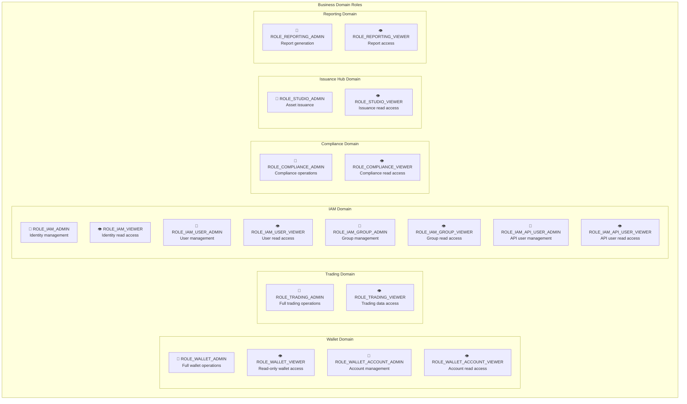
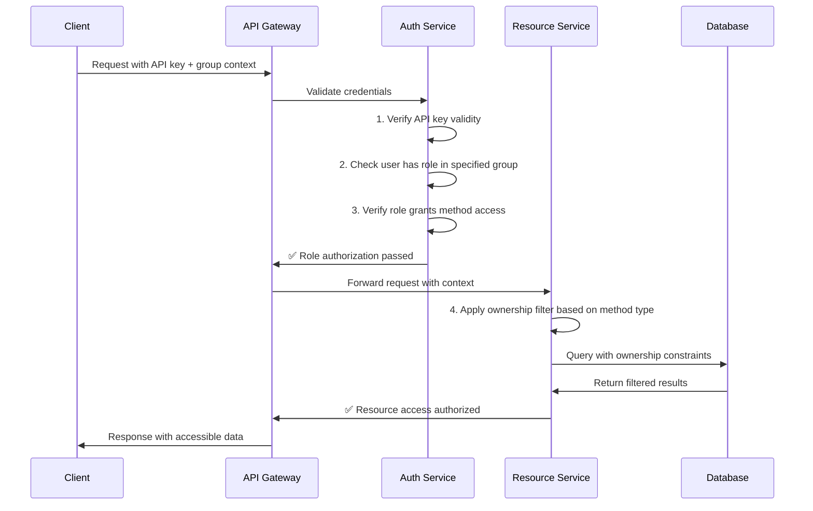
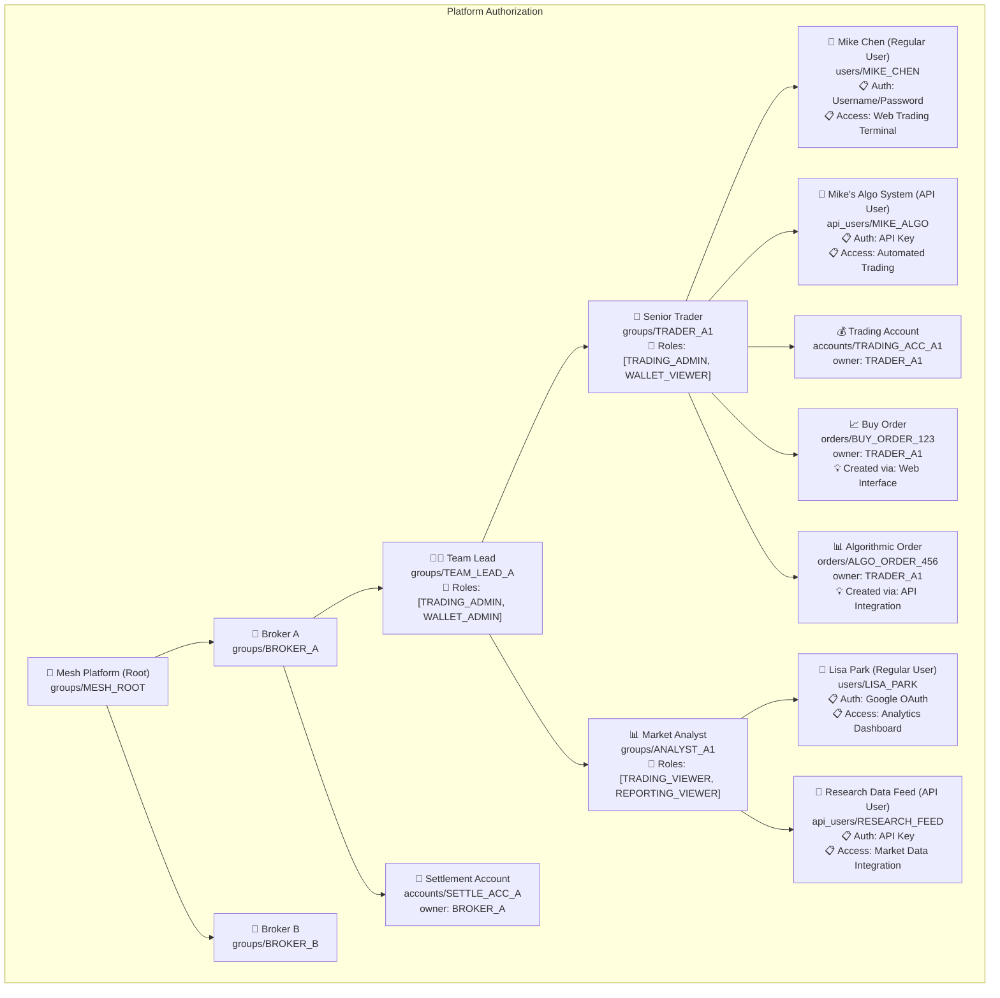
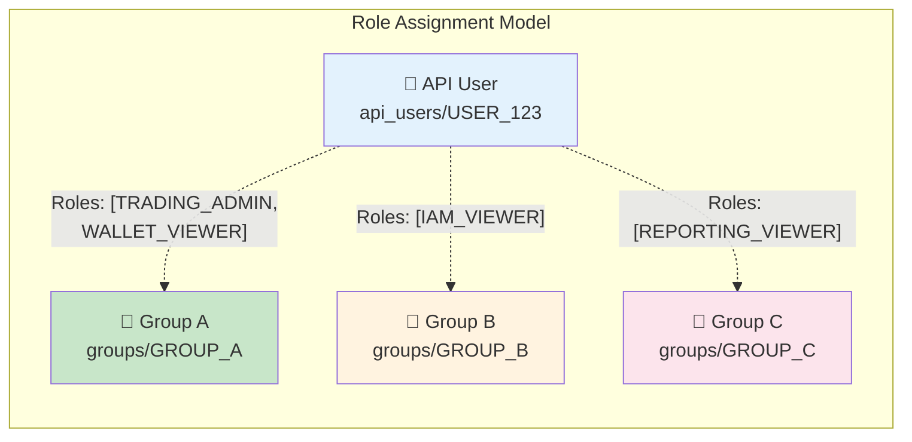

# Role-Based Access Control

Understanding how business domain roles control method-level access within the Mesh API's hierarchical group ownership system.

## Overview

Role-Based Access Control (RBAC) in Mesh operates as a **two-layer security model** where roles define **what operations** users can perform, while groups define **which resources** they can access. This creates a comprehensive authorization system that combines business-level permissions with organizational hierarchy constraints.

**The Dual Authorization Model:**
- **Roles** (this document): Control method-level access to API operations
- **Groups** ([Group Ownership](./group-ownership)): Control resource-level access through ownership hierarchy

Our guiding principle is using the **Protobuf schema as the single source of truth** for all authorization rules, ensuring our security model is self-documenting, automatically verifiable, and always in sync with the API contract.

## What are Roles?

Roles are **enum values** that provide implicit access to API methods within business domains. Unlike traditional permission systems with explicit permission strings, Mesh roles work by **method-level declaration** - each RPC method explicitly declares which role enum values can access it in its protobuf definition.

**Key Distinction:**
- **No Explicit Permissions**: Roles don't contain lists of permission strings
- **Method-Level Grants**: API methods declare which roles can access them via protobuf annotations
- **Implicit Authorization**: Having a role grants access to methods that declare that role
- **Enum-Based Design**: Roles are simple enum constants, not complex permission objects

Each role represents a coherent set of capabilities that align with real-world job functions and responsibilities through the methods that reference them.

**Key Characteristics:**
- **Domain-Scoped**: Roles are organized by business domains (Trading, Wallet, IAM, etc.)
- **Method-Level Control**: Each RPC method explicitly declares which roles can access it
- **Business-Aligned**: Role names reflect actual business functions and responsibilities
- **Hierarchical Permissions**: Admin roles include all viewer capabilities plus write operations

## Universal User System: API Users & Regular Users

**Important**: While this documentation focuses on "API users" for technical precision, the **exact same role-based permission system applies to regular users** accessing Mesh through web interfaces, mobile applications, and desktop software.

### Unified Role Assignment Model

**Both user types receive identical role assignments:**
- **Regular Users**: Login via username/password, OAuth (Google, Microsoft), or SSO systems
- **API Users**: Authenticate via API keys for programmatic integration
- **Same Roles**: Both receive identical role assignments within groups (e.g., `ROLE_TRADING_ADMIN`)
- **Same Method Access**: Both are subject to the same protobuf method-level authorization rules
- **Same Business Logic**: Identical permission validation regardless of authentication method

### Digital Infrastructure Applications

This role system enables comprehensive **enterprise digital infrastructure management**:

**Complete Access Control:**
- **Employee Access**: Staff using web dashboards, mobile apps, and desktop clients with role-based permissions
- **System Integration**: API-driven workflows, automation, and third-party integrations with same role restrictions
- **Unified Governance**: Single role model governing human users and automated systems
- **Consistent Security**: Same authorization logic across all access methods and interfaces

**Example: Financial Services Organization**
- **Portfolio Managers**: Regular users with `ROLE_TRADING_ADMIN` accessing web trading platforms
- **Risk Analysts**: Regular users with `ROLE_TRADING_VIEWER` using mobile dashboards for monitoring  
- **Trading Algorithms**: API users with `ROLE_TRADING_ADMIN` for automated execution systems
- **Compliance Systems**: API users with `ROLE_COMPLIANCE_VIEWER` for automated reporting and monitoring

Throughout the examples below, we reference "API users" for technical clarity, but understand that **regular users appear in identical organizational roles** with the same permissions and access patterns.

## Role Hierarchy by Business Domain

The Mesh API organizes roles into six core business domains, each with a consistent permission structure:



### Role Naming Convention

All roles follow a consistent pattern: `ROLE_{DOMAIN}_{SCOPE}_{ACCESS_LEVEL}`

- **Domain**: Business area (WALLET, TRADING, IAM, COMPLIANCE, ISSUANCE_HUB, REPORTING)
- **Scope**: Specific resource type (optional - e.g., ACCOUNT, USER, GROUP, API_USER)
- **Access Level**: Permission tier (ADMIN, VIEWER)

### Domain Role Structure

**Wallet Domain:**
- **General**: `ROLE_WALLET_ADMIN` 👤, `ROLE_WALLET_VIEWER` 👁️  
- **Specialized**: `ROLE_WALLET_ACCOUNT_ADMIN` 👤, `ROLE_WALLET_ACCOUNT_VIEWER` 👁️

**Trading Domain:**
- **General**: `ROLE_TRADING_ADMIN` 👤, `ROLE_TRADING_VIEWER` 👁️
- **Specialized**: *(Future expansion planned)*

**IAM Domain:**
- **General**: `ROLE_IAM_ADMIN` 👤, `ROLE_IAM_VIEWER` 👁️
- **Specialized**: 
  - User Management: `ROLE_IAM_USER_ADMIN` 👤, `ROLE_IAM_USER_VIEWER` 👁️
  - Group Management: `ROLE_IAM_GROUP_ADMIN` 👤, `ROLE_IAM_GROUP_VIEWER` 👁️  
  - API User Management: `ROLE_IAM_API_USER_ADMIN` 👤, `ROLE_IAM_API_USER_VIEWER` 👁️

**Compliance Domain:**
- **General**: `ROLE_COMPLIANCE_ADMIN` 👤, `ROLE_COMPLIANCE_VIEWER` 👁️
- **Specialized**: *(Future expansion planned)*

**Issuance Hub Domain:**
- **General**: `ROLE_STUDIO_ADMIN` 👤, `ROLE_STUDIO_VIEWER` 👁️  
- **Specialized**: *(Future expansion planned)*

**Reporting Domain:**
- **General**: `ROLE_REPORTING_ADMIN` 👤, `ROLE_REPORTING_VIEWER` 👁️
- **Specialized**: *(Future expansion planned)*

## Permission Levels: Admin vs Viewer

Each domain implements a two-tier permission model that aligns with common organizational needs:

### Admin Roles (`*_ADMIN`)

**Capabilities:**
- **Full Read Access**: All GET, LIST, SEARCH operations within domain
- **Full Write Access**: All CREATE, UPDATE, DELETE operations within domain
- **Resource Management**: Lifecycle operations for domain resources
- **Configuration Control**: Modify settings and parameters

**Use Cases:**
- Service administrators and operators
- Domain experts managing resources
- Automation systems requiring full control

### Viewer Roles (`*_VIEWER`)

**Capabilities:**
- **Read-Only Access**: GET, LIST, SEARCH operations only
- **Monitoring and Auditing**: Access for compliance and oversight
- **Reporting and Analytics**: Data access for analysis
- **No Modification Rights**: Cannot CREATE, UPDATE, or DELETE

**Use Cases:**
- Auditors and compliance officers
- Analysts and reporting systems
- Monitoring and observability tools
- Junior staff requiring supervised access

## Integration with Group Ownership System

Roles and groups work together to create a comprehensive authorization model. **Both** must be satisfied for an operation to succeed:

### The Dual Gate Model



### Authorization Requirements

For any API operation, **all four** requirements must be met:

1. **Valid Credentials**: Active API key with proper authentication
2. **Group Membership**: User must have role assignment in the specified group
3. **Method Authorization**: User's role must include access to the specific RPC method
4. **Resource Ownership**: Resources must pass ownership filter based on method type

## Method-Level Role Declaration

Each API method explicitly declares which roles can access it using protobuf annotations:

### Single Role Access

```protobuf
rpc CreateAccount(CreateAccountRequest) returns (Account) {
  option (meshtrade.option.v1.method_type) = METHOD_TYPE_WRITE;
  option (meshtrade.iam.role.v1.roles) = {
    roles: [ROLE_WALLET_ADMIN]
  };
}
```

### Multiple Role Access (Admin + Specialized)

```protobuf
rpc CreateAccount(CreateAccountRequest) returns (Account) {
  option (meshtrade.option.v1.method_type) = METHOD_TYPE_WRITE;
  option (meshtrade.iam.role.v1.roles) = {
    roles: [
      ROLE_WALLET_ADMIN,
      ROLE_WALLET_ACCOUNT_ADMIN
    ]
  };
}
```

### Read Access (Admin + Viewer)

```protobuf
rpc GetLimitOrder(GetLimitOrderRequest) returns (LimitOrder) {
  option (meshtrade.option.v1.method_type) = METHOD_TYPE_READ;
  option (meshtrade.iam.role.v1.roles) = {
    roles: [
      ROLE_TRADING_ADMIN,
      ROLE_TRADING_VIEWER
    ]
  };
}
```

## Real-World Authorization Scenario



**Access Scenarios:**

**Team Lead executing CreateAccount (WRITE method in Broker A context):**
- ✅ **Role Check**: Has `WALLET_ADMIN` role for CreateAccount method
- ✅ **Group Context**: Operating in `BROKER_A` group where they have role assignment
- ✅ **Resource Access**: Can create accounts with `owner: BROKER_A` (direct ownership rule)
- **Result**: Can create settlement accounts and team infrastructure

**Mike Chen (Regular User) executing CreateOrder via Web Trading Terminal (WRITE method):**
- ✅ **Role Check**: Has `TRADING_ADMIN` role for CreateOrder method
- ✅ **Group Context**: Operating in `TRADER_A1` group where he has role assignment
- ✅ **Resource Access**: Can create orders with `owner: TRADER_A1` (direct ownership rule)
- **Authentication**: Username/password login to web trading platform
- **Interface**: Browser-based trading terminal with real-time market feeds
- **Result**: Can execute trades manually through web interface

**Mike's Algo System (API User) executing CreateOrder via API (WRITE method):**
- ✅ **Role Check**: Has same `TRADING_ADMIN` role (inherited from group assignment)
- ✅ **Group Context**: Operating in same `TRADER_A1` group context
- ✅ **Resource Access**: Can create orders with same `owner: TRADER_A1` permissions
- **Authentication**: API key linked to same group and role assignments
- **Integration**: Automated algorithmic trading system with identical business rules
- **Result**: Can execute trades programmatically with same authorization scope

**Lisa Park (Regular User) executing GetAccount via Analytics Dashboard (READ method):**
- ✅ **Role Check**: Has `TRADING_VIEWER` role for GetAccount method
- ✅ **Group Context**: Operating in `ANALYST_A1` group where she has role assignment
- ✅ **Resource Access**: Can read accounts in ownership path (hierarchical READ access)
- **Authentication**: Google OAuth integration for streamlined access
- **Interface**: Web-based analytics dashboard with interactive charts and reports
- **Result**: Can view trading data for analysis but cannot modify anything

**Research Data Feed (API User) executing ListOrders for Market Analysis (READ method):**
- ✅ **Role Check**: Has same `TRADING_VIEWER` role as regular analyst
- ✅ **Group Context**: Operating in same `ANALYST_A1` group context  
- ✅ **Resource Access**: Can read same trading data with identical scope restrictions
- **Authentication**: API key with read-only permissions matching regular user
- **Integration**: Automated market research system feeding external analytics platforms
- **Result**: Enables automated data collection with same permission boundaries

## Role Assignment and Management

### API User Role Configuration

API Users receive role assignments within specific groups, creating the foundation for the authorization system:



**Key Principles:**
- **Per-Group Assignment**: Same user can have different roles in different groups
- **Context Switching**: User specifies execution group via `x-group` header
- **Principle of Least Privilege**: Assign minimal roles necessary for function
- **Scope Isolation**: Roles in one group don't grant access to other groups

### Best Practices for Role Assignment

**Organizational Alignment:**
- **Map to Job Functions**: Assign roles that match actual responsibilities
- **Consider Hierarchy**: Senior roles often need broader access across domains
- **Separate Concerns**: Don't grant admin roles when viewer access suffices

**Security Considerations:**
- **Regular Auditing**: Review and validate role assignments periodically
- **Cross-Training**: Multiple people should have critical admin roles
- **Automation Accounts**: Service accounts should have minimal required roles

## Related Documentation

- **[Group Ownership Structure](./group-ownership)** - Understanding the resource ownership and hierarchy system that works with roles
- **[Authentication](./authentication)** - API key and group context authentication mechanisms  
- **[Service Structure](./service-structure)** - Understanding API organization and method patterns
- **[IAM API User Service Reference](/docs/api-reference/iam/api_user/v1)** - Complete API documentation for managing API users and role assignments
- **[IAM Group Service Reference](/docs/api-reference/iam/group/v1)** - Complete API documentation for group management operations