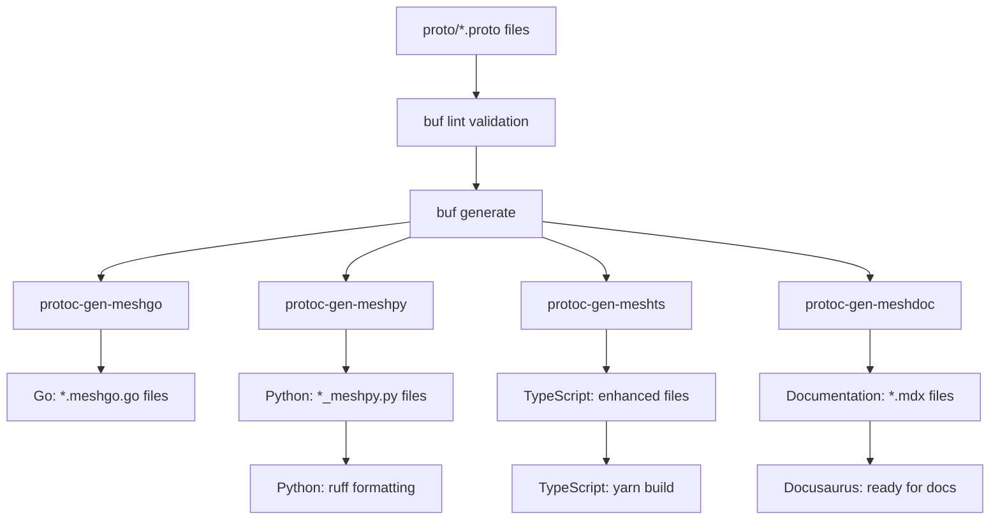

# Contributor Guide

This comprehensive guide provides everything you need to contribute effectively to our schema-first, multi-language SDK ecosystem. Whether you're adding new API services, fixing bugs, or improving documentation, this guide will help you understand our architecture, workflows, and best practices.

## Repository Overview

The Meshtrade API follows a **schema-first approach** using Protocol Buffers as the single source of truth. From these protobuf definitions, we generate:

- **Go client libraries** with interfaces and mocks
- **Python SDK** with authentication and resource management  
- **TypeScript/JavaScript SDK** for web applications
- **Comprehensive documentation** with interactive examples
- **Validation rules** and type safety across all languages

**Key Architecture Principles:**
- **Resource-oriented design** inspired by Google's API Improvement Proposals (AIPs)
- **Strong consistency** across all generated client libraries
- **Role-based access control** with fine-grained permissions
- **Developer experience** focus with comprehensive tooling and testing infrastructure

## 1. Understanding Our API Design (Protobuf + AIP)

### 1.1 Resource-Oriented Design Patterns

Our APIs follow Google's [API Improvement Proposals (AIPs)](https://google.aip.dev/), specifically:

#### Core Resource Patterns
- **Resources** have unique names like `api_users/{api_user_id}` or `groups/{group_id}`
- **Collections** contain resources: `ListApiUsers()`, `SearchApiUsers()`
- **Standard methods** follow consistent patterns: `GetX()`, `CreateX()`, `ListX()`, `SearchX()`
- **Custom methods** for business operations: `ActivateApiUser()`, `DeactivateApiUser()`

#### Example: API User Service Structure
```protobuf
// Resource name pattern: api_users/{api_user_id}
service ApiUserService {
  // Standard Methods (AIP-131, AIP-132, AIP-133)
  rpc GetApiUser(GetApiUserRequest) returns (APIUser);
  rpc CreateApiUser(CreateApiUserRequest) returns (APIUser);  
  rpc ListApiUsers(ListApiUsersRequest) returns (ListApiUsersResponse);
  rpc SearchApiUsers(SearchApiUsersRequest) returns (SearchApiUsersResponse);
  
  // Custom Methods (AIP-136) 
  rpc ActivateApiUser(ActivateApiUserRequest) returns (APIUser);
  rpc DeactivateApiUser(DeactivateApiUserRequest) returns (APIUser);
}
```

#### Resource Naming Conventions
- **Singular** for resource types: `APIUser`, `Group`, `Account`
- **Plural** for collections: `api_users`, `groups`, `accounts`  
- **Snake_case** for proto field names: `display_name`, `created_at`
- **PascalCase** for message names: `CreateApiUserRequest`
- **SCREAMING_SNAKE_CASE** for enums: `API_USER_STATE_ACTIVE`

### 1.2 Authorization Model

Every RPC method must specify:

#### Method Type Classification
```protobuf
import "meshtrade/option/v1/method_type.proto";

rpc GetApiUser(GetApiUserRequest) returns (APIUser) {
  option (meshtrade.option.v1.method_type) = METHOD_TYPE_READ;  // or METHOD_TYPE_WRITE
}
```

#### Role-Based Access Control
```protobuf
import "meshtrade/iam/role/v1/role.proto";

rpc CreateApiUser(CreateApiUserRequest) returns (APIUser) {
  option (meshtrade.iam.role.v1.roles) = {
    roles: [ROLE_IAM_ADMIN]  // Only IAM admins can create API users
  };
}
```

#### Role Hierarchy
Our authorization follows domain-based role patterns:
- `ROLE_IAM_ADMIN` / `ROLE_IAM_VIEWER` - Identity & Access Management
- `ROLE_COMPLIANCE_ADMIN` / `ROLE_COMPLIANCE_VIEWER` - KYC/AML operations  
- `ROLE_TRADING_ADMIN` / `ROLE_TRADING_VIEWER` - Trading operations
- `ROLE_WALLET_ADMIN` / `ROLE_WALLET_VIEWER` - Account management
- `ROLE_ISSUANCE_HUB_ADMIN` / `ROLE_ISSUANCE_HUB_VIEWER` - Instrument management

### 1.3 Validation and Type Safety

We use `buf/validate` for comprehensive input validation:

```protobuf
message ActivateApiUserRequest {
  string name = 1 [(buf.validate.field) = {
    string: {
      min_len: 1
      pattern: "^api_users/[0-9A-HJKMNP-TV-Z]{26}$"  // ULID format
    }
    cel: {
      id: "name.required"
      message: "name is required and must be in format api_users/{id}"
      expression: "this.matches('^api_users/[0-9A-HJKMNP-TV-Z]{26}$')"
    }
  }];
}
```

### 1.4 Common Types

Shared types in `/proto/meshtrade/type/v1/` ensure consistency:

- **`Amount`** - Precise financial amounts with currency
- **`Decimal`** - High-precision arithmetic (no float precision issues)
- **`Token`** - Universal Token Identifier for blockchain assets
- **`Ledger`** - Blockchain transaction references
- **`Date`** / **`TimeOfDay`** - Timezone-aware temporal types

## 2. Code Generation Architecture Deep Dive

### 2.1 Generation Workflow Overview

The `./dev/tool.sh all` script orchestrates everything:

```bash
# 1. Clean all generated files
🧹 Cleaning Go/Python/TypeScript/Java generated files

# 2. Build custom generators  
🛠 Building protoc-gen-meshts plugin

# 3. Generate from protobuf definitions
🚀 buf generate --template dev/generate/buf/buf.gen.yaml

# 4. Post-processing
📄 Generating TypeScript index files
⚙️ Building TypeScript library  
🚀 Formatting Python code with ruff
```

### 2.1.1 Testing Workflow Overview

The comprehensive testing system validates all generated code:

```bash
# Environment validation first
🏥 ./dev/tool.sh doctor
   ✅ Checking Go 1.21+, Python 3.12+ venv, Node.js 18+, Java 21, Maven, buf

# Comprehensive test execution
🧪 ./dev/tool.sh test
   🐹 Go tests with coverage and linting (golangci-lint, gosec)
   🐍 Python tests with pytest, coverage, ruff linting
   🔷 TypeScript tests with Jest, type checking, ESLint
   ☕ Java tests with Maven, JaCoCo coverage, SpotBugs security analysis

# Individual language testing
🎯 ./dev/tool.sh test --targets=python,java --verbose
```

### 2.2 Custom Protobuf Generators

#### protoc-gen-meshgo (Go Enhancement)
**Location**: `/tool/protoc-gen-meshgo/`
**Purpose**: Extends standard Go protobuf generation

**Generated Files:**
- `service.meshgo.go` - Enhanced gRPC clients with BaseGRPCClient pattern
- `service_interface.meshgo.go` - Service interfaces for dependency injection
- `serviceMock.meshgo.go` - Mock implementations for testing

**Key Features:**
- **BaseGRPCClient[T]** pattern with generics for type safety
- **Execute()** function with conservative retry logic (financial-grade)
- **Authentication interceptors** with role-based access
- **Resource management** with proper cleanup
- **Comprehensive documentation** with authentication hierarchy

#### protoc-gen-meshpy (Python Enhancement)  
**Location**: `/tool/protoc-gen-meshpy/`
**Purpose**: Generates Python clients with BaseGRPCClient pattern

**Generated Files:**
- `service_meshpy.py` - Minimal service wrappers inheriting from BaseGRPCClient
- `service_options_meshpy.py` - Configuration options for services
- `__init__.py` - Auto-managed package exports with manual section preservation

**Key Features:**
- **BaseGRPCClient** abstract base class (90% of functionality)
- **Lazy connection management** with context manager support
- **Dynamic import analysis** to avoid hardcoded type mappings
- **Credential discovery** following hierarchy (env vars → config files)
- **70% boilerplate reduction** compared to previous implementation

#### protoc-gen-meshts (TypeScript Enhancement)
**Location**: `/tool/protoc-gen-meshts/`  
**Purpose**: TypeScript utilities and index file generation

**Generated Files:**
- `index.ts` files for each package
- Additional TypeScript wrappers and utilities

#### protoc-gen-meshdoc (Documentation Generation)
**Location**: `/tool/protoc-gen-meshdoc/`
**Purpose**: Comprehensive API documentation from protobuf

**Generated Files:**
- `index.mdx` - Service overview pages (editable after first generation)
- `type/{type}_meshdoc.mdx` - Message and enum documentation  
- `service/{method}/index_meshdoc.mdx` - Method documentation with examples
- `sidebar_meshdoc.ts` - Navigation structure

**Features:**
- **Interactive tabs** - Table view, protobuf source, code examples
- **Multi-language examples** - Go, Python, TypeScript
- **GitHub source links** - Direct links to protobuf definitions
- **Role-based access documentation** - Shows required permissions

### 2.3 Generation Dependencies and Flow



## 3. Development Environment Setup

## 3.1 Tools to Install

Before you begin, ensure you have the following tools installed on your system:

| Tool | Version | Install Command |
| :--- | :--- | :--- |
| [Go](https://golang.org/) | `1.24.3` | `brew install go` |
| [Node.js](https://nodejs.org/) | `^18.0.0` | `brew install node` |
| [Yarn](https://yarnpkg.com/) | `1.22.22` | `corepack enable && corepack prepare yarn@1.22.22 --activate` |
| [Python](https://www.python.org) | `>3.12` | `brew install python` |
| [Java](https://openjdk.org/) | `21` (LTS) | `brew install openjdk@21` |
| [Maven](https://maven.apache.org/) | `latest` | `brew install maven` |
| [Buf CLI](https://buf.build/) | `latest` | `brew install bufbuild/buf/buf` |

## 3.2 Prerequisites

**Required Versions**:
- **Go**: 1.24.3 (`go.mod`)
- **Node.js**: ^18.0.0 (`package.json`)  
- **Yarn**: 1.22.22 (`package.json` packageManager)
- **Python**: >=3.12 (`pyproject.toml`)  
- **Java**: 21 LTS (`pom.xml`)
- **Maven**: latest (`pom.xml`)
- **Buf CLI**: Latest

### 3.3 Go Development Setup

#### Installation & Dependencies
```bash
# Install Go (macOS)
brew install go

# Install dependencies
go mod tidy

# Install linting tools  
go install github.com/golangci/golangci-lint/cmd/golangci-lint@latest
```

#### Critical Go Files
- **`go.mod`** / **`go.sum`** - Module dependency management
- **`go/`** - All generated Go client libraries
  - `go/{domain}/{resource}/v1/*.meshgo.go` - Enhanced gRPC clients
  - `go/{domain}/{resource}/v1/*_interface.meshgo.go` - Service interfaces
  - `go/{domain}/{resource}/v1/*Mock.meshgo.go` - Mock implementations
- **`tool/protoc-gen-meshgo/`** - Custom Go generator source code
- **`go/grpc/`** - BaseGRPCClient implementation and configuration

#### Running Go Tests & Linting
```bash
# Run all tests
go test ./...

# Run linting with security checks
golangci-lint run -v --timeout 10m -E gosec

# Clean module dependencies  
go mod tidy
```

### 3.4 Python Development Setup

#### Virtual Environment (CRITICAL)
```bash
# Create and activate virtual environment
python -m venv .venv
source .venv/bin/activate  # or python/.venv/bin/activate on macOS/Linux

# Install in development mode
pip install -r requirements-dev.txt
```

#### Critical Python Files
- **`pyproject.toml`** - Project configuration, dependencies, ruff settings
- **`python/src/meshtrade/`** - Generated Python SDK
  - `python/src/meshtrade/common/grpc_client.py` - BaseGRPCClient implementation
  - `python/src/meshtrade/{domain}/{resource}/v1/*_meshpy.py` - Service clients
  - `python/src/meshtrade/{domain}/{resource}/v1/__init__.py` - Auto-managed exports
- **`tool/protoc-gen-meshpy/`** - Custom Python generator source
- **`python/tests/`** - Test suites

#### Python Linting Standards (150-char line limit)
```bash
# CRITICAL: Always run after Python changes
ruff check python/src --fix
ruff format python/src

# Check specific rules
ruff check . --select E501,E711,F401,SIM112
```

**Key Ruff Rules:**
- **E501**: Line length (150 chars max - not 80!)
- **E711**: Use `is`/`is not` for None comparisons (not `==`)
- **F401**: Remove unused imports OR add proper `__all__` lists  
- **SIM112**: Environment variables must use UPPER_CASE naming

#### Running Python Tests
```bash
# Activate virtual environment first!
source python/.venv/bin/activate

# Run with correct PYTHONPATH
PYTHONPATH="./python/src:./python/tests" pytest ./python/tests -v

# Or use tox for comprehensive testing
tox
```

### 3.5 TypeScript Development Setup

#### Installation & Dependencies
```bash
# Install from repository root (yarn workspace)
yarn install

# Build TypeScript SDK
yarn build  # or yarn workspace @meshtrade/api build

# Build documentation site
yarn build:docs
```

#### Critical TypeScript Files  
- **`package.json`** (root) - Yarn workspace configuration
- **`ts/package.json`** - TypeScript SDK dependencies  
- **`ts/tsconfig.json`** - TypeScript compiler configuration
- **`ts/src/meshtrade/`** - Generated TypeScript modules
- **`tool/protoc-gen-meshts/`** - Custom TypeScript generator
- **`docs/`** - Docusaurus documentation site

#### Running TypeScript Tests & Linting
```bash
# Run tests
yarn test  # or yarn workspace @meshtrade/api test

# Run linting  
yarn lint  # or yarn workspace @meshtrade/api lint

# Start documentation server
yarn start:docs  # opens http://localhost:3000/api/
```

#### Hand-Written Client Maintenance
**IMPORTANT**: After protobuf changes, update hand-written TypeScript clients:

1. **Check for compilation errors**: `yarn build` will show missing types/methods
2. **Update method signatures**: Get/Create methods return resources directly (not response wrappers)
3. **Update imports**: Remove deleted response types, add new resource types
4. **Verify all methods exposed**: Compare `*_grpc_web.ts` wrappers to `*_pb.d.ts` service interfaces

### 3.6 Java Development Setup

#### Installation & Dependencies
```bash
# Install Java 21 (macOS - REQUIRED: Use OpenJDK LTS version)
brew install openjdk@21

# Add Java to PATH (CRITICAL: Required for Maven and compilation)
echo 'export PATH="/opt/homebrew/opt/openjdk@21/bin:$PATH"' >> ~/.zshrc

# Reload shell configuration (or restart terminal)
source ~/.zshrc

# Verify Java installation
java -version  # Should show OpenJDK 21.x.x

# Install Maven for Java builds
brew install maven

# Verify Maven installation  
mvn -version   # Should show Maven 3.x.x with Java 21
```

#### Environment Configuration (CRITICAL Steps)

**⚠️ CRITICAL**: You MUST configure your Java environment correctly or builds will fail:

```bash
# 1. Ensure Java 21 is in your PATH
export PATH="/opt/homebrew/opt/openjdk@21/bin:$PATH"

# 2. Set JAVA_HOME to Java 21 (CRITICAL: Maven requires this)
export JAVA_HOME="/opt/homebrew/opt/openjdk@21/libexec/openjdk.jdk/Contents/Home"

# 3. Verify Java version is exactly 21 (not 24 or other versions)
java -version
# Expected output: openjdk version "21.0.x" 2025-xx-xx

# 4. Verify Maven can find Java 21 (CRITICAL: Must show Java 21, not 24)
mvn -version
# Expected: Java version: 21.0.x, vendor: Homebrew
```

**Permanent Configuration**: Add to your `~/.zshrc` or `~/.bash_profile`:
```bash
# Add these lines to ensure Java 21 is always available
export PATH="/opt/homebrew/opt/openjdk@21/bin:$PATH"
export JAVA_HOME="/opt/homebrew/opt/openjdk@21/libexec/openjdk.jdk/Contents/Home"
```

#### Critical Java Files

- **`pom.xml`** (root) - Multi-module Maven workspace configuration
- **`java/pom.xml`** - Java SDK module with dependencies
- **`java/src/main/java/co/meshtrade/api/`** - Core Java SDK implementation
  - `auth/` - Credentials and credential discovery (Credentials.java, CredentialsDiscovery.java)
  - `config/` - Service configuration (ServiceOptions.java with builder pattern)
  - `grpc/` - Base gRPC client implementation (BaseGRPCClient.java)
  - `{domain}/{resource}/v1/` - Generated service interfaces and clients
- **`tool/protoc-gen-meshjava/`** - Custom Java code generator source
  - `src/main/java/co/meshtrade/protoc/` - Plugin implementation
  - `target/protoc-gen-meshjava-jar-with-dependencies.jar` - Compiled plugin JAR

#### Generated Files Structure

The Java SDK follows the same domain-based structure as Go/Python:
```
java/src/main/java/co/meshtrade/api/
├── auth/                           # Core authentication
│   ├── Credentials.java            # API key + group validation
│   └── CredentialsDiscovery.java   # Auto-discovery hierarchy
├── config/
│   └── ServiceOptions.java        # Builder pattern configuration
├── grpc/
│   └── BaseGRPCClient.java        # Generic gRPC client base class
├── iam/api_user/v1/               # Generated from protobuf
│   ├── ApiUserService.java        # Service interface (extends AutoCloseable)
│   └── ApiUserServiceClient.java  # Client implementation (extends BaseGRPCClient)
├── compliance/client/v1/          # Generated from protobuf
├── trading/direct_order/v1/       # Generated from protobuf
└── ...                            # Other generated services
```

#### Java Environment Setup from Scratch (Complete Walkthrough)

**Starting Point**: Fresh macOS system with no Java installed

```bash
# 1. Install Homebrew (if not already installed)
/bin/bash -c "$(curl -fsSL https://raw.githubusercontent.com/Homebrew/install/HEAD/install.sh)"

# 2. Install Java 21 (OpenJDK LTS)
brew install openjdk@21

# 3. Configure PATH and JAVA_HOME for Java (CRITICAL)
echo 'export PATH="/opt/homebrew/opt/openjdk@21/bin:$PATH"' >> ~/.zshrc
echo 'export JAVA_HOME="/opt/homebrew/opt/openjdk@21/libexec/openjdk.jdk/Contents/Home"' >> ~/.zshrc
source ~/.zshrc

# 4. Install Maven
brew install maven

# 5. Verify installations
java -version   # Should show: openjdk version "21.0.x"
mvn -version    # Should show: Java version: 21.x.x, vendor: Homebrew

# 6. Clone repository and navigate to it
git clone <repository-url>
cd <repository-directory>

# 7. Build Java SDK
cd java
mvn clean compile

# 8. Build Java protoc plugin
cd ../tool/protoc-gen-meshjava  
mvn clean package

# 9. Test code generation (from repository root)
cd ../..
buf generate --template dev/generate/buf/buf.gen.yaml --include-imports proto/meshtrade/iam/api_user/v1/service.proto

# 10. Verify generated files exist
ls -la java/src/main/java/co/meshtrade/api/iam/api_user/v1/
# Should show: ApiUserService.java, ApiUserServiceClient.java
```

#### Running Java Builds & Tests

```bash
# Build Java SDK (from java/ directory)
cd java
mvn clean compile

# Build with all checks
mvn clean compile test

# Build Java protoc plugin (from tool/protoc-gen-meshjava/ directory)  
cd tool/protoc-gen-meshjava
mvn clean package

# Run full code generation (from repository root)
./dev/tool.sh all
```

#### Java Code Generation Workflow

**CRITICAL**: Java code generation requires both the Java SDK and the protoc plugin:

```bash
# 1. Build the protoc plugin first (from repository root)
cd tool/protoc-gen-meshjava
mvn clean package -q

# 2. Verify plugin JAR exists
ls -la target/protoc-gen-meshjava-jar-with-dependencies.jar

# 3. Run code generation (from repository root)
cd ../..
buf generate --template dev/generate/buf/buf.gen.yaml

# 4. Verify Java files were generated
find java/src/main/java -name "*Service.java" -o -name "*Client.java"
```

#### Java-Specific Development Features

**Authentication Hierarchy** (matches Go/Python):
1. `MESH_API_CREDENTIALS` environment variable (JSON format)
2. Platform-specific credential files:
   - **Linux**: `~/.config/mesh/credentials.json`
   - **macOS**: `~/Library/Application Support/mesh/credentials.json`  
   - **Windows**: `%APPDATA%\mesh\credentials.json`

**Builder Pattern Configuration**:
```java
// Default configuration with auto-discovery
ServiceOptions options = ServiceOptions.builder().build();

// Custom configuration
ServiceOptions options = ServiceOptions.builder()
    .url("api.staging.mesh.dev")  
    .apiKey("your-43-character-api-key")
    .group("groups/your-group-id")
    .timeout(Duration.ofSeconds(60))
    .tls(true)
    .build();
```

**Generic Type Safety**:
```java  
// BaseGRPCClient uses generics for type safety
public abstract class BaseGRPCClient<T extends AbstractStub<T>> 
    implements AutoCloseable {
    // Ensures compile-time type checking for gRPC stubs
}

// Generated clients extend with proper stub type
public final class ApiUserServiceClient 
    extends BaseGRPCClient<ApiUserServiceGrpc.ApiUserServiceBlockingStub>
    implements ApiUserService {
    // Type-safe gRPC operations
}
```

**Resource Management**:
```java
// Always use try-with-resources for proper cleanup
try (ApiUserServiceClient client = new ApiUserServiceClient()) {
    GetApiUserRequest request = GetApiUserRequest.newBuilder()
        .setName("api_users/01HQXH5S8NPQR0QVMJ3NV9KWX8")
        .build();
    APIUser user = client.getApiUser(request, Optional.empty());
    // Client automatically closed when leaving try block
}
```

#### Maven Multi-Module Structure

The Java implementation uses Maven multi-module architecture:

```xml
<!-- Root pom.xml -->
<modules>
    <module>java</module>                    <!-- Main SDK -->
    <module>tool/protoc-gen-meshjava</module> <!-- Code generator -->
</modules>
```

**Benefits**:
- **Shared dependency management** across SDK and generator
- **Consistent versioning** for releases
- **Unified build process** with `mvn clean package` from root
- **Maven Central publishing** support built-in

#### Java Troubleshooting

**Problem**: `mvn command not found`
**Solution**: Install Maven with `brew install maven`

**Problem**: `java.lang.module.FindException: Module not found`  
**Solution**: Ensure Java 21 is in PATH: `export PATH="/opt/homebrew/opt/openjdk@21/bin:$PATH"`


**Problem**: Generated Java files not appearing
**Solution**: Build protoc plugin first: `cd tool/protoc-gen-meshjava && mvn clean package`

**Problem**: `wire unmarshal: proto: cannot parse invalid wire-format data`
**Solution**: This was fixed - ensure you're using the latest protoc plugin JAR

**Problem**: Compilation errors in generated code
**Solution**: Verify protobuf definitions are valid: `buf lint`

**Problem**: Maven dependency conflicts
**Solution**: Clean and rebuild: `mvn clean compile` or check parent POM dependency management

**Problem**: JAVA_HOME warnings or Maven using wrong Java version
**Solution**: Set JAVA_HOME permanently in your shell profile:
```bash
echo 'export JAVA_HOME="/opt/homebrew/opt/openjdk@21/libexec/openjdk.jdk/Contents/Home"' >> ~/.zshrc
echo 'export PATH="$JAVA_HOME/bin:$PATH"' >> ~/.zshrc
source ~/.zshrc
```

**Problem**: `WARNING: sun.misc.Unsafe::staticFieldBase` warnings from Google Guice
**Solution**: This is a **known Maven issue** (MNG-8760), not your code! Maven 3.9.11 bundles Google Guice 5.1.0 which uses deprecated Unsafe methods. These warnings are harmless and don't affect functionality. The warning will disappear when Maven updates their internal Guice version.

#### Quick Setup Command

For convenience, you can add all necessary Java environment variables to your shell configuration with this single command:

```bash
# Add Java 21 configuration to .zshrc (one command setup)
cat >> ~/.zshrc << 'EOF'

# Java 21 configuration for Meshtrade API development
export PATH="/opt/homebrew/opt/openjdk@21/bin:$PATH"
export JAVA_HOME="/opt/homebrew/opt/openjdk@21/libexec/openjdk.jdk/Contents/Home"
EOF

# Reload your shell configuration
source ~/.zshrc

# Verify the setup worked
echo "Java version:" && java -version
echo "Maven Java version:" && mvn -version | grep "Java version"
```

**For Bash users**: Replace `~/.zshrc` with `~/.bash_profile` in the command above.

## 4. Contributing Workflow

### 4.1 General Development Process

1. **Branch from master**: `git checkout -b feature/your-feature-name`
2. **Modify protobuf files first** in `/proto/meshtrade/`
3. **Run buf lint**: `buf lint` (must pass before generation)
4. **Regenerate all code**: `./dev/tool.sh all`
5. **Update hand-written code** if needed (especially TypeScript clients)
6. **Run comprehensive tests**:
   ```bash
   # Recommended: Use the unified testing infrastructure
   ./dev/tool.sh test                    # Test all languages
   ./dev/tool.sh test --targets=go,python --verbose  # Specific languages
   
   # Alternative: Individual language tests
   ./dev/test/go.sh          # Go with coverage, race detection, linting
   ./dev/test/python.sh      # Python with pytest, coverage, ruff
   ./dev/test/java.sh        # Java with Maven, JaCoCo, SpotBugs
   ./dev/test/typescript.sh  # TypeScript with Jest, ESLint, type checking
   
   # Legacy commands (still work but less comprehensive)
   go test ./...                                        # Basic Go tests
   source python/.venv/bin/activate && pytest ./python/tests -v  # Basic Python tests
   cd java && mvn test                                  # Basic Java tests
   yarn test                                            # Basic TypeScript tests
   ```
7. **Run all linters** (included in test scripts above, or run separately):
   ```bash
   # Linting is automatically included in ./dev/test/*.sh scripts
   # But can also be run individually:
   
   # Go linting
   golangci-lint run -v --timeout 10m -E gosec
   
   # Python linting (CRITICAL!)
   ruff check python/src --fix
   ruff format python/src
   
   # TypeScript linting
   yarn lint
   ```
8. **Update documentation** if needed
9. **Submit pull request** with comprehensive description

### 4.2 Protobuf Contribution Guidelines

#### Adding New Services
1. **Create service directory**: `/proto/meshtrade/{domain}/{resource}/v1/`
2. **Define resource proto**: `{resource}.proto` with message definitions
3. **Define service proto**: `service.proto` with RPC methods
4. **Add authorization**:
   ```protobuf
   option (meshtrade.iam.role.v1.standard_roles) = {
     roles: [ROLE_YOUR_DOMAIN_ADMIN, ROLE_YOUR_DOMAIN_VIEWER]
   };
   ```
5. **Add method types**: Every RPC method needs `method_type` option
6. **Add role restrictions**: Every RPC method needs `roles` option
7. **Use buf validation**: Add validation rules for all inputs
8. **Document thoroughly**: Comments become API documentation

#### Adding New Methods to Existing Services
1. **Follow AIP patterns**: Use standard method signatures when possible
2. **Choose appropriate method type**: `METHOD_TYPE_READ` vs `METHOD_TYPE_WRITE`
3. **Set proper authorization**: Who can call this method?
4. **Add validation rules**: Validate all inputs comprehensively
5. **Update service documentation**: Method comments become user-facing docs

#### Updating Existing APIs (Breaking Changes)
1. **Avoid breaking changes** in existing versions (v1, v2, etc.)
2. **For breaking changes**: Create new API version (e.g., v1 → v2)
3. **Deprecation process**: Mark old versions as deprecated, provide migration path
4. **Maintain backward compatibility**: Keep old versions working during transition period

### 4.3 Testing Infrastructure

#### Development Tool Testing Commands

The repository includes a comprehensive testing infrastructure accessible through the development tool:

```bash
# Environment health check (run first)
./dev/tool.sh doctor          # Validates all prerequisites and dependencies

# Comprehensive testing
./dev/tool.sh test            # Test all languages with full coverage
./dev/tool.sh test --targets=python,java  # Test specific languages
./dev/tool.sh test --verbose  # Detailed output for debugging

# Individual language tests
./dev/test/go.sh              # Go tests with coverage, race detection, linting  
./dev/test/python.sh          # Python with pytest, coverage, ruff linting
./dev/test/java.sh            # Java with Maven, JaCoCo coverage, SpotBugs security
./dev/test/typescript.sh      # TypeScript with Jest, type checking, ESLint

# Environment validation (troubleshooting)
./dev/env/go.sh               # Check Go version, modules
./dev/env/python.sh           # Check Python venv, dependencies  
./dev/env/java.sh             # Check Java 21, Maven setup
./dev/env/typescript.sh       # Check Node.js, Yarn, dependencies
./dev/env/general.sh          # Check buf, git, general tools
```

#### Test Features by Language

**Go Tests** (`./dev/test/go.sh`):
- Standard `go test ./...` with verbose output
- Race condition detection with `go test -race`
- Code coverage analysis with coverage report generation
- Security linting with `golangci-lint` and `gosec`
- Module hygiene validation (`go mod tidy`)

**Python Tests** (`./dev/test/python.sh`):
- Environment validation (virtual environment activation)
- Comprehensive `pytest` execution with coverage reporting
- Code formatting and linting with `ruff` (150-char line limit)
- Import validation and dependency checks

**Java Tests** (`./dev/test/java.sh`):
- Unit tests with Maven Surefire plugin
- Integration tests with Maven Failsafe plugin
- Code coverage analysis with JaCoCo
- Security analysis with SpotBugs
- Dependency vulnerability scanning

**TypeScript Tests** (`./dev/test/typescript.sh`):
- Jest test framework with coverage reporting
- TypeScript compilation verification (`yarn build`)
- ESLint linting with strict TypeScript rules
- Type checking validation

#### CI/CD Integration

The testing infrastructure is designed for continuous integration:

```bash
# Fail-fast mode for CI pipelines
./dev/test/all.sh --fail-fast

# Environment validation before tests
./dev/tool.sh doctor && ./dev/tool.sh test

# Selective testing for performance
./dev/tool.sh test --targets=python,java
```

### 4.4 Legacy Testing Commands

For reference, these individual commands still work but are less comprehensive than the unified testing infrastructure:

#### Go Testing
- **Unit tests**: Test business logic and validation
- **Integration tests**: Test with actual gRPC servers
- **Mock usage**: Use generated mocks for dependency injection
- **Security testing**: `golangci-lint run -E gosec`

#### Python Testing  
- **Always use virtual environment**: Tests will fail without proper Python setup
- **Set PYTHONPATH correctly**: `PYTHONPATH="./python/src:./python/tests"`
- **Test BaseGRPCClient pattern**: Verify all services inherit correctly
- **Test credential discovery**: Mock credential files and environment variables
- **Line length compliance**: Verify ruff rules are followed

#### TypeScript Testing
- **Jest configuration**: Tests in `ts/src/**/*.test.ts`
- **Type checking**: `yarn build` must pass (no TypeScript errors)
- **Linting compliance**: `yarn lint` must pass
- **Hand-written client validation**: Ensure all protobuf methods are exposed

### 4.5 Documentation Contributions

#### Auto-Generated Documentation
- **Never edit `*_meshdoc.mdx` files**: They're regenerated from protobuf
- **Edit protobuf comments**: They become the API documentation
- **Service overview pages**: `index.mdx` files are editable after first generation

#### Hand-Written Documentation  
- **Architecture docs**: Update `/docs/docs/architecture/` for system changes
- **Contributor guide**: Keep this guide updated with new patterns
- **Code examples**: Update TODO placeholders in generated examples

#### Documentation Testing
```bash
# Start development server
yarn start:docs

# Build static site (catches errors)
yarn build:docs

# Serve built site
yarn serve:docs
```

## 5. Common Pitfalls and Solutions

### 5.1 Protobuf Issues

**Problem**: `buf lint` failures
**Solution**: Follow naming conventions, add missing options, fix import paths

**Problem**: Breaking change detection failures  
**Solution**: Create new API version instead of modifying existing APIs

**Problem**: Missing authorization options
**Solution**: Every service needs `standard_roles`, every method needs `method_type` and `roles`

### 5.2 Code Generation Issues

**Problem**: Generated files not appearing
**Solution**: Check protobuf syntax, ensure service definitions are correct, run `buf generate` manually for debugging

**Problem**: Python import errors after generation
**Solution**: Check dynamic import analysis in `protoc-gen-meshpy`, ensure external types are properly categorized

**Problem**: TypeScript compilation errors
**Solution**: Update hand-written clients, remove deleted types, add new imports

### 5.3 Python-Specific Issues  

**Problem**: Import errors in tests
**Solution**: Always set `PYTHONPATH="./python/src:./python/tests"`

**Problem**: Ruff linting failures
**Solution**: Use 150-char line limit (not 80), fix E711 None comparisons, remove unused imports

**Problem**: Virtual environment not activated
**Solution**: Always run `source python/.venv/bin/activate` before Python commands

### 5.4 Go-Specific Issues

**Problem**: Module dependency conflicts
**Solution**: Run `go mod tidy`, check for version conflicts, update dependencies

**Problem**: Generic type compilation issues  
**Solution**: Ensure Go 1.24.3+, check BaseGRPCClient[T] usage patterns

### 5.5 TypeScript-Specific Issues

**Problem**: Hand-written clients missing methods
**Solution**: Compare `*_grpc_web.ts` files to generated `*_pb.d.ts` interfaces, add missing method wrappers

**Problem**: Yarn workspace dependency issues
**Solution**: Run `yarn install` from repository root, not from individual package directories

This guide represents the collective knowledge of the Meshtrade API development team. Keep it updated as our architecture evolves, and don't hesitate to improve it based on your contribution experience!