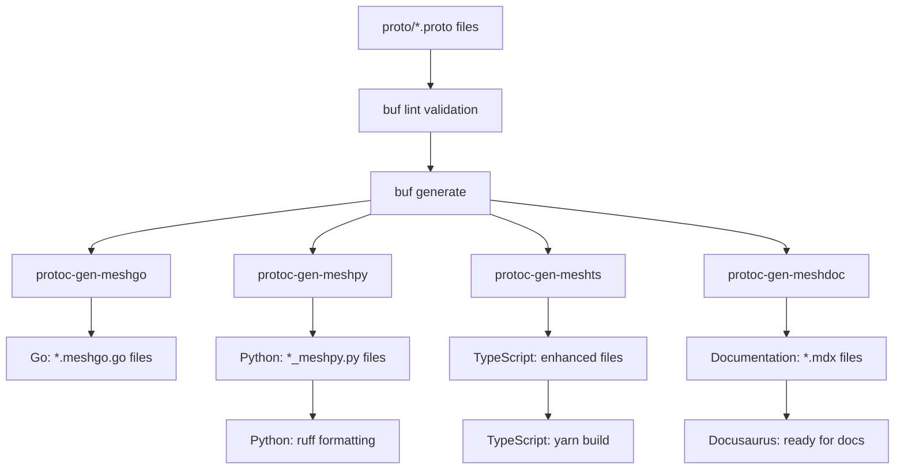

# Contributor Guide

This comprehensive guide provides everything you need to contribute effectively to our schema-first, multi-language SDK ecosystem. Whether you're adding new API services, fixing bugs, or improving documentation, this guide will help you understand our architecture, workflows, and best practices.

## Repository Overview

The Meshtrade API follows a **schema-first approach** using Protocol Buffers as the single source of truth. From these protobuf definitions, we generate:

- **Go client libraries** with interfaces and mocks
- **Python SDK** with authentication and resource management  
- **TypeScript/JavaScript SDK** for web applications
- **Comprehensive documentation** with interactive examples
- **Validation rules** and type safety across all languages

**Key Architecture Principles:**
- **Resource-oriented design** inspired by Google's API Improvement Proposals (AIPs)
- **Strong consistency** across all generated client libraries
- **Role-based access control** with fine-grained permissions
- **Developer experience** focus with comprehensive tooling

## 1. Understanding Our API Design (Protobuf + AIP)

### 1.1 Resource-Oriented Design Patterns

Our APIs follow Google's [API Improvement Proposals (AIPs)](https://google.aip.dev/), specifically:

#### Core Resource Patterns
- **Resources** have unique names like `api_users/{api_user_id}` or `groups/{group_id}`
- **Collections** contain resources: `ListApiUsers()`, `SearchApiUsers()`
- **Standard methods** follow consistent patterns: `GetX()`, `CreateX()`, `ListX()`, `SearchX()`
- **Custom methods** for business operations: `ActivateApiUser()`, `DeactivateApiUser()`

#### Example: API User Service Structure
```protobuf
// Resource name pattern: api_users/{api_user_id}
service ApiUserService {
  // Standard Methods (AIP-131, AIP-132, AIP-133)
  rpc GetApiUser(GetApiUserRequest) returns (APIUser);
  rpc CreateApiUser(CreateApiUserRequest) returns (APIUser);  
  rpc ListApiUsers(ListApiUsersRequest) returns (ListApiUsersResponse);
  rpc SearchApiUsers(SearchApiUsersRequest) returns (SearchApiUsersResponse);
  
  // Custom Methods (AIP-136) 
  rpc ActivateApiUser(ActivateApiUserRequest) returns (APIUser);
  rpc DeactivateApiUser(DeactivateApiUserRequest) returns (APIUser);
}
```

#### Resource Naming Conventions
- **Singular** for resource types: `APIUser`, `Group`, `Account`
- **Plural** for collections: `api_users`, `groups`, `accounts`  
- **Snake_case** for proto field names: `display_name`, `created_at`
- **PascalCase** for message names: `CreateApiUserRequest`
- **SCREAMING_SNAKE_CASE** for enums: `API_USER_STATE_ACTIVE`

### 1.2 Authorization Model

Every RPC method must specify:

#### Method Type Classification
```protobuf
import "meshtrade/option/v1/method_type.proto";

rpc GetApiUser(GetApiUserRequest) returns (APIUser) {
  option (meshtrade.option.v1.method_type) = METHOD_TYPE_READ;  // or METHOD_TYPE_WRITE
}
```

#### Role-Based Access Control
```protobuf
import "meshtrade/iam/role/v1/role.proto";

rpc CreateApiUser(CreateApiUserRequest) returns (APIUser) {
  option (meshtrade.iam.role.v1.roles) = {
    roles: [ROLE_IAM_ADMIN]  // Only IAM admins can create API users
  };
}
```

#### Role Hierarchy
Our authorization follows domain-based role patterns:
- `ROLE_IAM_ADMIN` / `ROLE_IAM_VIEWER` - Identity & Access Management
- `ROLE_COMPLIANCE_ADMIN` / `ROLE_COMPLIANCE_VIEWER` - KYC/AML operations  
- `ROLE_TRADING_ADMIN` / `ROLE_TRADING_VIEWER` - Trading operations
- `ROLE_WALLET_ADMIN` / `ROLE_WALLET_VIEWER` - Account management
- `ROLE_ISSUANCE_HUB_ADMIN` / `ROLE_ISSUANCE_HUB_VIEWER` - Instrument management

### 1.3 Validation and Type Safety

We use `buf/validate` for comprehensive input validation:

```protobuf
message ActivateApiUserRequest {
  string name = 1 [(buf.validate.field) = {
    string: {
      min_len: 1
      pattern: "^api_users/[0-9A-HJKMNP-TV-Z]{26}$"  // ULID format
    }
    cel: {
      id: "name.required"
      message: "name is required and must be in format api_users/{id}"
      expression: "this.matches('^api_users/[0-9A-HJKMNP-TV-Z]{26}$')"
    }
  }];
}
```

### 1.4 Common Types

Shared types in `/proto/meshtrade/type/v1/` ensure consistency:

- **`Amount`** - Precise financial amounts with currency
- **`Decimal`** - High-precision arithmetic (no float precision issues)
- **`Token`** - Universal Token Identifier for blockchain assets
- **`Ledger`** - Blockchain transaction references
- **`Date`** / **`TimeOfDay`** - Timezone-aware temporal types

## 2. Code Generation Architecture Deep Dive

### 2.1 Generation Workflow Overview

The `./scripts/code-generation/generate-all.sh` script orchestrates everything:

```bash
# 1. Clean all generated files
🧹 Cleaning Go/Python/TypeScript generated files

# 2. Build custom generators  
🛠 Building protoc-gen-meshts plugin

# 3. Generate from protobuf definitions
🚀 buf generate --template scripts/code-generation/buf/buf.gen.yaml

# 4. Post-processing
📄 Generating TypeScript index files
⚙️ Building TypeScript library  
🚀 Formatting Python code with ruff
```

### 2.2 Custom Protobuf Generators

#### protoc-gen-meshgo (Go Enhancement)
**Location**: `/tool/protoc-gen-meshgo/`
**Purpose**: Extends standard Go protobuf generation

**Generated Files:**
- `service.meshgo.go` - Enhanced gRPC clients with BaseGRPCClient pattern
- `service_interface.meshgo.go` - Service interfaces for dependency injection
- `serviceMock.meshgo.go` - Mock implementations for testing

**Key Features:**
- **BaseGRPCClient[T]** pattern with generics for type safety
- **Execute()** function with conservative retry logic (financial-grade)
- **Authentication interceptors** with role-based access
- **Resource management** with proper cleanup
- **Comprehensive documentation** with authentication hierarchy

#### protoc-gen-meshpy (Python Enhancement)  
**Location**: `/tool/protoc-gen-meshpy/`
**Purpose**: Generates Python clients with BaseGRPCClient pattern

**Generated Files:**
- `service_meshpy.py` - Minimal service wrappers inheriting from BaseGRPCClient
- `service_options_meshpy.py` - Configuration options for services
- `__init__.py` - Auto-managed package exports with manual section preservation

**Key Features:**
- **BaseGRPCClient** abstract base class (90% of functionality)
- **Lazy connection management** with context manager support
- **Dynamic import analysis** to avoid hardcoded type mappings
- **Credential discovery** following hierarchy (env vars → config files)
- **70% boilerplate reduction** compared to previous implementation

#### protoc-gen-meshts (TypeScript Enhancement)
**Location**: `/tool/protoc-gen-meshts/`  
**Purpose**: TypeScript utilities and index file generation

**Generated Files:**
- `index.ts` files for each package
- Additional TypeScript wrappers and utilities

#### protoc-gen-meshdoc (Documentation Generation)
**Location**: `/tool/protoc-gen-meshdoc/`
**Purpose**: Comprehensive API documentation from protobuf

**Generated Files:**
- `index.mdx` - Service overview pages (editable after first generation)
- `type/{type}_meshdoc.mdx` - Message and enum documentation  
- `service/{method}/index_meshdoc.mdx` - Method documentation with examples
- `sidebar_meshdoc.ts` - Navigation structure

**Features:**
- **Interactive tabs** - Table view, protobuf source, code examples
- **Multi-language examples** - Go, Python, TypeScript
- **GitHub source links** - Direct links to protobuf definitions
- **Role-based access documentation** - Shows required permissions

### 2.3 Generation Dependencies and Flow



## 3. Development Environment Setup

## 3.1 Prerequisites

**Required Versions** (verified in CI):
- **Go**: 1.24.3 (`go.mod`)
- **Node.js**: ^18.0.0 (`package.json`)  
- **Yarn**: 1.22.22 (`package.json` packageManager)
- **Python**: >=3.12 (`pyproject.toml`)
- **Buf CLI**: Latest (`brew install bufbuild/buf/buf`)

### 3.2 Go Development Setup

#### Installation & Dependencies
```bash
# Install Go (macOS)
brew install go

# Install dependencies
go mod tidy

# Install linting tools  
go install github.com/golangci/golangci-lint/cmd/golangci-lint@latest
```

#### Critical Go Files
- **`go.mod`** / **`go.sum`** - Module dependency management
- **`go/`** - All generated Go client libraries
  - `go/{domain}/{resource}/v1/*.meshgo.go` - Enhanced gRPC clients
  - `go/{domain}/{resource}/v1/*_interface.meshgo.go` - Service interfaces
  - `go/{domain}/{resource}/v1/*Mock.meshgo.go` - Mock implementations
- **`tool/protoc-gen-meshgo/`** - Custom Go generator source code
- **`go/grpc/`** - BaseGRPCClient implementation and configuration

#### Running Go Tests & Linting
```bash
# Run all tests
go test ./...

# Run linting with security checks
golangci-lint run -v --timeout 10m -E gosec

# Clean module dependencies  
go mod tidy
```

### 3.3 Python Development Setup

#### Virtual Environment (CRITICAL)
```bash
# Create and activate virtual environment
python -m venv python/.venv
source python/.venv/bin/activate  # or python/.venv/bin/activate on macOS/Linux

# Install in development mode
pip install -e '.[dev]'
```

#### Critical Python Files
- **`pyproject.toml`** - Project configuration, dependencies, ruff settings
- **`python/src/meshtrade/`** - Generated Python SDK
  - `python/src/meshtrade/common/grpc_client.py` - BaseGRPCClient implementation
  - `python/src/meshtrade/{domain}/{resource}/v1/*_meshpy.py` - Service clients
  - `python/src/meshtrade/{domain}/{resource}/v1/__init__.py` - Auto-managed exports
- **`tool/protoc-gen-meshpy/`** - Custom Python generator source
- **`python/tests/`** - Test suites

#### Python Linting Standards (150-char line limit)
```bash
# CRITICAL: Always run after Python changes
ruff check python/src --fix
ruff format python/src

# Check specific rules
ruff check . --select E501,E711,F401,SIM112
```

**Key Ruff Rules:**
- **E501**: Line length (150 chars max - not 80!)
- **E711**: Use `is`/`is not` for None comparisons (not `==`)
- **F401**: Remove unused imports OR add proper `__all__` lists  
- **SIM112**: Environment variables must use UPPER_CASE naming

#### Running Python Tests
```bash
# Activate virtual environment first!
source python/.venv/bin/activate

# Run with correct PYTHONPATH
PYTHONPATH="./python/src:./python/tests" pytest ./python/tests -v

# Or use tox for comprehensive testing
tox
```

### 3.4 TypeScript Development Setup

#### Installation & Dependencies
```bash
# Install from repository root (yarn workspace)
yarn install

# Build TypeScript SDK
yarn build  # or yarn workspace @meshtrade/api build

# Build documentation site
yarn build:docs
```

#### Critical TypeScript Files  
- **`package.json`** (root) - Yarn workspace configuration
- **`ts/package.json`** - TypeScript SDK dependencies  
- **`ts/tsconfig.json`** - TypeScript compiler configuration
- **`ts/src/meshtrade/`** - Generated TypeScript modules
- **`tool/protoc-gen-meshts/`** - Custom TypeScript generator
- **`docs/`** - Docusaurus documentation site

#### Running TypeScript Tests & Linting
```bash
# Run tests
yarn test  # or yarn workspace @meshtrade/api test

# Run linting  
yarn lint  # or yarn workspace @meshtrade/api lint

# Start documentation server
yarn start:docs  # opens http://localhost:3000/api/
```

#### Hand-Written Client Maintenance
**IMPORTANT**: After protobuf changes, update hand-written TypeScript clients:

1. **Check for compilation errors**: `yarn build` will show missing types/methods
2. **Update method signatures**: Get/Create methods return resources directly (not response wrappers)
3. **Update imports**: Remove deleted response types, add new resource types
4. **Verify all methods exposed**: Compare `*_grpc_web.ts` wrappers to `*_pb.d.ts` service interfaces

## 4. Contributing Workflow

### 4.1 General Development Process

1. **Branch from master**: `git checkout -b feature/your-feature-name`
2. **Modify protobuf files first** in `/proto/meshtrade/`
3. **Run buf lint**: `buf lint` (must pass before generation)
4. **Regenerate all code**: `./scripts/code-generation/generate-all.sh`
5. **Update hand-written code** if needed (especially TypeScript clients)
6. **Run all tests**:
   ```bash
   # Go tests
   go test ./...
   
   # Python tests  
   source python/.venv/bin/activate
   PYTHONPATH="./python/src:./python/tests" pytest ./python/tests -v
   
   # TypeScript tests
   yarn test
   ```
7. **Run all linters**:
   ```bash
   # Go linting
   golangci-lint run -v --timeout 10m -E gosec
   
   # Python linting (CRITICAL!)
   ruff check python/src --fix
   ruff format python/src
   
   # TypeScript linting
   yarn lint
   ```
8. **Update documentation** if needed
9. **Submit pull request** with comprehensive description

### 4.2 Protobuf Contribution Guidelines

#### Adding New Services
1. **Create service directory**: `/proto/meshtrade/{domain}/{resource}/v1/`
2. **Define resource proto**: `{resource}.proto` with message definitions
3. **Define service proto**: `service.proto` with RPC methods
4. **Add authorization**:
   ```protobuf
   option (meshtrade.iam.role.v1.standard_roles) = {
     roles: [ROLE_YOUR_DOMAIN_ADMIN, ROLE_YOUR_DOMAIN_VIEWER]
   };
   ```
5. **Add method types**: Every RPC method needs `method_type` option
6. **Add role restrictions**: Every RPC method needs `roles` option
7. **Use buf validation**: Add validation rules for all inputs
8. **Document thoroughly**: Comments become API documentation

#### Adding New Methods to Existing Services
1. **Follow AIP patterns**: Use standard method signatures when possible
2. **Choose appropriate method type**: `METHOD_TYPE_READ` vs `METHOD_TYPE_WRITE`
3. **Set proper authorization**: Who can call this method?
4. **Add validation rules**: Validate all inputs comprehensively
5. **Update service documentation**: Method comments become user-facing docs

#### Updating Existing APIs (Breaking Changes)
1. **Avoid breaking changes** in existing versions (v1, v2, etc.)
2. **For breaking changes**: Create new API version (e.g., v1 → v2)
3. **Deprecation process**: Mark old versions as deprecated, provide migration path
4. **Maintain backward compatibility**: Keep old versions working during transition period

### 4.3 Testing Standards

#### Go Testing
- **Unit tests**: Test business logic and validation
- **Integration tests**: Test with actual gRPC servers
- **Mock usage**: Use generated mocks for dependency injection
- **Security testing**: `golangci-lint run -E gosec`

#### Python Testing  
- **Always use virtual environment**: Tests will fail without proper Python setup
- **Set PYTHONPATH correctly**: `PYTHONPATH="./python/src:./python/tests"`
- **Test BaseGRPCClient pattern**: Verify all services inherit correctly
- **Test credential discovery**: Mock credential files and environment variables
- **Line length compliance**: Verify ruff rules are followed

#### TypeScript Testing
- **Jest configuration**: Tests in `ts/src/**/*.test.ts`
- **Type checking**: `yarn build` must pass (no TypeScript errors)
- **Linting compliance**: `yarn lint` must pass
- **Hand-written client validation**: Ensure all protobuf methods are exposed

### 4.4 Documentation Contributions

#### Auto-Generated Documentation
- **Never edit `*_meshdoc.mdx` files**: They're regenerated from protobuf
- **Edit protobuf comments**: They become the API documentation
- **Service overview pages**: `index.mdx` files are editable after first generation

#### Hand-Written Documentation  
- **Architecture docs**: Update `/docs/docs/architecture/` for system changes
- **Contributor guide**: Keep this guide updated with new patterns
- **Code examples**: Update TODO placeholders in generated examples

#### Documentation Testing
```bash
# Start development server
yarn start:docs

# Build static site (catches errors)
yarn build:docs

# Serve built site
yarn serve:docs
```

## 5. Common Pitfalls and Solutions

### 5.1 Protobuf Issues

**Problem**: `buf lint` failures
**Solution**: Follow naming conventions, add missing options, fix import paths

**Problem**: Breaking change detection failures  
**Solution**: Create new API version instead of modifying existing APIs

**Problem**: Missing authorization options
**Solution**: Every service needs `standard_roles`, every method needs `method_type` and `roles`

### 5.2 Code Generation Issues

**Problem**: Generated files not appearing
**Solution**: Check protobuf syntax, ensure service definitions are correct, run `buf generate` manually for debugging

**Problem**: Python import errors after generation
**Solution**: Check dynamic import analysis in `protoc-gen-meshpy`, ensure external types are properly categorized

**Problem**: TypeScript compilation errors
**Solution**: Update hand-written clients, remove deleted types, add new imports

### 5.3 Python-Specific Issues  

**Problem**: Import errors in tests
**Solution**: Always set `PYTHONPATH="./python/src:./python/tests"`

**Problem**: Ruff linting failures
**Solution**: Use 150-char line limit (not 80), fix E711 None comparisons, remove unused imports

**Problem**: Virtual environment not activated
**Solution**: Always run `source python/.venv/bin/activate` before Python commands

### 5.4 Go-Specific Issues

**Problem**: Module dependency conflicts
**Solution**: Run `go mod tidy`, check for version conflicts, update dependencies

**Problem**: Generic type compilation issues  
**Solution**: Ensure Go 1.24.3+, check BaseGRPCClient[T] usage patterns

### 5.5 TypeScript-Specific Issues

**Problem**: Hand-written clients missing methods
**Solution**: Compare `*_grpc_web.ts` files to generated `*_pb.d.ts` interfaces, add missing method wrappers

**Problem**: Yarn workspace dependency issues
**Solution**: Run `yarn install` from repository root, not from individual package directories

This guide represents the collective knowledge of the Meshtrade API development team. Keep it updated as our architecture evolves, and don't hesitate to improve it based on your contribution experience!