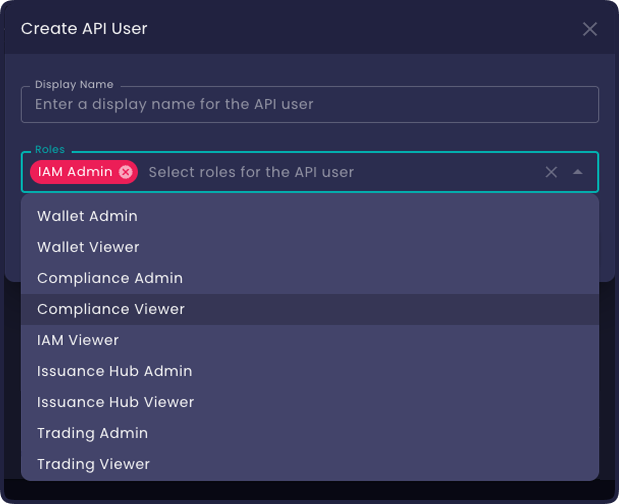
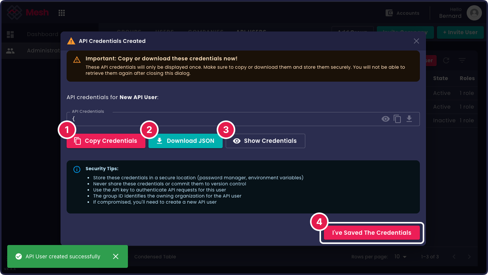

# Introduction

import Tabs from '@theme/Tabs';
import TabItem from '@theme/TabItem';

Welcome to the **Mesh API Documentation** - your comprehensive guide to integrating with the Mesh trading platform.

## What is Mesh API?

Mesh API is a modern, gRPC-based financial trading platform API organized into business domains including Identity & Access Management, Trading Services, Compliance Services, Wallet Management, and Issuance Hub.

For a complete overview of all available services and their current status, see the **[Services Reference](./api-reference/)**.

## Quick Start

Get started with the Mesh API using the API User Service.

### 1. Create an API User and Credentials

1. Log in as an administrator into the Mesh platform and go to the api users tab on the **[administration page](https://app.mesh.trade/administration/manage/api-users)**. From here Select the Create API user button.


2. Enter a name for the api user (not unique) and select one or more roles. These roles will be assigned in the group that will own the new api user, this is also the top level group of the client that you are logged in as. This is relevant because Mesh is a multitenant hierarchal system. Read through the **[Group Ownership Guide](./architecture/group-ownership)** to understand this further. Select Create api user to complete the creation.

<div style={{display: 'flex', gap: '10px', flexWrap: 'wrap', marginTop: '15px', justifyContent: 'center'}}>




</div>

3. On successful creation a dialog opens with the new api user credentials. This download or copy them. They are required to authenticate communicaiton with them mesh API.


### 2. Installation

Install the SDK for your preferred language:

<Tabs>
<TabItem value="go" label="Go">

```bash
# Install the Go SDK
go get github.com/meshtrade/api/go
```

Requirements: [Go](https://golang.org/dl/) version 1.21 or above

</TabItem>
<TabItem value="python" label="Python">

```bash
# Install the Python SDK
pip install meshtrade
```

Requirements: [Python](https://www.python.org/downloads/) version 3.9 or above

</TabItem>
</Tabs>

### 3. Set Up Credentials

Set up your api credentials so that they can be found by the sdk.

```bash
export MESH_API_CREDENTIALS=/path/to/your/credentials.json
```

**Credentials file format:**
```json
{
  "api_key": "your-api-key",
  "group_id": "your-group-id"
}
```

:::tip
Keep your API key secure and never commit it to version control.
:::

### 4. Your First API Request

Create and manage an API user using the credentials file:

<Tabs>
<TabItem value="go" label="Go">

```go
package main

import (
	"context"
	"log"

	api_userv1 "github.com/meshtrade/api/go/iam/api_user/v1"
	rolev1 "github.com/meshtrade/api/go/iam/role/v1"
)

func main() {
	// Create client (loads credentials from MESH_API_CREDENTIALS)
	client, err := api_userv1.NewApiUserServiceGRPCClient()
	if err != nil {
		log.Fatalf("Failed to create client: %v", err)
	}
	defer client.Close()

	// Create API user with IAM admin role
	apiUser, err := client.CreateApiUser(
		context.Background(),
		&api_userv1.CreateApiUserRequest{
			ApiUser: &api_userv1.APIUser{
				Owner:       client.Group(),
				DisplayName: "My API User",
				Roles: []string{
					rolev1.Role_ROLE_IAM_ADMIN.FullResourceNameFromGroupName(client.Group()),
				},
			},
		},
	)
	if err != nil {
		log.Fatalf("Failed to create API user: %v", err)
	}

	log.Printf("Created API user: %s", apiUser.Name)
	log.Printf("API key (save this!): %s", apiUser.ApiKey)
	log.Printf("State: %s", apiUser.State)
}
```

</TabItem>
<TabItem value="python" label="Python">

```python
from meshtrade.iam.api_user.v1 import (
    ApiUserServiceGRPCClient,
    ClientOptions,
    CreateApiUserRequest,
    APIUser,
)
from meshtrade.iam.role.v1 import Role, full_resource_name_from_group_name

def main():
    # Create client (loads credentials from MESH_API_CREDENTIALS)
    options = ClientOptions()
    client = ApiUserServiceGRPCClient(options)
    
    with client:
        # Create API user with IAM admin role
        api_user = APIUser(
            owner=client.group(),
            display_name="My API User",
            roles=[full_resource_name_from_group_name(Role.ROLE_IAM_ADMIN, client.group())],
        )
        
        created_user = client.create_api_user(CreateApiUserRequest(api_user=api_user))
        
        print(f"Created API user: {created_user.name}")
        print(f"API key (save this!): {created_user.api_key}")
        print(f"State: {created_user.state}")

if __name__ == "__main__":
    main()
```

</TabItem>
</Tabs>

The client will automatically load your credentials and use default configuration.

## Next Steps

Now that you have a working connection to the Mesh API, explore these key concepts.
It is recommended that you have read through and understood these concepts before starting
to use the API.

### 📋 Learn About Service Structure
Understand how our APIs are organized and the common patterns used across all services.

👉 **[Service Structure Guide](./architecture/service-structure)** - Learn about resource-oriented design, standard verbs, and API patterns

### 🏢 Group Ownership Structure  
Learn how groups provide ownership and isolation boundaries for your resources.

👉 **[Group Ownership Guide](./architecture/group-ownership)** - Understand multi-tenancy, resource isolation, and group management

### 🔐 Permissions Structure
Discover our schema-driven authorization system and role-based access control.

👉 **[Permissions Guide](./architecture/role-based-access)** - Master RBAC, roles, and permission management

### 📚 Additional Resources

- **[API Reference](./api-reference/)** - Complete API documentation
- **[Roadmap](./roadmap)** - Upcoming features and improvements

---

*Ready to build something amazing with Mesh API? Let's get started!*