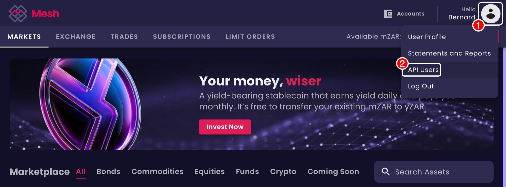
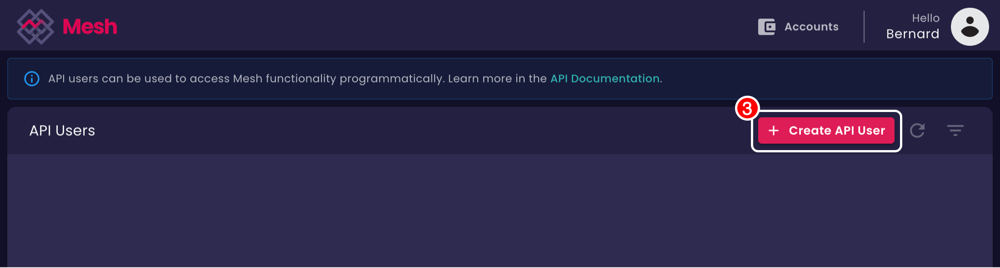
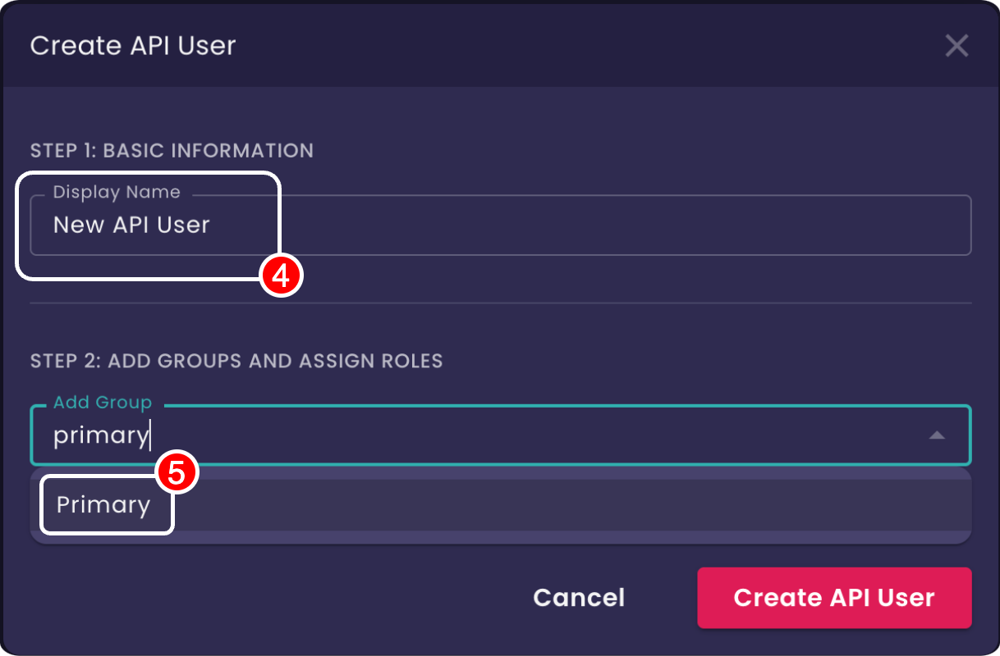
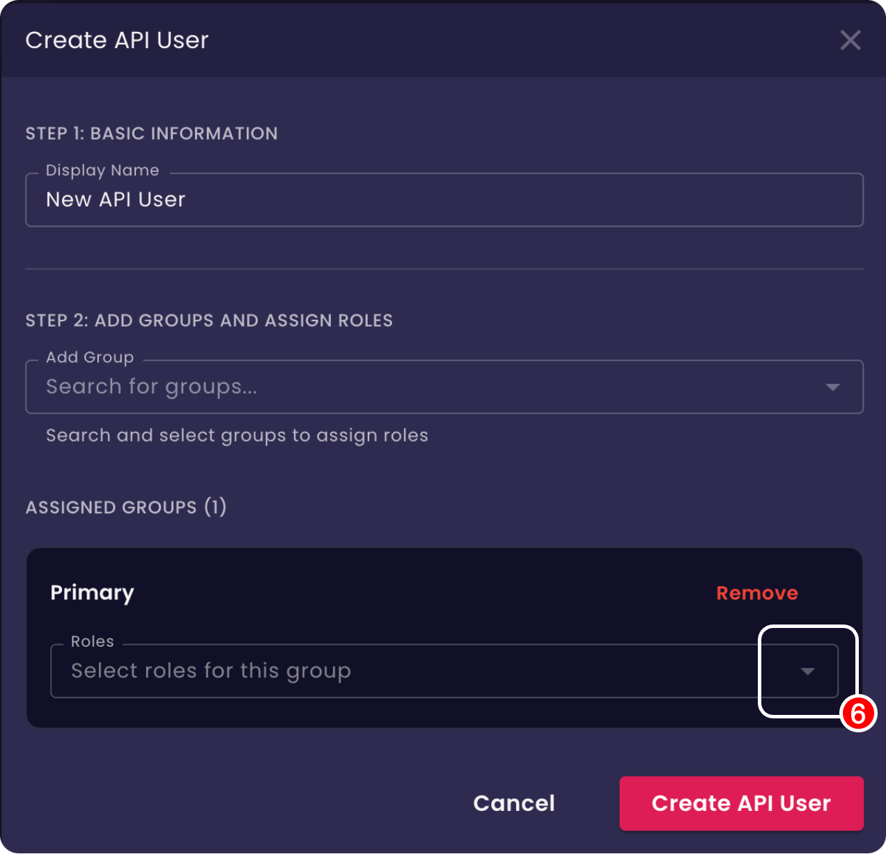
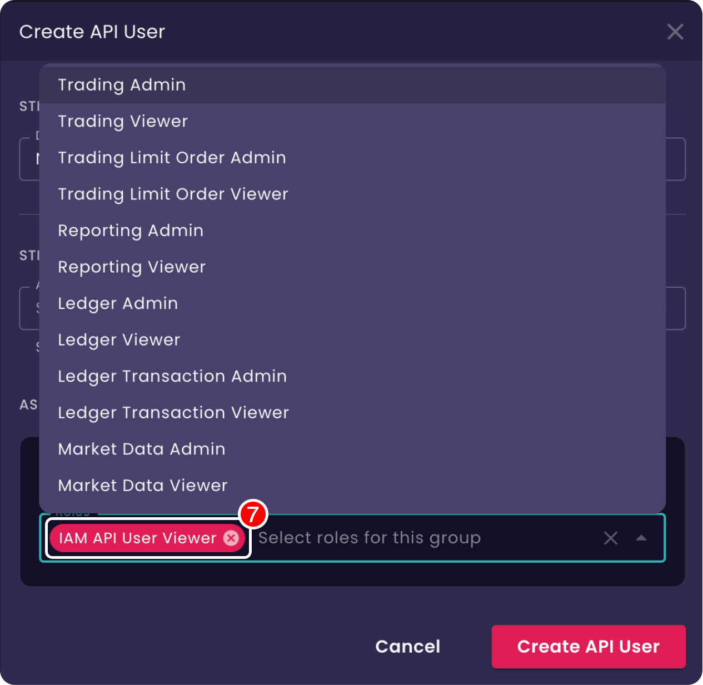
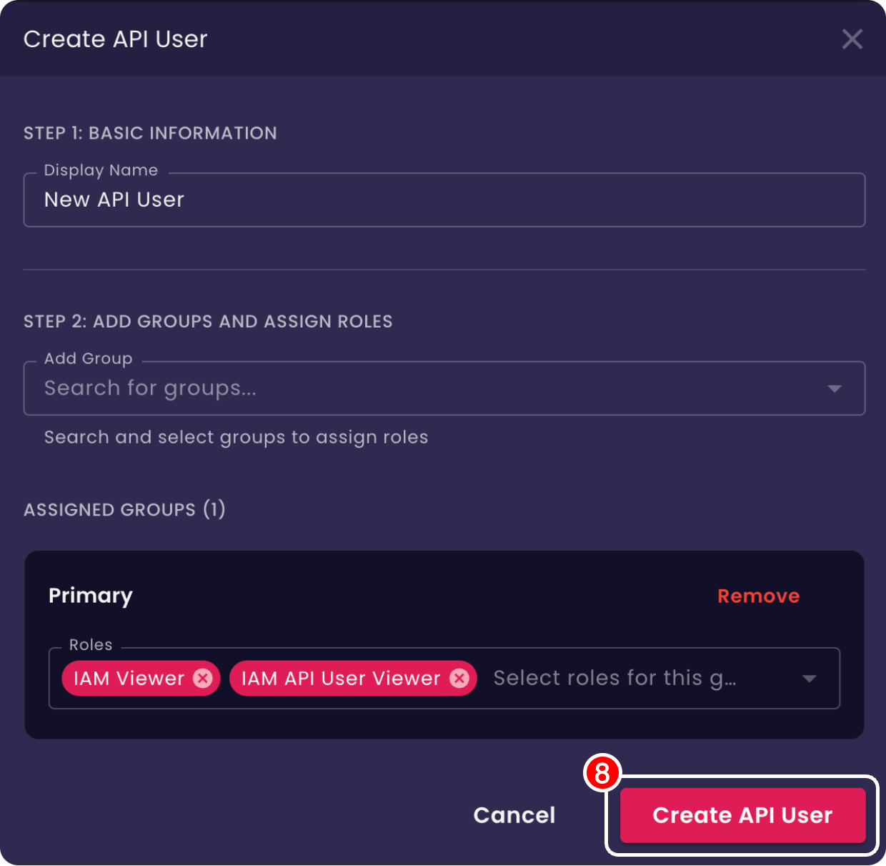

# Introduction

import Tabs from '@theme/Tabs';
import TabItem from '@theme/TabItem';
import CodeBlock from '@theme/CodeBlock';
import GoExample from '!!raw-loader!./examples/example.go';
import PythonExample from '!!raw-loader!./examples/example.py';
import JavaExample from '!!raw-loader!./examples/example.java';

The **Mesh API Documentation** - integrate with Mesh's trading infrastructure.

## What is Mesh API?

The Mesh API provides programmatic access to Mesh's trading platform. Build trading applications, manage client portfolios, automate compliance workflows, and integrate financial services into your platform.

:::info
To jump to the complete list of available services go to **[API Reference](/docs/api-reference/)**.
:::

## Quick Start

Get started with the Mesh API using the API User Service.

### 1. Create an API User and Credentials

- Log in to Mesh and select [API Users](https://app.mesh.trade/api-users) from the user drop down menu on the main task bar to get to the API User Management Screen.



- Select the 'Create API User' button in the top right of the table to open the API User Creation dialog.



- Enter a display name for the API User and select one or more groups in which roles are to be granted to the new API User.

<div style={{display: 'flex', gap: '8px', flexDirection: 'row', marginTop: '15px', justifyContent: 'center'}}>





</div>

- Then select roles to Assign to the API User in the selected group(s) (for the coming example to work select *at least* the **IAM Viewer** Role).
- Select **Create API user** to complete the creation.

<div style={{display: 'flex', gap: '8px', flexDirection: 'row', marginTop: '15px', justifyContent: 'center'}}>





</div>

:::info
See **[Access Control](/docs/access-control/)** for more information on group, roles access control in Mesh.
:::

- On successful creation a dialog opens with the new API User's credentials.
Download or copy them.
They are required to authenticate SDKs to use the Mesh API.


:::danger
Keep your API credentials file **secure**! Never commit this credentials file to version control!
:::

- The new API User is inactive on creation. Select its row in the table and click on the Activate button in the
table header to activate it so that it is ready for use.


### 2. Credentials Setup

Mesh API SDKs are configured to automatically discover your credentials.
For this to work, create a **`mesh`** subdirectory in your platform's application data/configuration directory and 
place your **`credentials.json`** file inside it.

The application data/configuration directory differs by platform:

* **Linux**: `~/.config/mesh/credentials.json`
* **macOS**: `~/Library/Application Support/mesh/credentials.json`
* **Windows**: `C:\Users\<user>\AppData\Roaming\mesh\credentials.json`

Credential file location can also be indicated by environment variable:

```bash
export MESH_API_CREDENTIALS=/path/to/your/credentials.json
```

:::info
For more information about authentication see **[Access Control](/docs/access-control/)**.
:::

### 3. SDK Installation

Install the SDK for your preferred language:

<Tabs>

<TabItem value="go" label="Go">
```bash
go get github.com/meshtrade/api/go
```
</TabItem>

<TabItem value="python" label="Python">
```bash
pip install meshtrade
```
</TabItem>

<TabItem value="java" label="Java">
To include this SDK in your Maven project, add the following dependency to your `pom.xml` file:

```xml
<dependency>
    <groupId>co.meshtrade</groupId>
    <artifactId>api</artifactId>
    <version>LATEST</version>
</dependency>
```
**Important:** Always use a specific version number (e.g., 1.2.3) instead of LATEST to ensure your build is stable and reproducible. You can find the latest version on the [co.meshtrade.api](https://central.sonatype.com/artifact/co.meshtrade.api/api) Maven Central repository page.

</TabItem>

</Tabs>

### 4. Your First API Request

As a first API request to confirm that everything is working call the **[SearchApiUsers API](/docs/api-reference/iam/api_user/v1/service/search-api-users)**
to retrieve your new API Key:

<Tabs>
<TabItem value="go" label="Go">
<CodeBlock language="go">{GoExample}</CodeBlock>
</TabItem>
<TabItem value="python" label="Python">
<CodeBlock language="python">{PythonExample}</CodeBlock>
</TabItem>
<TabItem value="java" label="Java">
<CodeBlock language="java">{JavaExample}</CodeBlock>
</TabItem>
</Tabs>

:::note
This will only work if:
- Either IAM Admin or IAM Viewer role was assigned to the API User on creation
- The API User is Active
- API Credentials are discoverable
:::

## Next Steps

After setting up your API connection, review these core concepts before integrating.

### 📋 Learn About Service Structure
Understand how our APIs are organized and the common patterns used across all services.

👉 **[Service Structure Guide](/docs/service-structure)** - Learn about resource-oriented design, standard verbs, and API patterns

### 🔐 Access Control
Understand authentication, authorisation, group hierarchy, and role-based access control.

👉 **[Access Control Guide](/docs/access-control/)** - Authentication, RBAC, resource ownership, and scoping

### 📚 Additional Resources

- **[API Reference](/docs/api-reference/)** - Complete API documentation
- **[Roadmap](/docs/roadmap)** - Upcoming features and improvements

---