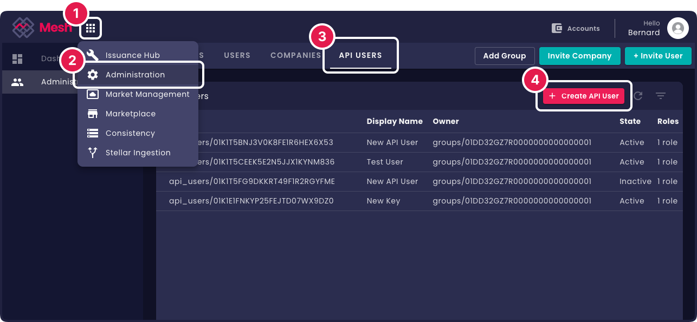

# Introduction

import Tabs from '@theme/Tabs';
import TabItem from '@theme/TabItem';
import CodeBlock from '@theme/CodeBlock';
import GoExample from '!!raw-loader!./examples/example.go';
import PythonExample from '!!raw-loader!./examples/example.py';
import JavaExample from '!!raw-loader!./examples/example.java';

Welcome to the **Mesh API Documentation** - your comprehensive guide to integrating with the Mesh platform.

## What is Mesh API?

The Mesh API is a modern, gRPC-based API organized into business domains including Identity & Access Management, Trading Services, Compliance Services, Wallet Management, and Issuance Hub.

:::info
To jump to the complete list of available services go to **[API Reference](/docs/api-reference/)**.
:::

## Quick Start

Get started with the Mesh API using the API User Service.

### 1. Create an API User and Credentials

1. Log into Mesh as an administrator and go to the API Users tab on the **[administration page](https://app.mesh.trade/administration/manage/api-users)**.
Then click the **Create API User** button on the table header.



2. Enter a display name for the API User and select one or more roles (for the coming example to work select *at least* the **IAM Viewer** Role).
These roles will be assigned to the API User **in the group** that will own it - the top level group of the client that you are logged in as.
Select **Create API user** to complete the creation.

<div style={{display: 'flex', gap: '8px', flexDirection: 'row', marginTop: '15px', justifyContent: 'center'}}>


</div>

:::info
See **[Group Ownership Structure](/docs/architecture/group-ownership)** for more information on group structures in Mesh.
:::

3. On successful creation a dialog opens with the new API User's credentials.
Download or copy them.
They are required to authenticate SDKs to use the Mesh API.


:::danger
Keep your API credentials file **secure**! Never commit this credentials file to version control!
:::

3. The new API User is inactive on creation. Select its row in the table and click on the Activate button in the
table header to activate it so that it is ready for use.


### 2. Credentials Setup

Mesh API SDKs are configured to automatically discover your credentials.
For this to work, create a **`mesh`** subdirectory in your platform's application data/configuration directory and 
place your **`credentials.json`** file inside it.

The application data/configuration directory differs by platform:

* **Linux**: `~/.config/mesh/credentials.json`
* **macOS**: `~/Library/Application Support/mesh/credentials.json`
* **Windows**: `C:\Users\<user>\AppData\Roaming\mesh\credentials.json`

Credential file location can also be indicated by environment variable:

```bash
export MESH_API_CREDENTIALS=/path/to/your/credentials.json
```

:::info
For more information about authentication see **[Authentication](/docs/architecture/authentication)**.
:::

### 3. SDK Installation

Install the SDK for your preferred language:

<Tabs>

<TabItem value="go" label="Go">
```bash
go get github.com/meshtrade/api/go
```
</TabItem>

<TabItem value="python" label="Python">
```bash
pip install meshtrade
```
</TabItem>

<TabItem value="java" label="Java">
To include this SDK in your Maven project, add the following dependency to your `pom.xml` file:

```xml
<dependency>
    <groupId>co.meshtrade</groupId>
    <artifactId>api</artifactId>
    <version>LATEST</version>
</dependency>
```
**Important:** Always use a specific version number (e.g., 1.2.3) instead of LATEST to ensure your build is stable and reproducible. You can find the latest version on the [co.meshtrade.api](https://central.sonatype.com/artifact/co.meshtrade.api/api) Maven Central repository page.

</TabItem>

</Tabs>

### 4. Your First API Request

As a first API request to confirm that everything is working call the **[SearchApiUsers API](/docs/api-reference/iam/api_user/v1/service/search-api-users)**
to retrieve your new API Key:

<Tabs>
<TabItem value="go" label="Go">
<CodeBlock language="go">{GoExample}</CodeBlock>
</TabItem>
<TabItem value="python" label="Python">
<CodeBlock language="python">{PythonExample}</CodeBlock>
</TabItem>
<TabItem value="java" label="Java">
<CodeBlock language="java">{JavaExample}</CodeBlock>
</TabItem>
</Tabs>

:::note
This will only work if:
- Either IAM Admin or IAM Viewer role was assigned to the API User on creation
- The API User is Active
- API Credentials are discoverable
:::

## Next Steps

Now that you have a working connection to the Mesh API, explore these key concepts.

It is recommended that you have read through and understood these concepts before starting
to use the API.

### 📋 Learn About Service Structure
Understand how our APIs are organized and the common patterns used across all services.

👉 **[Service Structure Guide](/docs/architecture/service-structure)** - Learn about resource-oriented design, standard verbs, and API patterns

### 🏢 Group Ownership Structure  
Learn how groups provide ownership and isolation boundaries for your resources.

👉 **[Group Ownership Guide](/docs/architecture/group-ownership)** - Understand multi-tenancy, resource isolation, and group management

### 🔐 Permissions Structure
Discover our schema-driven authorization system and role-based access control.

👉 **[Roles & Permissions Guide](/docs/architecture/role-based-access)** - Master RBAC, roles, and permission management

### 📚 Additional Resources

- **[API Reference](/docs/api-reference/)** - Complete API documentation
- **[Roadmap](/docs/roadmap)** - Upcoming features and improvements

---

*Ready to build something amazing with Mesh API? Let's get started!*