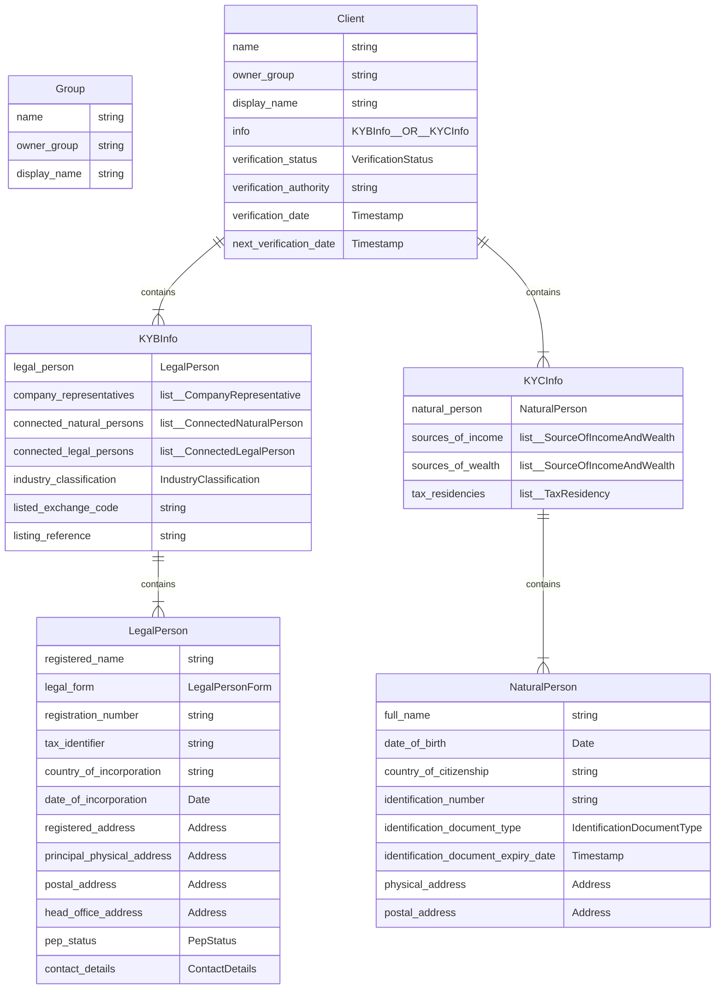

```mermaid
erDiagram
    Group {
        name string
        owner_group string
        display_name string
    }


    Client {
        name string
        owner_group string
        display_name string
        info KYBInfo__OR__KYCInfo
        verification_status VerificationStatus
        verification_authority string
        verification_date Timestamp
        next_verification_date Timestamp
    }
    Client ||--|{ KYBInfo : contains
    Client ||--|{ KYCInfo : contains
    
    KYCInfo {
        natural_person NaturalPerson
        sources_of_income list__SourceOfIncomeAndWealth
        sources_of_wealth list__SourceOfIncomeAndWealth
        tax_residencies list__TaxResidency
    }
    KYCInfo ||--|{ NaturalPerson : contains

    KYBInfo {
        legal_person LegalPerson
        company_representatives list__CompanyRepresentative
        connected_natural_persons list__ConnectedNaturalPerson
        connected_legal_persons list__ConnectedLegalPerson
        industry_classification IndustryClassification
        listed_exchange_code string
        listing_reference string
    }
    KYBInfo ||--|{ LegalPerson : contains

    NaturalPerson {
        full_name string
        date_of_birth Date
        country_of_citizenship string
        identification_number string
        identification_document_type IdentificationDocumentType
        identification_document_expiry_date Timestamp
        physical_address Address
        postal_address Address
    }

    LegalPerson {
        registered_name string
        legal_form LegalPersonForm
        registration_number string
        tax_identifier string
        country_of_incorporation string
        date_of_incorporation Date
        registered_address Address
        principal_physical_address Address
        postal_address Address
        head_office_address Address
        pep_status PepStatus
        contact_details ContactDetails
    }
```