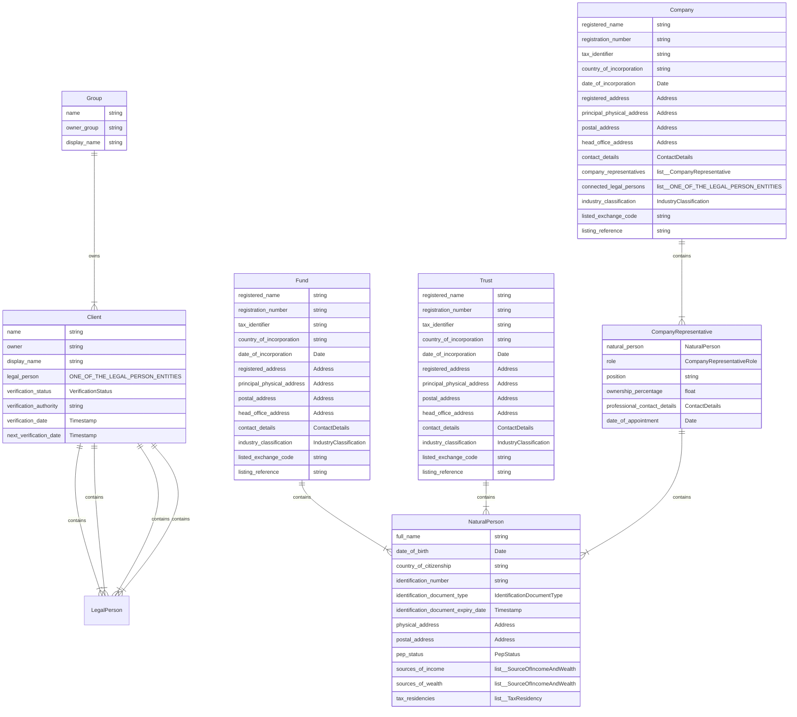

```mermaid
erDiagram
    Group {
        name string
        owner_group string
        display_name string
    }
    Group ||--|{ Client : owns

    Client {
        name string
        owner string
        display_name string
        legal_person ONE_OF_THE_LEGAL_PERSON_ENTITIES
        verification_status VerificationStatus
        verification_authority string
        verification_date Timestamp
        next_verification_date Timestamp
    }
    Client ||--|{ LegalPerson : contains
    Client ||--|{ LegalPerson : contains
    Client ||--|{ LegalPerson : contains
    Client ||--|{ LegalPerson : contains

    NaturalPerson {
        full_name string
        date_of_birth Date
        country_of_citizenship string
        identification_number string
        identification_document_type IdentificationDocumentType
        identification_document_expiry_date Timestamp
        physical_address Address
        postal_address Address
        pep_status PepStatus
        sources_of_income list__SourceOfIncomeAndWealth
        sources_of_wealth list__SourceOfIncomeAndWealth  
        tax_residencies list__TaxResidency      
    }

    Company {
        registered_name string
        registration_number string
        tax_identifier string
        country_of_incorporation string
        date_of_incorporation Date
        registered_address Address
        principal_physical_address Address
        postal_address Address
        head_office_address Address
        contact_details ContactDetails
        company_representatives list__CompanyRepresentative
        connected_legal_persons list__ONE_OF_THE_LEGAL_PERSON_ENTITIES
        industry_classification IndustryClassification
        listed_exchange_code string
        listing_reference string
    }
    Company ||--|{ CompanyRepresentative : contains  

    Fund {
        registered_name string
        registration_number string
        tax_identifier string
        country_of_incorporation string
        date_of_incorporation Date
        registered_address Address
        principal_physical_address Address
        postal_address Address
        head_office_address Address
        contact_details ContactDetails
        industry_classification IndustryClassification
        listed_exchange_code string
        listing_reference string
    }
    Fund ||--|{ NaturalPerson : contains

    Trust {
        registered_name string
        registration_number string
        tax_identifier string
        country_of_incorporation string
        date_of_incorporation Date
        registered_address Address
        principal_physical_address Address
        postal_address Address
        head_office_address Address
        contact_details ContactDetails
        industry_classification IndustryClassification
        listed_exchange_code string
        listing_reference string
    }
    Trust ||--|{ NaturalPerson : contains    

    CompanyRepresentative {
        natural_person NaturalPerson
        role CompanyRepresentativeRole
        position string
        ownership_percentage float
        professional_contact_details ContactDetails
        date_of_appointment Date
    }
    CompanyRepresentative ||--|{ NaturalPerson : contains  
```